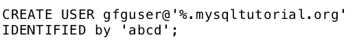

# MySQL |创建用户声明

> 原文:[https://www.geeksforgeeks.org/mysql-create-user-statement/](https://www.geeksforgeeks.org/mysql-create-user-statement/)

MySQL 允许我们指定哪个用户帐户可以连接到数据库服务器。MySQL 中的用户帐户详细信息包含两个信息——用户名和主机，用户试图以*用户名@主机名*的格式连接。

如果管理员用户通过本地主机连接，那么用户帐户将是*管理员@本地主机*。

MySQL 将用户账号存储在 *mysql* 数据库的*用户*授权表中。

MySQL 中的 **CREATE USER** 语句允许我们创建新的 MySQL 帐户，或者换句话说， **CREATE USER** 语句用于创建允许用户登录 MySQL 数据库的数据库帐户。

**语法:**
MySQL 中 CREATE USER 语句的语法是:

```
CREATE USER user_account IDENTIFIED BY password;
```

**使用的参数:**

1.  **user_account:** 是用户想给数据库账户起的名字。user_account 的格式应该是**“用户名”@“主机名”**
2.  **密码:**是分配给 user_account 的密码。密码在 IDENTIFIED BY 子句中指定。

以下是使用 CREATE USER 语句的不同方式:

*   **Creating a new user**: For creating a new user “gfguser1” that connects to the MySQL database server from the localhost with the password “abcd”, the CREATE USER statement should be used in the following way. 

    **语法:**

```
CREATE USER gfguser1@localhost IDENTIFIED BY 'abcd';
```

**注意**:create user 语句只创建一个新用户，并不授予该用户任何权限。

*   **创建多个用户**:对于创建多个从 localhost 连接到 MySQL 数据库服务器的新用户，CREATE USER 语句应该按照以下方式使用。
    **语法:**

```
CREATE USER
'gfguser2'@'localhost' IDENTIFIED BY 'efgh',
'gfguser3'@'localhost' IDENTIFIED BY 'uvxy';
```

上面的代码创建了两个新用户，用户名分别为“gfguser2”和“gfguser3 ”,密码分别为“efgh”和“uvxy”。

*   **允许用户帐户从任何主机连接**:要允许用户帐户从任何主机连接，百分比(%)通配符的使用方式如下。
    **语法:**


要允许用户帐户从“mysqltutorial.org”主机的任何子域连接到数据库服务器，则应使用百分比通配符%如下:
**语法:**



*   **查看用户账户的权限**:“显示授权”语句用于查看用户账户的权限。show grants 语句的用法如下:
    **语法:**

```
SHOW GRANTS FOR user-account;
```

*   **例** :


**输出:**


*。*在输出中表示“gfguser1”用户帐户只能登录数据库服务器，没有其他权限。