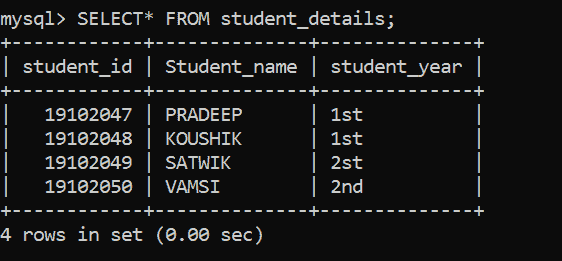

# MySQL |有外键时删除行

> 原文:[https://www . geesforgeks . org/MySQL-删除行-存在外键时/](https://www.geeksforgeeks.org/mysql-deleting-rows-when-there-is-a-foreign-key/)

在本文中，让我们讨论一下 [SQL](https://www.geeksforgeeks.org/structured-query-language/) 中外键的概述，主要的焦点将是如何删除 MySQL 中的一个外键。我们一步一步来讨论。

**外键:**
在外键中，当一个表中的非主键属性引用另一个表中的主键属性时，该非主键被称为外键。我们使用外键引用来建立表之间的链接，并在任何表中执行任何操作。

**在**[**MySQL**](https://www.geeksforgeeks.org/mysql-common-mysql-queries/)**:**
中有外键时删除行的步骤在这里，我们将借助示例来讨论在 MySQL 中实现有外键时删除行所需的步骤，以便更好地理解。

**步骤-1:创建数据库** :
使用如下 SQL 查询创建数据库学生。

```sql
CREATE DATABASE student;
```

**输出:**


**第 2 步:使用数据库** :
使用数据库学生使用以下 SQL 查询如下。

```sql
USE student;
```

**输出:**


**步骤-3:创建两个表:**
**表 1–**使用如下 SQL 查询创建一个包含 3 列的表 student_details。

```sql
CREATE TABLE student_details
(
     student_id INT PRIMARY KEY,
     Student_name varchar(8),
     student_year varchar(8)
);
```

**输出:**


**表 2–**使用以下 SQL 查询创建一个包含 3 列的 student_exam 表，如下所示。

```sql
CREATE TABLE student_exam
(
  exam_id INT PRIMARY KEY,
  exam_name varchar(8),
  student_id INT,
 FOREIGN KEY(student_id)
 REFERENCES student_details(student_id) 
 ON DELETE CASCADE
);
```

**输出:**
表 student_exam 在 student_details 表中有引用 student_id 的外键 student_id。这里，添加了 **ON DELETE CASCADE** ，因为当在一个表中删除任何行时，在引用该表中主键的外部引用表中，该行也会被删除。


**第 4 步:验证数据库** :
使用以下 SQL 查询查看数据库中表的描述，如下所示。

```sql
DESCRIBE student_details;
```

**输出:**


```sql
DESCRIBE student_exam;
```

**输出:**
这里，我们可以在 key 列看到外键的 MUL。


**第 5 步:向表中插入数据** :
使用如下 SQL 查询向 student_details 表中插入行。

```sql
INSERT INTO student_details VALUES(19102047,'PRADEEP','1st');
INSERT INTO student_details VALUES(19102048,'KOUSHIK','1st');
INSERT INTO student_details VALUES(19102049,'SATWIK','2st');
INSERT INTO student_details VALUES(19102050,'VAMSI','2nd');
```

**输出:**


使用以下 SQL 查询将行插入 student_exam 表，如下所示。

```sql
INSERT INTO student_exam VALUES(9001,'DBMS','19102047');
INSERT INTO student_exam VALUES(9002,'C.N','19102048');
INSERT INTO student_exam VALUES(9003,'O.S','19102049');
INSERT INTO student_exam VALUES(9004,'O.S','19102050');
```

**输出:**


**步骤-6:验证插入的数据:**
使用如下 SQL 查询查看插入行后的表 student_details。

```sql
SELECT * FROM student_details;
```

**输出:**



使用以下 SQL 查询在插入行后查看 student_exam 表，如下所示。

```sql
SELECT* FROM student_exam;
```

**输出:**


**注意–**
如果未使用 ON DELETE CASCADE 约束，则会出现引用错误。

**第 7 步:有外键时删除行:**
查询删除学生 _ 考试表中 id 为 19102048 的学生，其中引用的表是学生 _ 详细信息。
**语法–**

```sql
 DELETE FROM table_name
 WHERE constraint;
```

**查询–**

```sql
 DELETE FROM student_details
 WHERE student_id=19102048;
```

**输出:删除前–**


**输出:删除后–**
两个表中都删除了学生证 19102048 的行。

