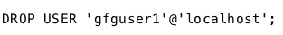
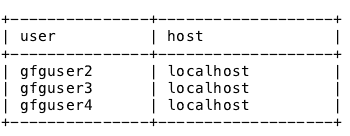
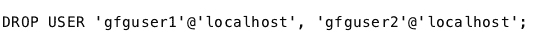
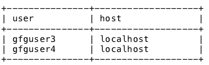

# MySQL | DROP USER

> 原文:[https://www.geeksforgeeks.org/mysql-drop-user/](https://www.geeksforgeeks.org/mysql-drop-user/)

MySQL 中的 DROP USER 语句可用于从 MySQL 中完全删除用户帐户及其权限。但是在使用 drop user 语句之前，应该撤销用户的权限，或者换句话说，如果用户没有权限，那么 drop user 语句可以用来将用户从 Mysql 数据库服务器中删除。

**语法:**

```sql
DROP USER 'user'@'host';

```

**参数** :
**1。用户:**是您要删除的用户帐户的用户名。
**2。主机:**是用户账户的主机服务器名称。用户名应采用以下格式
**“user _ name”@“host _ name”**。

假设 MySQL 数据库服务器中有 4 个用户，如下所示:


我们可以使用如下所示的一个 DROP USER 语句删除单个用户帐户和多个用户帐户:

*   **Dropping a single user using the DROP USER statement**: To drop the user account with the username “gfguser1”, the drop user statement should be executed as follows:

    **语法:**
    

    **输出:**
    表执行后的 drop 用户语句会如下:
    

*   **Dropping multiple users using the DROP USER statement**: The Drop User statement can be used to drop multiple user accounts at once. To drop two user account “gfguser2” and “gfguser1” from the table mentioned above,the drop user statement should be executed as follows:

    **语法:**
    

    **输出:**
    表执行完上面的 drop 用户语句后会如下:
    

**注意:**如果在用户帐户的会话处于活动状态时，对该帐户执行 DROP USER 语句，则在该帐户的会话关闭之前，该语句不会影响该帐户。用户帐户将在其会话关闭后被删除，并且将无法再登录。

**参考文献**:

*   [https://dev . MySQL . com/doc/ref man/5.7/en/drop-user . html](https://dev.mysql.com/doc/refman/5.7/en/drop-user.html)