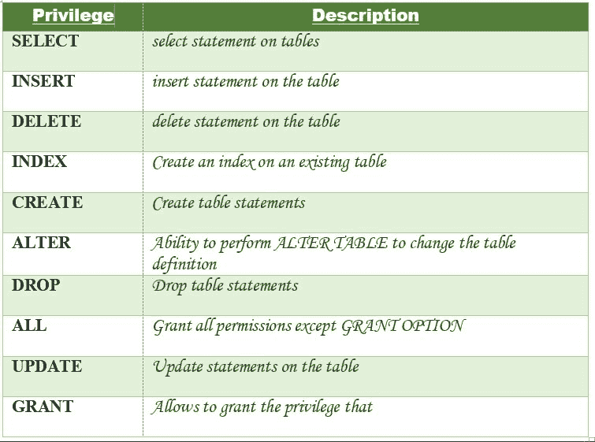

# MySQL |授予/撤销权限

> 原文:[https://www . geesforgeks . org/MySQL-grant-revoke-privileges/](https://www.geeksforgeeks.org/mysql-grant-revoke-privileges/)

**授予特权**

我们已经了解了如何使用 [MySQL |创建用户语句](https://www.geeksforgeeks.org/mysql-create-user-statement/)在 MySQL 中创建用户。但是使用创建用户语句只会创建一个新用户，而不会授予用户帐户任何权限。因此，要授予用户帐户权限，需要使用 grant 语句。

**语法:**

```sql
GRANT privileges_names ON object TO user;
```

**使用的参数**:

*   **权限 _ 名称**:这些是授予用户的访问权限或权限。
*   **对象:**是被授予权限的数据库对象的名称。在授予表权限的情况下，这将是表名。
*   **用户:**是将被授予权限的用户的名称。

**权限** :
下面列出了可以授予用户的权限以及说明:


现在让我们了解授予用户权限的不同方式:

1.  **向表中的用户授予 Select 权限**:要向用户名为 Amit 的名为“users”的表授予 SELECT 权限，应执行以下 grant 语句。

    ```sql
    GRANT SELECT ON Users TO'Amit'@'localhost;
    ```

2.  **向表中的用户授予多个权限**:要向表“用户”中名为“阿米特”的用户授予多个权限，应执行以下 grant 语句。

    ```sql
    GRANT SELECT, INSERT, DELETE, UPDATE ON Users TO 'Amit'@'localhost;
    ```

3.  **向表中的用户授予所有权限**:要向表“用户”中名为“阿米特”的用户授予所有权限，应执行以下授予语句。

    ```sql
    GRANT ALL ON Users TO 'Amit'@'localhost;
    ```

4.  **Granting a Privilege to all Users in a Table**: To Grant a specific privilege to all the users in a table “users”, the following Grant statement should be executed.

    ```sql
    GRANT SELECT  ON Users TO '*'@'localhost;
    ```

    在上例中，“*”符号用于向表“用户”的所有用户授予选择权限。

5.  **Granting Privileges on Functions/Procedures**: While using functions and procedures, the Grant statement can be used to grant users the ability to execute the functions and procedures in MySQL.

    **授予执行权限**:执行权限赋予执行功能或过程的能力。

    **语法:**

    ```sql
    GRANT EXECUTE ON [ PROCEDURE | FUNCTION ] object TO user; 
    ```

    授予执行权限的不同方式:

    *   **授予 MySQL 中某个函数的 EXECUTE 权限。**:如果有一个名为“CalculateSalary”的函数，并且您想授予名为 Amit 的用户 EXECUTE 访问权限，那么应该执行下面的 grant 语句。

        ```sql
        GRANT EXECUTE ON FUNCTION Calculatesalary TO 'Amit'@localhost';
        ```

    *   **授予所有用户对 MySQL 中某个函数的执行权限。**:如果有一个名为“CalculateSalary”的函数，并且您想授予所有用户 EXECUTE 访问权限，那么应该执行下面的 grant 语句。

        ```sql
        GRANT EXECUTE ON FUNCTION Calculatesalary TO '*'@localhost'; 
        ```

    *   **授予用户在 MySQL 过程中的执行权限。**:如果有一个名为“DBMSProcedure”的过程，并且您想授予名为 Amit 的用户 EXECUTE 访问权限，那么应该执行下面的 grant 语句。

        ```sql
        GRANT EXECUTE ON PROCEDURE DBMSProcedure TO 'Amit'@localhost'; 
        ```

    *   **授予所有用户对 MySQL 中某个过程的执行权限。**:如果有一个名为“DBMSProcedure”的过程，并且您想授予所有用户 EXECUTE 访问权限，那么应该执行下面的 grant 语句。

        ```sql
        GRANT EXECUTE ON PROCEDURE DBMSProcedure TO '*'@localhost'; 
        ```

**检查授予用户的权限**:要查看表中授予用户的权限，使用 SHOW GRANTS 语句。要检查授予名为“Amit”的用户和作为“localhost”的主机的权限，将执行以下 SHOW GRANTS 语句:

```sql
SHOW GRANTS FOR  'Amit'@localhost'; 
```

**输出:**

```sql
GRANTS FOR  Amit@localhost 

GRANT USAGE ON *.* TO `SUPER`@localhost` 

```

**从表中撤销权限**

撤销语句用于撤销过去授予用户的部分或全部权限。

**语法:**

```sql
REVOKE privileges ON object FROM user;

```

**使用的参数**:

*   **对象:**是被撤销权限的数据库对象的名称。在撤销表权限的情况下，这将是表名。
*   **用户:**是被撤销权限的用户的名称。

**特权**
特权可以是以下值:


撤销用户权限的不同方式:

1.  **撤销表中用户的选择权限**:要撤销用户名为 Amit 的“用户”表的选择权限，应执行以下撤销语句。

    ```sql
    REVOKE SELECT ON  users TO 'Amit'@localhost'; 
    ```

2.  **撤销表中用户的多个权限**:要撤销表“用户”中名为“阿米特”的用户的多个权限，应执行以下撤销语句。

    ```sql
    REVOKE SELECT, INSERT, DELETE, UPDATE ON Users TO 'Amit'@'localhost; 
    ```

3.  **撤销表**中用户的所有权限:要撤销表“users”中名为“Amit”的用户的所有权限，应执行以下撤销语句。

    ```sql
    REVOKE ALL ON Users TO 'Amit'@'localhost; 
    ```

4.  **撤销表中所有用户的权限**:要撤销表“用户”中所有用户的特定权限，应执行以下撤销语句。

    ```sql
    REVOKE SELECT  ON Users TO '*'@'localhost; 
    ```

5.  **Revoking Privileges on Functions/Procedures**: While using functions and procedures, the revoke statement can be used to revoke the privileges from users which have been EXECUTE privileges in the past.

    **语法:**

    ```sql
    REVOKE EXECUTE ON [ PROCEDURE | FUNCTION ] object FROM user; 
    ```

    *   **撤销 MySQL 中某个函数的 EXECUTE 权限。**:如果有一个名为“CalculateSalary”的函数，你想撤销对名为 Amit 的用户的 EXECUTE 访问，那么应该执行下面的撤销语句。

        ```sql
        REVOKE EXECUTE ON FUNCTION Calculatesalary TO 'Amit'@localhost'; 
        ```

    *   **撤销 MySQL 中某个函数对所有用户的 EXECUTE 权限。**:如果有一个函数叫做“CalculateSalary”，你想撤销所有用户的 EXECUTE 访问权限，那么应该执行下面的撤销语句。

        ```sql
        REVOKE EXECUTE ON FUNCTION Calculatesalary TO '*'@localhost'; 
        ```

    *   **撤销用户在 MySQL 过程中的执行权限。**:如果有一个名为“DBMSProcedure”的过程，并且您想要撤销对名为 Amit 的用户的 EXECUTE 访问，那么应该执行下面的撤销语句。

        ```sql
        REVOKE EXECUTE ON PROCEDURE DBMSProcedure TO 'Amit'@localhost'; 
        ```

    *   **撤销所有用户对 MySQL 中某个过程的执行权限。**:如果有一个名为“DBMSProcedure”的过程，并且您想要撤销对所有用户的 EXECUTE 访问权限，那么应该执行下面的撤销语句。

        ```sql
        REVOKE EXECUTE ON PROCEDURE DBMSProcedure TO '*'@localhost'; 
        ```