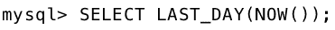
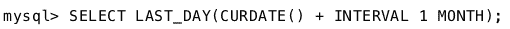

# MySQL | LAST_DAY()函数

> 原文:[https://www.geeksforgeeks.org/mysql-last_day-function/](https://www.geeksforgeeks.org/mysql-last_day-function/)

MySQL 中的 LAST_DAY()函数可以用来知道给定日期或日期时间的一个月的最后一天。LAST_DAY()函数以*日期*值为参数，返回该*日期*中的最后一天。*日期*参数表示有效的日期或日期时间。

**语法:**

```sql
LAST_DAY( Date );

```

如果日期或日期时间值无效，函数将返回空值。

**使用的参数:**
*日期:*LAST _ DAY()函数采用单个参数 Date。它是要提取该月最后一天的日期或日期时间值。

**返回值**:
LAST _ DAY()函数为有效的*日期*参数返回一个月的最后一天。如果参数*日期*无效或为空，则函数也将返回空。

以下是 LAST_DAY()函数的一些常见示例或用法:

1.  **Extracting last day from a given date**:
    To know the last date of the month December 2017,the LAST_DAY() function can be executed in the following way:
    **Syntax :**
    
    **Output :**

    ```sql
    '2017-12-31'
    ```

2.  **Extracting the last day from a given datetime**:
    To know the last date of the month December using datetime format,the LAST_DAY() function can be executed in the following way:
    **Syntax :**
    
    **Output :**

    ```sql
    '2017-12-31'
    ```

3.  **Checking whether it is a leap year or not**:
    To know whether the year is a leap year or not, we can use the LAST_DAY() function to check the last day of the month February of that year. If it is the 29th day then that year is leap otherwise not.
    **Syntax :**
    
    **Output :**

    ```sql
    '2016-02-29'
    ```

4.  **Extracting the last day for the current month**:
    To know the last date of the current month ,the LAST_DAY() function is combined with the NOW() or CURDATE() function and can be executed in the following way:
    **Using the NOW() function**: The NOW() function in MySQL returns the current date-time stamp.
    **Syntax :**
    
    **Output :**

    ```sql
    '2017-12-31'
    ```

5.  **Using the CURDATE() function**: The CURDATE() function in MySQL return the current date in Date format.
    **Syntax :**
    
    **Output :**

    ```sql
    '2017-12-31'
    ```

6.  **提取次月最后一天** :
    要知道次月最后一天，可以通过以下方式执行 last_day()函数:
    **语法:**
    
    **输出:**

    ```sql
    '2018-01-31'
    ```