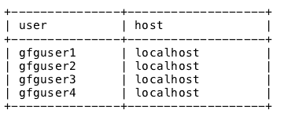
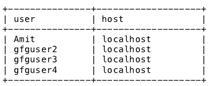
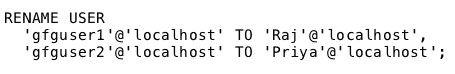
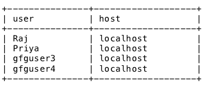

# MySQL |重命名用户

> 原文:[https://www.geeksforgeeks.org/mysql-rename-user/](https://www.geeksforgeeks.org/mysql-rename-user/)

如果 MySQL 管理员想要在不改变用户帐户权限的情况下更改现有 MySQL 用户帐户的用户名或主机，可以在 MySQL 中使用 RENAME USER 语句。

**语法:**

```
RENAME USER 'username'@'host' TO 'new_username'@'host';

```

**使用的参数**:

1.  **用户名:**是你要重命名的用户账号的用户名。
2.  **new_username:** 是要分配给用户的新名称。

假设 MySQL 数据库服务器中有 4 个用户，如下所示:


现在让我们了解如何使用 RENAME USER 语句重命名用户:

1.  **使用 rename user 语句**重命名单个用户:要使用用户名“gfguser1”重命名用户帐户，RENAME USER 语句应执行如下:

    **语法:**
    

    **输出:**
    执行 RENAME USER 语句后的表将如下:
    

2.  **使用 RENAME USER 语句**重命名多个用户:RENAME USER 语句可用于一次重命名多个用户账户。要从上面提到的表中重命名两个用户帐户“gfguser2”和“gfguser1”，RENAME USER 语句应该如下执行:

    **语法:**
    

    **输出:**
    执行上述重命名用户语句后的表将如下所示:
    