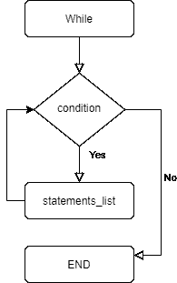

# MySQL WHILE 循环

> 原文:[https://www.geeksforgeeks.org/mysql-while-loop/](https://www.geeksforgeeks.org/mysql-while-loop/)

在此，我们将介绍 MySQL [WHILE Loop](https://www.geeksforgeeks.org/c-c-while-loop-with-examples/) 的概述，然后将介绍每个示例的算法，然后将看到每个示例的分析。我们一个一个来讨论。

**简介:**
[MySQL](https://www.geeksforgeeks.org/mysql-common-mysql-queries/) WHILE 循环语句用于反复执行一个或多个语句，只要某个条件为真。当条件为真时，当我们需要重复执行任务时，我们可以使用循环。
**注意–**
使用 WHILE LOOP 语句，以防您不确定希望循环体执行多少次。因为 WHILE 条件是在进入循环之前计算的，所以循环体可能甚至不会执行一次。

**语法:**

```
[label_name:] WHILE 
condition DO 
  statements_list
END WHILE [label_name]
```

**语法标签含义–**

*   **Label _ name–**
    Label _ name**是可选的，它是一个与 WHILE 循环相关的名称。**
*   ****条件–**
    条件通过 WHILE 循环进行测试。如果条件结果为真，则执行语句列表，或者如果条件结果为假，则终止 WHILE 循环。**
*   ****Statements _ list–**
    Statements _ list 是指要执行的语句列表能够经受 WHILE 循环。**

****While 循环框图:****

**

WHILE 循环框图** 

****MySQL WHILE 循环示例:****

****示例-1 :**
让我们使用 while 循环创建一个函数。**

```
DELIMITER $
CREATE FUNCTION GeekInc ( value INT )
RETURNS INT
BEGIN
  DECLARE inc INT;
  SET inc = 0;
  label: 
WHILE inc <= 30000 DO
    SET inc = inc + value;
  END 
WHILE label;
  RETURN inc;
END; $
DELIMITER ;
```

****分析–****

*   **值是极客公司功能的输入。**
*   **inc 被声明并设置为 0。**
*   **当 inc 小于等于 3000 时，它会将 inc 设置为 inc +值。**

**要检查输出，请使用下面给出的命令。**

```
CALL GeekInc(10000);
```

****输出–****

```
0, 10000, 20000, 30000
```

****示例-2 :**
让我们使用 while 循环创建一个过程。**

```
DELIMITER $
CREATE procedure while_ex()
block: BEGIN
 declare value VARCHAR(20) default ' ' ;
 declare num INT default 0;
 SET num = 1;
 WHILE num <= 5 DO
   SET value = CONCAT(value, num ,',' );
   SET num = num + 1;
 END
 WHILE block;
 select value ;
END $
DELIMITER ;
```

****分析–****

*   **创建 while_ex 过程，并声明值和 num。**
*   **将 num 设置为 1，而 num 等于或小于 5 do**
*   **将值设置为等于值和数字的连接。**

**要检查输出，请使用下面给出的命令。**

```
call while_ex();
```

****输出–****

<figure class="table">

| value |
| --- |
| 1、2、3、4、5 |

</figure>

****示例-3 :**
让我们创建一个表“Test_Cal”，其日期如下。**

```
CREATE TABLE Test_Cal(
   t_in INT AUTO_INCREMENT,
   fulldate DATE UNIQUE,
   day TINYINT NOT NULL,
   month TINYINT NOT NULL,
   PRIMARY KEY(id)
);
```

**现在，创建一个存储过程，将数据插入表中，如下所示。**

```
DELIMITER $
CREATE PROCEDURE InsertCal(dt DATE)
BEGIN
   INSERT INTO Test_Cal(
       fulldate,
       day,
       month )
   VALUES(dt,  
       EXTRACT(DAY FROM dt),
       EXTRACT(MONTH FROM dt)
     );
END$
DELIMITER ;
```

**现在创建存储过程 LoadCal()，将从开始日期开始的天数更新到表中。**

```
DELIMITER $
CREATE PROCEDURE LoadCal(
   startDate DATE,  
   day INT
)
BEGIN
      DECLARE counter INT DEFAULT 1;
   DECLARE dt DATE DEFAULT startDate;
   WHILE counter <= day DO
       CALL InsertCal(dt);
       SET counter = counter + 1;
       SET dt = DATE_ADD(dt,INTERVAL 1 day);
   END WHILE;
END$
DELIMITER ;
```

****分析–****

*   **存储过程 LoadCal()有两个参数:开始日期和日期。**
*   **首先，声明一个计数器和 dt 变量来保存值。**
*   **然后，检查计数器是否小于或等于天，如果是:**
*   **运行存储过程惯性()在 Test_Cal 表中插入一行。**
*   **计数器增加 1，使用 DATE_ADD()将 dt 增加 1 天。**
*   **WHILE 循环将日期插入表中，直到计数器与日期相同。**

**要检查输出，请使用下面给出的命令。**

```
CALL LoadCal('2021-01-01',31);
select * from Test_Cal where tid < 10 ;
```

****输出─****

<figure class="table">**5**

|  | 【完整日期】 | [month] | 【2021-01-05】 |  |  |
| --- | --- | --- | --- | --- | --- |
| 【2021-01-06】 |

</figure>