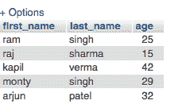

# PHP |插入 MySQL 数据库

> 原文:[https://www . geesforgeks . org/PHP-insert-in-MySQL-database/](https://www.geeksforgeeks.org/php-inserting-into-mysql-database/)

先决条件: [MySQL 简介](https://www.geeksforgeeks.org/php-mysql-database-introduction/)，[创建 MySQL 数据库](https://www.geeksforgeeks.org/php-mysql-creating-database/)
**INSERT INTO** 语句用于在数据库表中插入新行。考虑到数据库已经存在，让我们看看如何插入到表中的语法。

**语法:**

```
INSERT INTO TABLE_NAME (column1, column2, column3, ... columnN) 
VALUES (value1, value2, value3, ...valueN);
```

这里，column1、column2、column3、…column 是表中要插入数据的列的名称。

如果要为表的所有列添加值，可能不需要在 SQL 查询中指定列名。但是请确保值的顺序与表中列的顺序相同。

因此，要使用带有适当值的 INSERT INTO 语句创建一个 SQL 查询，这里有一个示例，它将通过为名字、姓氏和电子邮件字段指定值，向 newDB 表中插入一个新行。

1.  **Creating table using MySQLi Object-oriented Procedure :**

    ```
    <?php
     $mysqli = new mysqli("localhost", "root", "", "newdb");

    if ($mysqli == = false) {
        die("ERROR: Could not connect. ".$mysqli->connect_error);
    }

    $sql = "INSERT INTO mytable (first_name, last_name, age)
                  VALUES('ram', 'singh', '25') ";
        if ($mysqli->query($sql) == = true)
    {
        echo "Records inserted successfully.";
    }
    else
    {
        echo "ERROR: Could not able to execute $sql. "
               .$mysqli->error;
    }

    // Close connection
    $mysqli->close();
    ? >
    ```

    **输出:**
    

2.  **Creating table using MySQLi Procedural Procedure :**

    ```
    <?php 
    $link = mysqli_connect("localhost", "root", "", "newdb");

    if ($link == = false) {
        die("ERROR: Could not connect. ".mysqli_connect_error());
    }

    $sql = "INSERT INTO mytable (first_name, last_name, age) 
              VALUES('ram', 'singh', '25') ";
        if (mysqli_query($link, $sql))
    {
        echo "Records inserted successfully.";
    }
    else
    {
        echo "ERROR: Could not able to execute $sql. "
            .mysqli_error($link);
    }

    mysqli_close($link);
    ? >
    ```

    **输出:**
    

3.  **Creating table using MySQLi PDO Procedure :**

    ```
    <?php
    try {
       $pdo = new PDO("mysql:host=localhost;dbname=newdb",
                         "root", "");
       $pdo->setAttribute(PDO::ATTR_ERRMODE,
                            PDO::ERRMODE_EXCEPTION);
    }
    catch (PDOException $e) {
        die("ERROR: Could not connect. ".$e->getMessage());
    }

    try {
        $sql = "INSERT INTO mytable (first_name, last_name, age) 
               VALUES('ram', 'singh', '25') ";    
               $pdo->exec($sql);
        echo "Records inserted successfully.";
    }
    catch (PDOException $e) {
        die("ERROR: Could not able to execute $sql. "
                .$e->getMessage());
    }

    // Close connection
    unset($pdo);
    ? >
    ```

    **输出:**
    

**该表的值可以在 MySql 数据库中查看为–**


### 在表格中插入多行

也可以用一个插入查询一次向表中插入多行。为此，请在 INSERT INTO 语句中包含多个列值列表，其中每行的列值必须用括号括起来，并用逗号分隔。

1.  **Creating table using MySQLi Object-oriented Procedure :**

    ```
    <?php 
    $mysqli = new mysqli("localhost", "root", "", "newdb");

    if ($mysqli == = false) {
        die("ERROR: Could not connect. ".$mysqli->connect_error);
    }

    $sql = "INSERT INTO mytable (first_name, last_name, age) 
               VALUES('raj', 'sharma', '15'),
        ('kapil', 'verma', '42'),
        ('monty', 'singh', '29'),
        ('arjun', 'patel', '32') ";
        if ($mysqli->query($sql) == = true)
    {
        echo "Records inserted successfully.";
    }
    else
    {
        echo "ERROR: Could not able to execute $sql. "
            .$mysqli->error;
    }

    $mysqli->close();
    ? >
    ```

    **输出:**
    

2.  **Creating table using MySQLi Procedural Procedure :**

    ```
    <?php 
    $link = mysqli_connect("localhost", "root", "", "newdb");

    if ($link == = false) {
        die("ERROR: Could not connect. ".mysqli_connect_error());
    }

    $sql = "INSERT INTO mytable (first_name, last_name, age) 
              VALUES('raj', 'sharma', '15'),
        ('kapil', 'verma', '42'),
        ('monty', 'singh', '29'),
        ('arjun', 'patel', '32') ";
        if (mysqli_query($link, $sql))
    {
        echo "Records added successfully.";
    }
    else
    {
        echo "ERROR: Could not able to execute $sql. "
            .mysqli_error($link);
    }

    // Close connection
    mysqli_close($link);
    ? >
    ```

    **输出:**
    

3.  **使用 MySQL PDO 程序创建表:**

    ```
    <?php 
    try {
        $pdo = new PDO("mysql:host=localhost;dbname="newdb",
                          "root", "");
        $pdo->setAttribute(PDO::ATTR_ERRMODE, 
                              PDO::ERRMODE_EXCEPTION);
    }
    catch (PDOException $e) {
        die("ERROR: Could not connect. ".$e->getMessage());
    }

    try {
        $sql = "INSERT INTO mytable (first_name, last_name, age)
             VALUES('raj', 'sharma', '15'),
                   ('kapil', 'verma', '42'),
                   ('monty', 'singh', '29'),
                   ('arjun', 'patel', '32') ";   
         $pdo->exec($sql);
        echo "Records inserted successfully.";
    }
    catch (PDOException $e) {
        die("ERROR: Could not able to execute $sql. "
                 .$e->getMessage());
    }
    unset($pdo);
    ? >
    ```

**输出:**


**该表的值可以在 MySql 数据库中查看为–**
