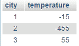
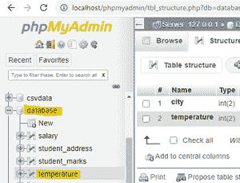
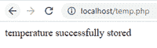
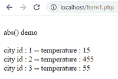

# PHP–我的 SQL:ABS()–数值函数

> 原文:[https://www . geesforgeks . org/PHP-my-SQL-ABS-numeric-function/](https://www.geeksforgeeks.org/php-my-sql-abs-numeric-function/)

**问题陈述**:

在本文中，我们将使用 php 通过 abs()操作来执行数据库操作。

所以我们正在考虑温度数据库。

**简介:**

PHP 代表超文本预处理器，它还通过 xampp 服务器与 mysql 数据库通信。

MySQL 是一种用于管理数据库的查询语言。

abs()

abs()用于返回表中的正值。

**语法:**

> abs(数据)；

**示例:**

abs(-12)=12

abs(23) = 23

考虑一下表格:



将温度栏转换为正值。

**查询:**

> 从温度中选择城市、绝对温度；

**结果:**

> 城市 id : 1 —温度:15
> 
> 城市 id : 2 —温度:455
> 
> 城市 id : 3 —温度:55

**步骤**

*   启动 xampp 服务器


*   创建名为 database 的数据库并创建名为 temperature 的表。



*   编写 php 代码将记录插入表中。

temp.php

## 服务器端编程语言（Professional Hypertext Preprocessor 的缩写）

```sql
<?php
//servername
$servername = "localhost";
//username
$username = "root";
//empty password
$password = "";
//database is the database name
$dbname = "database";

// Create connection by passing these connection parameters
$conn = new mysqli($servername, $username, $password, $dbname);
// Check this connection
if ($conn->connect_error) {
  die("Connection failed: " . $conn->connect_error);
}
//insert records into table
$sql  = "INSERT INTO temperature VALUES (1,-15);";
$sql .= "INSERT INTO temperature VALUES (2,-455);";
$sql .= "INSERT INTO temperature VALUES (3,55);";

if ($conn->multi_query($sql) === TRUE) {
  echo "temperature successfully stored";
} else {
  echo "Error: " . $sql . "<br>" . $conn->error;
}

$conn->close();
?>
```

输出:

localhost/temp.php

 

*   通过将温度负值转换为正值来执行 abs()函数的 PHP 代码

form1.php

## 服务器端编程语言（Professional Hypertext Preprocessor 的缩写）

```sql
<html>
<body>
<?php
//servername
$servername = "localhost";
//username
$username = "root";
//empty password
$password = "";
//database is the database name
$dbname = "database";
// Create connection by passing these connection parameters
$conn = new mysqli($servername, $username, $password, $dbname);
echo "<br>";
echo "abs() demo";
echo "<br>";
echo "<br>";
//sql query
$sql = "SELECT city,ABS(temperature) FROM temperature";
$result = $conn->query($sql);
//display data on web page
while($row = mysqli_fetch_array($result)){
    echo " city id  : ". $row['city']," --    temperature : ". $row['ABS(temperature)'];
    echo "<br>";
}
//close the connection
$conn->close();
?>
</body>
</html>
```

**输出:**

