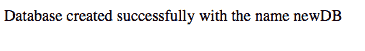

# PHP | MySQL(创建数据库)

> 原文:[https://www.geeksforgeeks.org/php-mysql-creating-database/](https://www.geeksforgeeks.org/php-mysql-creating-database/)

**什么是数据库？**
[数据库](https://www.geeksforgeeks.org/database-management-system-introduction-set-1/)是相互关联的数据的集合，有助于从数据库中高效地检索、插入和删除数据，并以表格、视图、模式、报告等形式组织数据。例如，大学数据库组织关于学生、教师和管理人员等的数据。这有助于有效地从中检索、插入和删除数据。

我们知道，在 MySQL 中，为了创建数据库，我们需要执行一个查询。您可以参考[这篇](https://www.geeksforgeeks.org/sql-create/)文章中的 SQL 查询来创建数据库。

使用 PHP 创建 MySQL 数据库的基本步骤是:

*   按照本文中的描述，从您的 PHP 脚本建立到 MySQL 服务器的连接。
*   如果连接成功，编写一个 SQL 查询来创建一个数据库，并将其存储在一个字符串变量中。
*   执行查询。

我们已经学习了在 PHP 中建立连接和创建变量。我们可以用 3 种不同的方式执行 PHP 脚本中的查询，如下所述:

1.  **Using MySQLi Object-oriented procedure**: If the MySQL connection is established using Object-oriented procedure then we can use the query() function of mysqli class to execute our query as described in the below syntax.

    **语法**:

    ```sql
    <?php
    $servername = "localhost";
    $username = "username";
    $password = "password";

    // Creating a connection
    $conn = new mysqli($servername, $username, $password);
    // Check connection
    if ($conn->connect_error) {
        die("Connection failed: " . $conn->connect_error);
    } 
    // Creating a database named newDB
    $sql = "CREATE DATABASE newDB";
    if ($conn->query($sql) === TRUE) {
        echo "Database created successfully with the name newDB";
    } else {
        echo "Error creating database: " . $conn->error;
    }

    // closing connection
    $conn->close();
    ?>

    ```

    **注意:**每当创建数据库时，为 mysqli 对象指定三个参数 servername、username 和 password。

    **输出** :
    

2.  **Using MySQLi Procedural procedure**: If the MySQL connection is established using procedural procedure then we can use the mysqli_query() function of PHP to execute our query as described in the below syntax.

    **语法**:

    ```sql
    <?php
    $servername = "localhost";
    $username = "username";
    $password = "password";

    // Creating connection
    $conn = mysqli_connect($servername, $username, $password);
    // Checking connection
    if (!$conn) {
        die("Connection failed: " . mysqli_connect_error());
    }

    // Creating a database named newDB
    $sql = "CREATE DATABASE newDB";
    if (mysqli_query($conn, $sql)) {
        echo "Database created successfully with the name newDB";
    } else {
        echo "Error creating database: " . mysqli_error($conn);
    }

    // closing connection
    mysqli_close($conn);
    ?>

    ```

    **输出** :
    

3.  **Using PDO procedure**: If the MySQL connection is established using PDO procedure then we can execute our query as described in the below syntax.

    **语法**:

    ```sql
    <?php
    $servername = "localhost";
    $username = "username";
    $password = "password";

    try {
        $conn = new PDO("mysql:host=$servername;dbname=newDB", $username, $password);
        // setting the PDO error mode to exception
        $conn->setAttribute(PDO::ATTR_ERRMODE, PDO::ERRMODE_EXCEPTION);
        $sql = "CREATE DATABASE newDB";
        // using exec() because no results are returned
        $conn->exec($sql);
        echo "Database created successfully with the name newDB";
        }
    catch(PDOException $e)
        {
        echo $sql . "
    " . $e->getMessage();
        }
    $conn = null;
    ?>

    ```

    **注意:**PDO 的异常类用于处理我们的数据库查询中可能出现的任何问题。如果在 try{ }块中引发异常，脚本将停止执行，并直接流向第一个 catch(){ }块。

    **输出** :
    