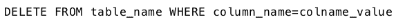
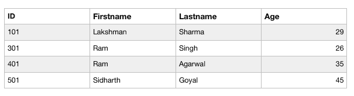
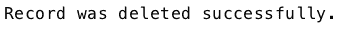

# PHP | MySQL 删除查询

> 原文:[https://www.geeksforgeeks.org/php-mysql-delete-query/](https://www.geeksforgeeks.org/php-mysql-delete-query/)

**DELETE** 查询用于从数据库表中删除记录。
通常与“选择”语句一起使用，仅删除满足特定条件的记录。

**语法:**
删除查询的基本语法是–


让我们考虑下表“数据”，其中有四列“身份证”、“名字”、“姓氏”和“年龄”。


要从“数据”表中删除标识为 201 的人员的记录，可以使用以下代码。

**使用程序方法删除查询:**

```sql
<?php
$link = mysqli_connect("localhost", "root", "", "Mydb");

if($link === false){
    die("ERROR: Could not connect. " . mysqli_connect_error());
}

$sql = "DELETE FROM Data WHERE ID=201";
if(mysqli_query($link, $sql)){
    echo "Record was deleted successfully.";
} 
else{
    echo "ERROR: Could not able to execute $sql. " 
                                   . mysqli_error($link);
}
mysqli_close($link);
?>
```

**输出:**
上升后的表–
T5】

网络浏览器上的输出:


**使用面向对象方法删除查询:**

```sql
<?php
$mysqli = new mysqli("localhost", "root", "", "Mydb");

if($mysqli === false){
    die("ERROR: Could not connect. " . $mysqli->connect_error);
}

$sql = "DELETE FROM Data WHERE ID=201";
if($mysqli->query($sql) === true){
    echo "Record was deleted successfully.";
} else{
    echo "ERROR: Could not able to execute $sql. " 
                                         . $mysqli->error;
}

$mysqli->close();
?>
```

**输出:**
上升后的表–
T5】

网络浏览器上的输出:


**使用 PDO 方法删除查询:**

```sql
<?php
try{
    $pdo = new PDO("mysql:host=localhost;
                        dbname=Mydb", "root", "");
    $pdo->setAttribute(PDO::ATTR_ERRMODE, 
                          PDO::ERRMODE_EXCEPTION);
} catch(PDOException $e){
    die("ERROR: Could not connect. " . $e->getMessage());
}

try{
    $sql = "DELETE FROM Data WHERE ID=201";
    $pdo->exec($sql);
    echo "Record was deleted successfully.";
} catch(PDOException $e){
    die("ERROR: Could not able to execute $sql. "
                                . $e->getMessage());
}
unset($pdo);
?>
```

**输出:**
上升后的表–
T5】

网络浏览器上的输出:
