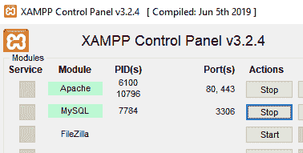
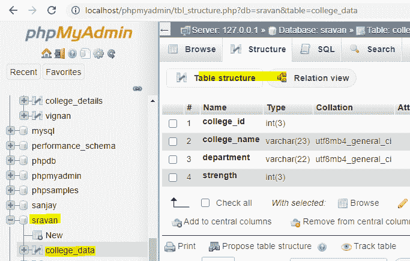
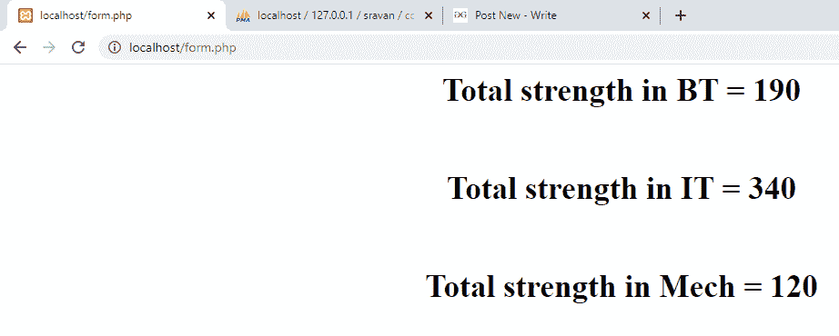

# PHP–MySQL 分组依据条款

> 原文:[https://www.geeksforgeeks.org/php-mysql-group-by-clause/](https://www.geeksforgeeks.org/php-mysql-group-by-clause/)

在本文中，我们将使用 GROUP BY 子句将 PHP 代码连接到数据库以执行聚合操作。在这里，在这篇文章中，我们将总结学院相对于院系的实力，并将其显示在网页上。我们一个一个来讨论。

**要求–**[xampp 服务器](https://www.geeksforgeeks.org/how-to-install-xampp-on-windows/)

**概述:**

1.  **PHP–**
    PHP 代表炒作文本预处理器。它用于创建动态网页，并可以通过使用 Xampp 服务器与 MySQL 数据库连接。

2.  **MySQL–**
    MySQL 是一种用于管理数据库的查询语言。GROUP BY 语句用于通过使用聚合操作将数据排列成组。

**注:**

1.  在 SELECT 语句查询中，GROUP BY 子句与 SELECT 语句一起使用。
2.  在查询中，GROUP BY 子句放在 WHERE 子句之后。
3.  “分组依据”将出现在“订单依据”条款(如果使用)之前。

**聚合操作:**
聚合操作包括 sum()、min()、max()、count()等。

**语法:**

```sql
SELECT column1,column2,.....columnn, function_name(columnn)
FROM table_data 
WHERE condition
GROUP BY column1, column2;
```

**进场:**

*   在 xampp 中创建数据库。
*   在数据库中创建一个表
*   使用 PHP 代码将记录插入其中。
*   使用 group by 子句从表中获取所需数据的 PHP 脚本

**实现步骤:**
这里，我们将逐步实现，与 GROUP BY 子句一起执行聚合操作。让我们看看。

*   启动 xampp 服务器



*   创建一个名为 sravan 的数据库，并创建一个名为 college_data 的包含 4 列的表。



*   打开记事本，写下插入记录的代码，
*   将文件保存在名为 data1.php 的 xampp 文件夹下

**PHP 代码实现:**
代码显示在学院数据库中插入学院详细信息。

## 服务器端编程语言（Professional Hypertext Preprocessor 的缩写）

```sql
<?php
//servername
$servername = "localhost";
//username
$username = "root";
//empty password
$password = "";
//sravan is the database name
$dbname = "sravan";

// Create connection by passing these connection parameters
$conn = new mysqli($servername, $username, $password, $dbname);
// Check this connection
if ($conn->connect_error) {
  die("Connection failed: " . $conn->connect_error);
}
//insert records into table
$sql  = "INSERT INTO college_data VALUES (1,'vignan','IT',120);";
$sql .= "INSERT INTO college_data VALUES (1,'vignan','BT',190);";
$sql .= "INSERT INTO college_data VALUES (1,'vignan','Mech',120);";
$sql .= "INSERT INTO college_data VALUES (2,'vvit','IT',220);";

if ($conn->multi_query($sql) === TRUE) {
  echo "data stored successfully";
} else {
  echo "Error: " . $sql . "<br>" . $conn->error;
}

$conn->close();
?>
```

通过键入 **localhost/data1.php** 在浏览器中运行文件

**输出:**


**表资料─**

<figure class="table">

| [College id] | 【 name of college 】 | [department] | [strength] |
| --- | --- | --- | --- |

</figure>

**通过 PHP 代码查询:**
现在我们的表包含数据。

*   编写 PHP 代码，使用 group by 子句找到部门实力的总和。
*   将文件保存为 form.php

## 服务器端编程语言（Professional Hypertext Preprocessor 的缩写）

```sql
<html>
<body>
<center>
<?php
//servername
$servername = "localhost";
//username
$username = "root";
//empty password
$password = "";
//sravan is the database name
$dbname = "sravan";

// Create connection by passing these connection parameters
$conn = new mysqli($servername, $username, $password, $dbname);

//sql query to find total strength with respect to the department
$sql = "SELECT department, SUM(strength) FROM college_data GROUP BY department";
$result = $conn->query($sql);
//display data on web page
while($row = mysqli_fetch_array($result)){
    echo "<h1>" ;echo "Total strength in ". $row['department']. " = ". $row['SUM(strength)'];echo "</h1>";
      echo "<br />";
}

//close the connection

$conn->close();
?>
</center>
</body>
</html>
```

**输出:**

