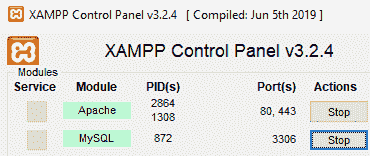
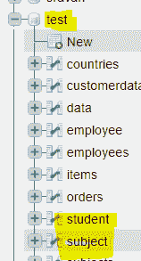
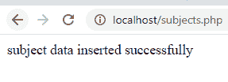
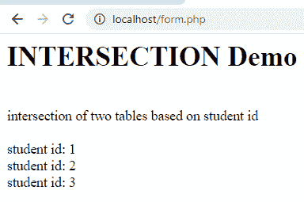

# PHP–MySQL:交集操作

> 原文:[https://www . geesforgeks . org/PHP-MySQL-intersection-operation/](https://www.geeksforgeeks.org/php-mysql-intersection-operation/)

在本文中，我们将在 xampp 服务器中使用 PHP 执行一个包含两个表交集的数据库操作。所以，我们正在利用学生数据库。

**要求–**[xampp 服务器](https://www.geeksforgeeks.org/how-to-install-xampp-on-windows/)

**简介:**

1.  **MySQL–**
    它是一种管理数据库的数据库查询语言。PHP 是一种服务器端编程语言，用于维护和操作数据库。

2.  **交集–**
    这是一个有用的运算符，用于组合选择查询，例如，如果您有两个 SELECT 语句，那么从第一个 SELECT 语句开始，它将只返回行，并且与第二个 SELECT 语句中的行相同。

**语法:**

```
SELECT column1,column2,columnn
FROM table1
[WHERE condition]
INTERSECT
SELECT column1,column2,columnn
FROM table1 [, table2 ]
[WHERE condition];
```

**例:**
考虑如下两张表。

**表-1:学生表─**

<figure class="table">

| 【id】 | 【 name 】 | [mark] | [Address] |
| --- | --- | --- | --- |

</figure>

**表-2:主体表─**

<figure class="table">

| 【样本号】 | 【学生名称】 | 【子名称】 |
| --- | --- | --- |

</figure>

**数据库操作:**
两个基于学生证的表的交集如下。

```
SELECT id FROM student 
INTERSECT 
SELECT sid FROM subject
```

**结果–**

```
student id: 1
student id: 2
student id: 3
```

**进场:**
在这里，你会看到实现路口操作的进场如下。

*   创建数据库。
*   创建表格。
*   编写 PHP 代码将记录插入到表中。
*   编写 PHP 代码执行交集运算。

**实施交叉作业的步骤:**

*   启动 xampp 服务器。



*   在 xampp 服务器中创建名为 test 的数据库和名为 student 和 subject 的表



*   表结构如下所示。

**表结构-学生:**

<figure class="table">T22】1T30】2 名称 T34

| **Table structure-student** |
| --- |
| # | name | type |
| --- | --- | --- |
| 身份证明（identification） | int(2) |

</figure>

**表结构-主题:**

<figure class="table">T22】1T26】int(2)T30】2T32】stu _ Name

| **Table Structure-Topic** |
| --- |
| # | name | type |
| --- | --- | --- |
| （同 suddenionosphericdisturbance）电离层的突然骚扰 |

</figure>

**PHP 将记录插入学生表的代码:**
文件名-student.php

## 服务器端编程语言（Professional Hypertext Preprocessor 的缩写）

```
<?php
//servername
$servername = "localhost";
//username
$username = "root";
//empty password
$password = "";
//test is the database name
$dbname = "test";

// Create connection by passing these connection parameters
$conn = new mysqli($servername, $username, $password, $dbname);
// Check this connection
if ($conn->connect_error) {
  die("Connection failed: " . $conn->connect_error);
}
//insert records into table
$sql  = "INSERT INTO student VALUES (1,'sravan kumar',98,'kakumanu');";
$sql .= "INSERT INTO student VALUES (2,'bobby',90,'kakumanu');";
$sql .= "INSERT INTO student VALUES (3,'ojaswi',89,'hyderabad');";
$sql .= "INSERT INTO student  VALUES (4,'rohith',90,'hyderabad');";
$sql .= "INSERT INTO student  VALUES (5,'gnanesh',87,'hyderabad');";

if ($conn->multi_query($sql) === TRUE) {
  echo "student data inserted successfully";
} else {
  echo "Error: " . $sql . "<br>" . $conn->error;
}

$conn->close();
?>
```

**输出:**


**将记录插入主题表:**
文件名-subjects.php

## 服务器端编程语言（Professional Hypertext Preprocessor 的缩写）

```
<?php
//servername
$servername = "localhost";
//username
$username = "root";
//empty password
$password = "";
//test is the database name
$dbname = "test";

// Create connection by passing these connection parameters
$conn = new mysqli($servername, $username, $password, $dbname);
// Check this connection
if ($conn->connect_error) {
  die("Connection failed: " . $conn->connect_error);
}
//insert records into table
$sql  = "INSERT INTO subject VALUES (1,'sravan kumar','Maths');";
$sql .= "INSERT INTO subject  VALUES (7,'ramya','social');";
$sql .= "INSERT INTO subject VALUES (2,'bobby','Maths');";
$sql .= "INSERT INTO subject VALUES (3,'ojaswi','social');";
$sql .= "INSERT INTO subject  VALUES (6,'ravi','hindi');";

if ($conn->multi_query($sql) === TRUE) {
  echo "subject data inserted successfully";
} else {
  echo "Error: " . $sql . "<br>" . $conn->error;
}

$conn->close();
?>
```

**输出:**



现在两个表中的记录如下。

**表-1:主体表─**

<figure class="table">

| 【样本号】 | 【学生名称】 | 【子名称】 |
| --- | --- | --- |

</figure>

**表-2:学生表─**

<figure class="table">

| 【id】 | 【 name 】 | [mark] | [Address] |
| --- | --- | --- | --- |

</figure>

**对 id :**
进行交集运算的 PHP 代码文件名-form.php

## 服务器端编程语言（Professional Hypertext Preprocessor 的缩写）

```
<?php
    // code
?><html>
<body>
<?php
//servername
$servername = "localhost";
//username
$username = "root";
//empty password
$password = "";
//test is the database name
$dbname = "test";

// Create connection by passing these connection parameters
$conn = new mysqli($servername, $username, $password, $dbname);
echo "<h1>"; echo "INTERSECTION  Demo "; echo"</h1>";
echo "<br>";
echo "intersection of two tables based on student id";
echo "<br>";
echo "<br>";
//sql query
$sql = "SELECT id FROM student INTERSECT SELECT sid FROM subject ";
$result = $conn->query($sql);
//display data on web page
while($row = mysqli_fetch_array($result)){
    echo " student id: ". $row['id'];
    echo "<br>";
}

//close the connection

$conn->close();
?>
</body>
</html>
```

**输出:**
localhost/form.php

