# PHP–MySQL 加入

> 原文:[https://www.geeksforgeeks.org/php-mysql-joins/](https://www.geeksforgeeks.org/php-mysql-joins/)

在本文中，我们将使用 PHP 连接两个表，并在网页上显示它们。

**简介:**

PHP 是一种服务器端脚本语言，用于连接数据库。利用这一点，我们可以使用 PHP 脚本从数据库中获取数据。可以用来和 PHP 通信的数据库语言是 MySQL。MySQL 是一种用于管理数据库的数据库查询语言。

**要求:**

Xampp 服务器–xampp 服务器用于本地存储我们的数据库。我们将使用 PHP 从 xampp 服务器访问数据。

在本文中，我们使用包含两个表的学生详细信息数据库。它们是学生地址和学生标记。

**表格结构:**

表 1 =学生地址

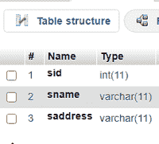

表 2 =学生分数。

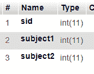

我们将在这两个表上执行内部连接、左连接、右连接。

**1。内部连接:**

INNER JOIN 是一个关键字，用于选择两个表中具有匹配值的记录。

**语法:**

```
SELECT column 1,column 2,...column n
FROM table1
INNER JOIN table2
ON table1.column_name = table2.column_name;
```

**示例:**

让学生地址包含这些详细信息

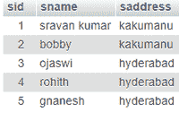

学生分数表包括

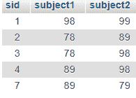

通过使用 sid，我们可以使用内部连接来连接这两个表，因为 sid 在两个表中是通用的。

*   基于内部连接显示学生地址详细信息的查询–

```
SELECT  * from student_address INNER JOIN student_marks on student_address.sid=student_marks.sid;
```

**结果:**

```
STUDENT-ID : 1 ----- NAME : sravan kumar ----- ADDRESS : kakumanu
STUDENT-ID : 2 ----- NAME : bobby ----- ADDRESS : kakumanu
STUDENT-ID : 3 ----- NAME : ojaswi ----- ADDRESS : hyderabad
STUDENT-ID : 4 ----- NAME : rohith ----- ADDRESS : hyderabad
```

*   基于内部连接显示 student_marks 详细信息的查询。

```
SELECT  * from student_marks INNER JOIN student_address on student_address.sid=student_marks.sid
```

**结果:**

```
STUDENT-ID : 1 ----- SUBJECT 1 : 98 ----- SUBJECT 2 : 99
STUDENT-ID : 2 ----- SUBJECT 1 : 78 ----- SUBJECT 2 : 89
STUDENT-ID : 3 ----- SUBJECT 1 : 78 ----- SUBJECT 2 : 98
STUDENT-ID : 4 ----- SUBJECT 1 : 89 ----- SUBJECT 2 : 98
```

**2。左连接:**

LEFT JOIN 关键字用于返回左表(表 1)中的所有记录，以及右表(表 2)中的匹配记录。

**语法:**

```
SELECT column1,column2,...columnn
FROM table1
LEFT JOIN table2
ON table1.column_name = table2.column_name;
```

*   使用左连接基于学生 id 显示所有学生地址表的查询

```
SELECT * from student_address LEFT JOIN student_marks on student_address.sid=student_marks.sid
```

**结果:**

```
STUDENT-ID : 1 ----- NAME : sravan kumar ----- ADDRESS : kakumanu
STUDENT-ID : 2 ----- NAME : bobby ----- ADDRESS : kakumanu
STUDENT-ID : 3 ----- NAME : ojaswi ----- ADDRESS : hyderabad
STUDENT-ID : 4 ----- NAME : rohith ----- ADDRESS : hyderabad
STUDENT-ID : ----- NAME : gnanesh ----- ADDRESS : hyderabad
```

*   使用左连接基于学生 id 显示所有 student_marks 表的查询

```
SELECT * from student_marks LEFT JOIN student_address on student_address.sid=student_marks.sid
```

**结果:**

```
STUDENT-ID : 1 ----- SUBJECT 1 : 98 ----- SUBJECT 2 : 99
STUDENT-ID : 2 ----- SUBJECT 1 : 78 ----- SUBJECT 2 : 89
STUDENT-ID : 3 ----- SUBJECT 1 : 78 ----- SUBJECT 2 : 98
STUDENT-ID : 4 ----- SUBJECT 1 : 89 ----- SUBJECT 2 : 98
STUDENT-ID : ----- SUBJECT 1 : 89 ----- SUBJECT 2 : 79
```

**3。右连接:**

RIGHT JOIN 关键字用于返回右表(表 2)中的所有记录，以及左表(表 1)中的匹配记录。

**语法:**

```
SELECT column1,column2,...columnn
FROM table1
RIGHT  JOIN table2
ON table1.column_name = table2.column_name;
```

*   使用右连接基于学生 id 显示所有学生地址表的查询

```
SELECT * from student_address RIGHT JOIN student_marks on student_address.sid=student_marks.sid
```

**结果:**

```
STUDENT-ID : 1 ----- NAME : sravan kumar ----- ADDRESS : kakumanu
STUDENT-ID : 2 ----- NAME : bobby ----- ADDRESS : kakumanu
STUDENT-ID : 3 ----- NAME : ojaswi ----- ADDRESS : hyderabad
STUDENT-ID : 4 ----- NAME : rohith ----- ADDRESS : hyderabad
STUDENT-ID : 7 ----- NAME : ----- ADDRESS :
```

*   使用右连接基于学生 id 显示所有 student_marks 表的查询

```
SELECT * from student_marks RIGHT JOIN student_address on student_address.sid=student_marks.sid
```

**结果:**

```
STUDENT-ID : 1 ----- SUBJECT 1 : 98 ----- SUBJECT 2 : 99
STUDENT-ID : 2 ----- SUBJECT 1 : 78 ----- SUBJECT 2 : 89
STUDENT-ID : 3 ----- SUBJECT 1 : 78 ----- SUBJECT 2 : 98
STUDENT-ID : 4 ----- SUBJECT 1 : 89 ----- SUBJECT 2 : 98
STUDENT-ID : 5 ----- SUBJECT 1 : ----- SUBJECT 2 :
```

**进场:**

*   创建名为 database 的数据库，并创建表(学生地址和学生标记)
*   使用 PHP 将记录插入两个表中
*   使用 PHP 编写 SQL 查询来执行所有连接
*   观察结果。

**步骤:**

*   启动 xampp 服务器

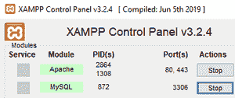

*   在浏览器中键入“localhost/phpmyadmin”并创建一个名为“database”的数据库，然后创建两个名为 student_address 和 student_marks 的表

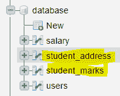

学生地址表结构:


学生标记表结构:


*   使用 PHP(data1.php)将记录插入学生地址表。通过键入“localhost/data1.php”运行代码

## 服务器端编程语言（Professional Hypertext Preprocessor 的缩写）

```
<?php
//servername
$servername = "localhost";
//username
$username = "root";
//empty password
$password = "";
//database is the database name
$dbname = "database";

// Create connection by passing these connection parameters
$conn = new mysqli($servername, $username, $password, $dbname);
// Check this connection
if ($conn->connect_error) {
  die("Connection failed: " . $conn->connect_error);
}
//insert records into table
$sql  = "INSERT INTO student_address VALUES (1,'sravan kumar','kakumanu');";
$sql .= "INSERT INTO student_address VALUES (2,'bobby','kakumanu');";
$sql .= "INSERT INTO student_address  VALUES (3,'ojaswi','hyderabad');";
$sql .= "INSERT INTO student_address  VALUES (4,'rohith','hyderabad');";
$sql .= "INSERT INTO student_address  VALUES (5,'gnanesh','hyderabad');";

if ($conn->multi_query($sql) === TRUE) {
  echo "data stored successfully";
} else {
  echo "Error: " . $sql . "<br>" . $conn->error;
}

$conn->close();
?>
```

**输出:**

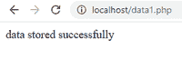

**编写 PHP 代码，在 student_marks 表中插入细节。(data2.PHP)**

## 服务器端编程语言（Professional Hypertext Preprocessor 的缩写）

```
<?php
//servername
$servername = "localhost";
//username
$username = "root";
//empty password
$password = "";
//database is the database name
$dbname = "database";

// Create connection by passing these connection parameters
$conn = new mysqli($servername, $username, $password, $dbname);
// Check this connection
if ($conn->connect_error) {
  die("Connection failed: " . $conn->connect_error);
}
//insert records into table
$sql  = "INSERT INTO student_marks VALUES (1,98,99);";
$sql .= "INSERT INTO student_marks VALUES (2,78,89);";
$sql .= "INSERT INTO student_marks  VALUES (3,78,98);";
$sql .= "INSERT INTO student_marks  VALUES (4,89,98);";
$sql .= "INSERT INTO student_marks  VALUES (7,89,79);";

if ($conn->multi_query($sql) === TRUE) {
  echo "data stored successfully";
} else {
  echo "Error: " . $sql . "<br>" . $conn->error;
}

$conn->close();
?>
```

**输出:**

键入“localhost/data2.php”查看输出

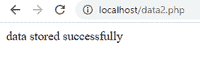

**编写 PHP 代码执行内部连接(form.php)**

## 服务器端编程语言（Professional Hypertext Preprocessor 的缩写）

```
<html>
<body>
<?php
//servername
$servername = "localhost";
//username
$username = "root";
//empty password
$password = "";
//database is the database name
$dbname = "database";

// Create connection by passing these connection parameters
$conn = new mysqli($servername, $username, $password, $dbname);
echo "inner join on student_address: ";
echo "<br>";
echo "<br>";
//sql query to display all student_address table based on student id using  inner join
$sql = "SELECT  * from student_address INNER JOIN student_marks on student_address.sid=student_marks.sid";
$result = $conn->query($sql);
//display data on web page
while($row = mysqli_fetch_array($result)){
    echo " STUDENT-ID : ". $row['sid'], " ----- NAME : ". $row['sname'] ," ----- ADDRESS : ". $row['saddress'] ;
    echo "<br>";

}

echo "<br>";
echo "inner join on student_marks: ";
echo "<br>";
echo "<br>";
//sql query to display all student_marks  table based on student id using  inner join
$sql1 = "SELECT  * from student_marks INNER JOIN student_address on student_address.sid=student_marks.sid";
$result1 = $conn->query($sql1);
//display data on web page
while($row = mysqli_fetch_array($result1)){
    echo " STUDENT-ID : ". $row['sid'], " ----- SUBJECT 1 : ". $row['subject1'] ," ----- SUBJECT 2 : ". $row['subject2'] ;
    echo "<br>";

}

//close the connection

$conn->close();
?>
</body>
</html>
```

**输出:**

在浏览器中键入“localhost/form.php”。

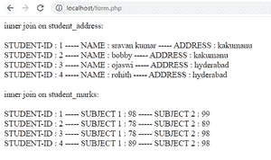

**编写代码执行右连接(form1.php)**

## 服务器端编程语言（Professional Hypertext Preprocessor 的缩写）

```
<html>
<body>
<?php
//servername
$servername = "localhost";
//username
$username = "root";
//empty password
$password = "";
//database is the database name
$dbname = "database";

// Create connection by passing these connection parameters
$conn = new mysqli($servername, $username, $password, $dbname);
echo "right join on student_address: ";
echo "<br>";
echo "<br>";
//sql query to display all student_address table based on student id using  right join
$sql = "SELECT  * from student_address RIGHT JOIN student_marks on student_address.sid=student_marks.sid";
$result = $conn->query($sql);
//display data on web page
while($row = mysqli_fetch_array($result)){
    echo " STUDENT-ID : ". $row['sid'], " ----- NAME : ". $row['sname'] ," ----- ADDRESS : ". $row['saddress'] ;
    echo "<br>";

}

echo "<br>";
echo "right  join on student_marks: ";
echo "<br>";
echo "<br>";
//sql query to display all student_marks  table based on student id using right join
$sql1 = "SELECT  * from student_marks RIGHT JOIN student_address on student_address.sid=student_marks.sid";
$result1 = $conn->query($sql1);
//display data on web page
while($row = mysqli_fetch_array($result1)){
    echo " STUDENT-ID : ". $row['sid'], " ----- SUBJECT 1 : ". $row['subject1'] ," ----- SUBJECT 2 : ". $row['subject2'] ;
    echo "<br>";

}

//close the connection

$conn->close();
?>
</body>
</html>
```

**输出:**

在浏览器中键入“localhost/form1.php”。

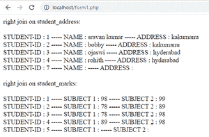

**编写 PHP 代码执行左连接(form2.php)**

## 服务器端编程语言（Professional Hypertext Preprocessor 的缩写）

```
<html>
<body>
<?php
//servername
$servername = "localhost";
//username
$username = "root";
//empty password
$password = "";
//database is the database name
$dbname = "database";

// Create connection by passing these connection parameters
$conn = new mysqli($servername, $username, $password, $dbname);
echo "left join on student_address: ";
echo "<br>";
echo "<br>";
//sql query to display all student_address table based on student id using  left join
$sql = "SELECT  * from student_address LEFT JOIN student_marks on student_address.sid=student_marks.sid";
$result = $conn->query($sql);
//display data on web page
while($row = mysqli_fetch_array($result)){
    echo " STUDENT-ID : ". $row['sid'], " ----- NAME : ". $row['sname'] ," ----- ADDRESS : ". $row['saddress'] ;
    echo "<br>";

}

echo "<br>";
echo "left join on student_marks: ";
echo "<br>";
echo "<br>";
//sql query to display all student_marks  table based on student id using left join
$sql1 = "SELECT  * from student_marks LEFT JOIN student_address on student_address.sid=student_marks.sid";
$result1 = $conn->query($sql1);
//display data on web page
while($row = mysqli_fetch_array($result1)){
    echo " STUDENT-ID : ". $row['sid'], " ----- SUBJECT 1 : ". $row['subject1'] ," ----- SUBJECT 2 : ". $row['subject2'] ;
    echo "<br>";

}

//close the connection

$conn->close();
?>
</body>
</html>
```

**输出:**

在浏览器中键入 localhost/form2.php

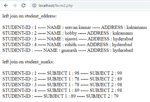