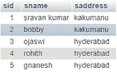
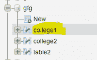
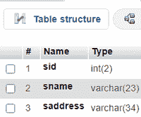
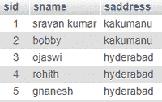
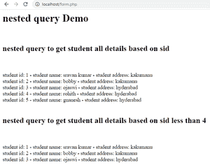
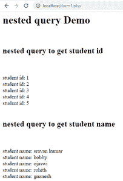

# PHP–MySQL:嵌套查询

> 原文:[https://www.geeksforgeeks.org/php-mysql-nested-query/](https://www.geeksforgeeks.org/php-mysql-nested-query/)

在本文中，我们将使用 Xampp 服务器对 MySQL 服务器中的数据库执行嵌套查询操作。

**简介:**

PHP 代表超文本预处理器，这是一种服务器端脚本语言，也用于处理数据库操作。我们是一个 PHP xampp 服务器来与数据库通信。使用的语言是 MySQL。MySQL 是一种用于管理数据库的数据库查询语言。它与 PHP 通信，并通过执行一些操作来管理数据库。

**嵌套查询:**

它也称为子查询，或者我们可以说在查询中使用的查询称为嵌套查询。我们使用 college_details 数据来执行嵌套查询。

**语法:**

```sql
SELECT column1,column2,column3,...,columnn
FROM table_name
WHERE column_name expression operator  
   ( SELECT COLUMN_NAME ...n from TABLE_NAME   WHERE ... );
```

(从表名中选择列名…n，其中…)；是内部/子查询。

**示例:**

想想这张桌子。



*   基于 sid 获取学生所有详细信息的嵌套查询，

```sql
SELECT * FROM college1 WHERE sid IN (SELECT sid FROM college1);
```

**结果:**

```sql
student id: 1 - student name: sravan kumar - student address: kakumanu
student id: 2 - student name: bobby - student address: kakumanu
student id: 3 - student name: ojaswi - student address: hyderabad
student id: 4 - student name: rohith - student address: hyderabad
student id: 5 - student name: gnanesh - student address: hyderabad
```

*   基于小于 4 的 sid 获取学生所有详细信息的嵌套查询

```sql
SELECT * FROM college1 WHERE sid IN (SELECT sid where sid < 4);
```

**结果:**

```sql
student id: 1 - student name: sravan kumar - student address: kakumanu
student id: 2 - student name: bobby - student address: kakumanu
student id: 3 - student name: ojaswi - student address: hyderabad
```

**进场:**

*   创建一个数据库并在其中创建一个表。
*   编写 PHP 代码将数据插入其中
*   编写 PHP 代码来执行嵌套查询。

**步骤:**

*   启动 Xampp 服务器


*   创建名为 gfg 的数据库，并创建 table college1



学院 1 栏:



*   使用 PHP 代码将记录插入表中

## 服务器端编程语言（Professional Hypertext Preprocessor 的缩写）

```sql
<?php
//servername
$servername = "localhost";
//username
$username = "root";
//empty password
$password = "";
//gfg is the database name
$dbname = "gfg";

// Create connection by passing these connection parameters
$conn = new mysqli($servername, $username, $password, $dbname);
// Check this connection
if ($conn->connect_error) {
  die("Connection failed: " . $conn->connect_error);
}
//insert records into table
$sql  = "INSERT INTO college1 VALUES (1,'sravan kumar','kakumanu');";
$sql .= "INSERT INTO college1 VALUES (2,'bobby','kakumanu');";
$sql .= "INSERT INTO college1 VALUES (3,'ojaswi','hyderabad');";
$sql .= "INSERT INTO college1  VALUES (4,'rohith','hyderabad');";
$sql .= "INSERT INTO college1  VALUES (5,'gnanesh','hyderabad');";

if ($conn->multi_query($sql) === TRUE) {
  echo "college 1 data inserted successfully";
} else {
  echo "Error: " . $sql . "<br>" . $conn->error;
}

$conn->close();
?>
```

**输出:**

在浏览器中键入“localhost/insert.php”来运行程序。


插入的数据，



**编写 PHP 代码执行嵌套查询**

**form.php**

## 服务器端编程语言（Professional Hypertext Preprocessor 的缩写）

```sql
<html>
<body>
<?php
//servername
$servername = "localhost";
//username
$username = "root";
//empty password
$password = "";
//gfg is the database name
$dbname = "gfg";

// Create connection by passing these connection parameters
$conn = new mysqli($servername, $username, $password, $dbname);
echo "<h1>"; echo "nested query Demo "; echo"</h1>";
echo "<br>";
echo "<h2>";echo "nested query to get student all details based on sid";echo "</h2>";
echo "<br>";
echo "<br>";
//sql query
$sql = "SELECT  * FROM college1 WHERE sid IN (SELECT sid FROM college1)";
$result = $conn->query($sql);
//display data on web page
while($row = mysqli_fetch_array($result)){
    echo " student id: ". $row['sid']," - student name: ". $row['sname']," -  student address: ". $row['saddress'];

    echo "<br>";
}

echo "<br>";
echo "<h2>";echo "nested query to get student all details based on sid less than 4";echo "</h2>";
echo "<br>";
echo "<br>";
//sql query
$sql = "SELECT  * FROM college1 WHERE sid IN (SELECT sid where sid < 4)";
$result = $conn->query($sql);
//display data on web page
while($row = mysqli_fetch_array($result)){
    echo " student id: ". $row['sid']," - student name: ". $row['sname']," -  student address: ". $row['saddress'];

    echo "<br>";
}
//close the connection

$conn->close();
?>
</body>
</html>
```

**输出:**



**例 2**

**form1.php**

## 服务器端编程语言（Professional Hypertext Preprocessor 的缩写）

```sql
<html>
<body>
<?php
//servername
$servername = "localhost";
//username
$username = "root";
//empty password
$password = "";
//gfg is the database name
$dbname = "gfg";

// Create connection by passing these connection parameters
$conn = new mysqli($servername, $username, $password, $dbname);
echo "<h1>"; echo "nested query Demo "; echo"</h1>";
echo "<br>";
echo "<h2>";echo "nested query to get student id";echo "</h2>";
echo "<br>";
echo "<br>";
//sql query
$sql = "SELECT  sid FROM college1 WHERE sid IN (SELECT sid FROM college1)";
$result = $conn->query($sql);
//display data on web page
while($row = mysqli_fetch_array($result)){
    echo " student id: ". $row['sid'];
    echo "<br>";
}

echo "<br>";
echo "<h2>";echo "nested query to get student name ";echo "</h2>";
echo "<br>";
echo "<br>";
//sql query
$sql = "SELECT  sname FROM college1 WHERE sid IN (SELECT sid FROM college1)";
$result = $conn->query($sql);
//display data on web page
while($row = mysqli_fetch_array($result)){
    echo " student name: ". $row['sname'];
    echo "<br>";
}

//close the connection

$conn->close();
?>
</body>
</html>
```

**输出:**

