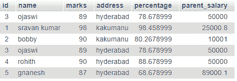
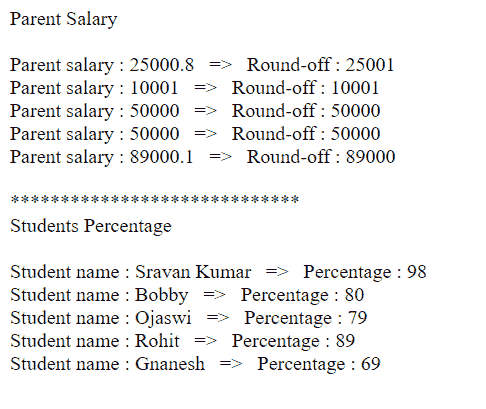

# PHP MySQL ROUND()函数

> 原文:[https://www.geeksforgeeks.org/php-mysql-round-function/](https://www.geeksforgeeks.org/php-mysql-round-function/)

在本文中，我们将看到 MySQL ROUND()函数在 PHP 中是如何工作的。 [MySQL ROUND()函数](https://www.geeksforgeeks.org/round-function-in-mysql/)用于将一个数字舍入到指定的小数位。如果舍入没有指定的小数位数，则将该数字舍入到最接近的整数。

**语法:**

```sql
ROUND(X, D)
```

```sql
SELECT ROUND(column1), ... ROUND(column n)
from TABLE;
```

这里，我们拿着学生数据库来执行 round()操作。

**要求:**

*   XAMPP 服务器

PHP 是一种服务器端脚本语言，它与 MySQL 通信来管理数据库。 [<u>MySQL</u>](https://www.geeksforgeeks.org/structured-query-language/) 是一个开源的关系数据库管理系统(RDBMS)。MySQL 是由甲骨文公司开发、分发和支持的。

**数据库表截图:**



**MySQL 查询舍入父代 _ 薪资:**

```sql
SELECT parent_salary, ROUND(parent_salary) FROM student;
```

**结果:**

> 父母工资:50000 —四舍五入到:50000
> 父母工资:25000.8 —四舍五入到:25001
> 父母工资:10001 —四舍五入到:10001
> 父母工资:50000 —四舍五入到:50000
> 父母工资:50000 —四舍五入到:50000
> 父母工资:89000.1 —四舍五入到:89000

**MySQL 查询学生成绩四舍五入:**

```sql
SELECT name, ROUND(percentage) FROM student;
```

**结果:**

> 学生姓名:奥贾斯维—百分比:79
> 学生姓名:斯拉万·库马尔—百分比:98
> 学生姓名:鲍比—百分比:80
> 学生姓名:奥贾斯维—百分比:79
> 学生姓名:罗希思—百分比:89
> 学生姓名:格纳尼什—百分比:69

**进场:**

*   启动 XAMPP 服务器。
*   打开 phpMyAdmin 数据库管理器，创建一个名为 **test** 的数据库。
*   在测试数据库中创建一个名为**学生**的表格。
*   将学生的记录插入表格。要将数据插入到表中，我们可以使用 SQL 查询或者直接将数据插入到表中。
*   编写 PHP 代码来执行 MySQL round()函数并获取舍入数据。

**程序:**

## 服务器端编程语言（Professional Hypertext Preprocessor 的缩写）

```sql
<?php

// Store the servername in a variable
$servername = "localhost";

// Store the username in a variable
$username = "root";

//Store the password in  a variable
$password = "";

// Store the database name in a variable
$dbname = "test";

// Create connection by passing these 
// connection parameters
$conn = new mysqli($servername, 
    $username, $password, $dbname);

echo "Parent Salary";
echo "<br><br>";

// SQL Query to select the data from
// database tablr
$sql = "SELECT parent_salary, 
    ROUND(parent_salary) FROM student";

$result = $conn->query($sql);

// Display data on the web page
while($row = mysqli_fetch_array($result)){
    echo " Parent salary : " . 
        $row['parent_salary'] .
        "   =>   Round-off : " . 
        $row['ROUND(parent_salary)']
        . "<br>";
}

echo "<br>*****************************";
echo "<br>Students Percentage";
echo "<br><br>";

// SQL Query to extract data from database
$sql = "SELECT name, ROUND(percentage) FROM student";
$result = $conn->query($sql);

// Display data on the web page
while($row = mysqli_fetch_array($result)){
    echo " Student name  : ". $row['name'] .
    "   =>   Percentage : " 
    . $row['ROUND(percentage)'] . "<br>";
}

// Close the connection
$conn->close();

?>
```

**输出:**

