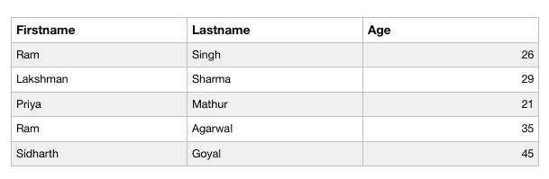

# PHP | MySQL 选择查询

> 原文:[https://www.geeksforgeeks.org/php-mysql-select-query/](https://www.geeksforgeeks.org/php-mysql-select-query/)

SQL **SELECT** 语句用于从数据库表中选择记录。

**语法:**
select 子句的基本语法是–


要从表格中选择所有列，使用字符。


**选择查询的实现:**
让我们考虑下表“数据”，其中有三列“名字”、“姓氏”和“年龄”。


要选择“数据”表中存储的所有数据，我们将使用下面提到的代码。

**使用程序方法选择查询:**

```sql
<?php 
$link = mysqli_connect("localhost", "root", "", "Mydb");

if ($link == = false) {
    die("ERROR: Could not connect. "
                .mysqli_connect_error());
}

$sql = "SELECT * FROM Data";
if ($res = mysqli_query($link, $sql)) {
    if (mysqli_num_rows($res) > 0) {
        echo "<table>";
        echo "<tr>";
        echo "<th>Firstname</th>";
        echo "<th>Lastname</th>";
        echo "<th>age</th>";
        echo "</tr>";
        while ($row = mysqli_fetch_array($res)) {
            echo "<tr>";
            echo "<td>".$row['Firstname']."</td>";
            echo "<td>".$row['Lastname']."</td>";
            echo "<td>".$row['Age']."</td>";
            echo "</tr>";
        }
        echo "</table>";
        mysqli_free_res($res);
    }
    else {
        echo "No matching records are found.";
    }
}
else {
    echo "ERROR: Could not able to execute $sql. "
                                .mysqli_error($link);
}
mysqli_close($link);
?>
```

**输出:**


**代码说明:**

1.  “res”变量存储函数 *mysql_query()* 返回的数据。
2.  每次调用 MySQL _ fetch _ array()时，它都会返回 *res()* 集合中的下一行。
3.  while 循环用于循环遍历表“数据”的所有行。

**使用面向对象方法选择查询:**

```sql
<?php
$mysqli = new mysqli("localhost", "root", "", "Mydb");

if ($mysqli == = false) {
    die("ERROR: Could not connect. "
                          .$mysqli->connect_error);
}

$sql = "SELECT * FROM Data";
if ($res = $mysqli->query($sql)) {
    if ($res->num_rows > 0) {
        echo "<table>";
        echo "<tr>";
        echo "<th>Firstname</th>";
        echo "<th>Lastname</th>";
        echo "<th>Age</th>";
        echo "</tr>";
        while ($row = $res->fetch_array()) 
        {
            echo "<tr>";
            echo "<td>".$row['Firstname']."</td>";
            echo "<td>".$row['Lastname']."</td>";
            echo "<td>".$row['Age']."</td>";
            echo "</tr>";
        }
        echo "</table>";
        $res->free();
    }
    else {
        echo "No matching records are found.";
    }
}
else {
    echo "ERROR: Could not able to execute $sql. "
                                             .$mysqli->error;
}
$mysqli->close();
?>
```

**输出:**


**使用 PDO 方法选择查询:**

```sql
<?php 
try {
    $pdo = new PDO("mysql:host = localhost;
                      dbname=mydb", "root", "");
    $pdo->setAttribute(PDO::ATTR_ERRMODE, 
                        PDO::ERRMODE_EXCEPTION);
}
catch (PDOException $e) {
    die("ERROR: Could not connect. ".$e->getMessage());
}
try {
    $sql = "SELECT * FROM Data";
    $res = $pdo->query($sql);
    if ($res->rowCount() > 0) {
        echo "<table>";
        echo "<tr>";
        echo "<th>Firstname</th>";
        echo "<th>Lastname</th>";
        echo "<th>Age</th>";
        echo "</tr>";
        while ($row = $res->fetch()) {
            echo "<tr>";
            echo "<td>".$row['Firstname']."</td>";
            echo "<td>".$row['Lastname']."</td>";
            echo "<td>".$row['Age']."</td>";
            echo "</tr>";
        }
        echo "</table>";
        unset($res);
    }
    else {
        echo "No matching records are found.";
    }
}
catch (PDOException $e) {
    die("ERROR: Could not able to execute $sql. "
                                .$e->getMessage());
}
unset($pdo);
?>
```

**输出:**
