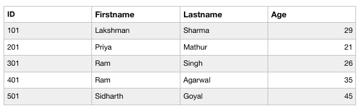
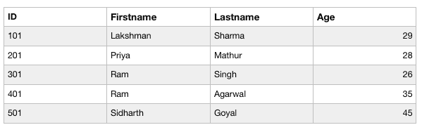

# PHP | MySQL UPDATE 查询

> 原文:[https://www.geeksforgeeks.org/php-mysql-update-query/](https://www.geeksforgeeks.org/php-mysql-update-query/)

MySQL **UPDATE** 查询用于更新 MySQL 数据库表中的现有记录。

*   它可用于同时更新一个或多个字段。*   It can be used to specify any condition using the WHERE clause.

    **语法:**
    更新查询的基本语法是–
    

    #### 何处更新查询的实现:

    让我们考虑下表“数据”，其中有四列“身份证”、“名字”、“姓氏”和“年龄”。
    

    要更新“数据”表中“身份证”为 201 的人的“年龄”，我们可以使用以下代码:

    **使用程序方法更新查询:**

    ```sql
    <?php
    $link = mysqli_connect("localhost", "root", "", "Mydb");

    if($link === false){
        die("ERROR: Could not connect. " 
                    . mysqli_connect_error());
    }

    $sql = "UPDATE data SET Age='28' WHERE id=201";
    if(mysqli_query($link, $sql)){
        echo "Record was updated successfully.";
    } else {
        echo "ERROR: Could not able to execute $sql. " 
                                . mysqli_error($link);
    } 
    mysqli_close($link);
    ?>
    ```

    **输出:**
    上升后的表–
    T5】

    网络浏览器上的输出:
    

    **使用面向对象方法更新查询:**

    ```sql
    <?php
    $mysqli = new mysqli("localhost", "root", "", "Mydb");

    if($mysqli === false){
        die("ERROR: Could not connect. "
                . $mysqli->connect_error);
    }

    $sql = "UPDATE data SET Age='28' WHERE id=201";
    if($mysqli->query($sql) === true){
        echo "Records was updated successfully.";
    } else{
        echo "ERROR: Could not able to execute $sql. " 
                                            . $mysqli->error;
    }
    $mysqli->close();
    ?>
    ```

    **输出:**
    上升后的表–
    T5】

    网络浏览器上的输出:
    

    **使用 PDO 方法更新查询:**

    ```sql
    <?php
    try{
        $pdo = new PDO("mysql:host=localhost;
                        dbname=Mydb", "root", "");
        $pdo->setAttribute(PDO::ATTR_ERRMODE, 
                            PDO::ERRMODE_EXCEPTION);
    } catch(PDOException $e){
        die("ERROR: Could not connect. " 
                        . $e->getMessage());
    }

    try{
        $sql = "UPDATE data SET Age='28' WHERE id=201";
        $pdo->exec($sql);
        echo "Records was updated successfully.";
    } catch(PDOException $e){
        die("ERROR: Could not able to execute $sql. "
                                    . $e->getMessage());
    }
    unset($pdo);
    ?>
    ```

    **输出:**
    上升后的表–
    T5】

    网络浏览器上的输出:
    

    PHP 是一种专门为 web 开发设计的服务器端脚本语言。您可以通过以下 [PHP 教程](https://www.geeksforgeeks.org/php-tutorials/)和 [PHP 示例](https://www.geeksforgeeks.org/php-examples/)从头开始学习 PHP。