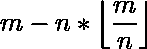

# PLSQL | MOD 功能

> 原文:[https://www.geeksforgeeks.org/plsql-mod-function/](https://www.geeksforgeeks.org/plsql-mod-function/)

**MOD** 函数是 PLSQL 中内置的[函数，用于在 **a** 除以 **b** 时返回余数。其配方为。](https://www.geeksforgeeks.org/functions-in-plsql/)

**语法:**

```
MOD(a, b)
```

**参数使用:**
该功能接受两个参数 **a** 和 **b** 。当输入数 a 除以 b 时，该函数给出余数作为输出。

**返回值:**
当 **a** 除以 **b** 时，该函数返回余数。

**支持的 Oracle/PLSQL 版本如下:**

1.  Oracle 12c
2.  Oracle 11g
3.  Oracle 10g
4.  Oracle 9i 发行版
5.  Oracle 8i 发行版

让我们看一些例子来说明 MOD 功能:

**示例-1:**

```
DECLARE 
   Test_Number number1 := 15;
   Test_Number number2 := 4;

BEGIN 
   dbms_output.put_line(MOD(Test_Number number1, 
                            Test_Number number2)); 

END;  
```

**输出:**

```
3
```

在上面的例子中，当数值 15 除以 4 时，它返回 3 的余数作为输出。

**示例-2:**

```
DECLARE 
   Test_Number number1 := 15;
   Test_Number number2 := 0;

BEGIN 
   dbms_output.put_line(MOD(Test_Number number1, 
                            Test_Number number2)); 

END; 
```

**输出:**

```
15
```

在上面的例子中，当数值 15 除以 0 时，它返回 15 的余数作为输出。

**示例-3:**

```
DECLARE 
   Test_Number number1 := 11.6;
   Test_Number number2 := 2.1;

BEGIN 
   dbms_output.put_line(MOD(Test_Number number1, 
                            Test_Number number2)); 

END; 
```

**输出:**

```
1.1
```

在上面的例子中，当数值 11.6 除以 2.1 时，它返回 1.1 的余数作为输出。

**优势:**
该功能用于 **a** 除以 **b** 时求余数。