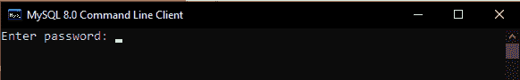
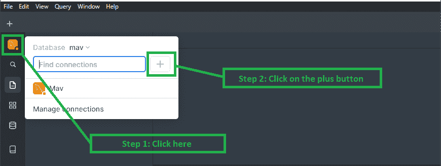
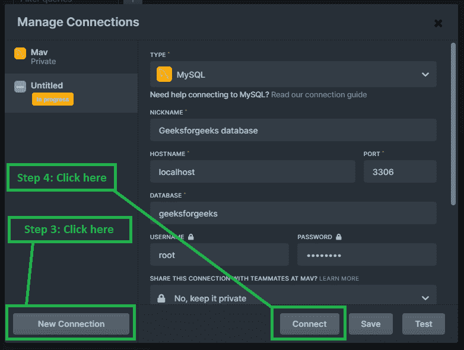
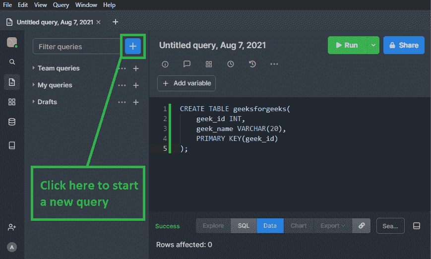

# PopSQL 编辑器

> 原文:[https://www.geeksforgeeks.org/popsql-editor/](https://www.geeksforgeeks.org/popsql-editor/)

在本文中，我们将讨论 PopSQL 编辑器的概述，并将讨论如何使用 PopSQL 编辑器以及如何与数据库连接。我们一个一个来讨论。

**先决条件–**[安装 MySQL](https://www.geeksforgeeks.org/how-to-install-mysql-in-windows/)

**概述:**
PopSQL 是一个多功能的 SQL 管理工具，可以让您同时处理和协作多个数据库管理任务。数据的可视化非常重要，因为它可以清晰地展示客户的数据。PopSQL 来了，这是一个非常有趣的工具，可以用来编写 SQL、可视化数据和共享结果。在本教程中，我们将看到如何将 MySQL 服务器与 PopSQL 连接起来。这也可以作为 MySQL 工作台的替代。我们开始吧。

**创建 MySQL 数据库实例并将其与 PopSQL 连接的步骤:**

**步骤-1 :**
打开 MySQL 8.0 命令行客户端。您的版本可能不同，但没有问题。

**步骤 2 :**
现在，输入你在 MySQL 安装期间设置的**根**密码。

**步骤 3 :**
现在，创建一个数据库，例如“极客博客”。该数据库将在本地主机实例下创建:

**步骤-4 :**
创建完数据库后，打开 PopSQL，创建一个账户，然后按照图操作:

**第 5 步:**
点击“新连接”并相应地设置你的数据库。它的伟大之处在于它将适用于大多数类型的数据库，包括微软 SQL、MySQL、红移、Cassandra、MemSQL、BigQuery 等。在本教程中，我将设置 MySQL。因此**仔细填写以下所有必填字段，即主机名、端口、数据库、用户名和密码**。

**第 6 步:**
连接后，现在可以开始输入查询了。点击**运行**按钮运行您的查询。

**结论:**
这个应用程序使得客户端和开发人员能够简单地同时协作处理不同的 SQL 活动。您可以选择同时处理不同类型的数据库，这在其他 SQL 管理工具中可能无法访问。

**参考资料:**
pop SQL 中有很多特性，你可以在他们的官方[文档](https://popsql.com/docs)中探索它们。