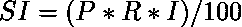
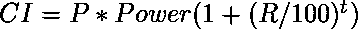

# PL/SQL 中寻找单利和复利的程序

> 原文:[https://www . geeksforgeeks . org/program-to-find-单利加复利-in-pl-sql/](https://www.geeksforgeeks.org/program-to-find-simple-interest-and-compound-interest-in-pl-sql/)

**先决条件**–[PL/SQL 简介](https://www.geeksforgeeks.org/plsql-introduction/)

在 PL/SQL 代码中，命令组排列在一个块中。一组相关的声明或语句。在声明部分，我们声明变量，在开始和结束部分之间，我们执行操作。

给定本金(p)、利率(r)、时间(t)，任务是计算单利和复利。

**示例:**

```sql
Input: p = 1500
       r = 5
       t = 3
Output: SI = 225, CI = 1736.44 

Input: p = 2700
       r = 7
       t = 8
Output: SI = 1512, CI = 4639.1

```

**单利公式:**

 **复利公式:**

**其中:**
P:本金(原始金额)
R:利率(单位%)
T:时间段

**以下是所需的实现:-**

```sql
  DECLARE
    --declaration of principal variable
    p  NUMBER(9, 2);
    ----declaration of rate variable
    r  NUMBER(9, 2);
    --declaration of time period variable
    t  NUMBER(9, 2);
    --declaration of simple interest variable
    si NUMBER(9, 2);
    ci NUMBER(9, 2);
BEGIN
    --Code Block Start 
    --assigning principal values
    p := 33000;

    --assigning rate  values
    r := 7;

    --assigning time period values
    t := 6;

    --To calculate SI by simple 
    --mathematical formula
    si := ( p * r * t ) / 100;

    ci := p * Power (1 + ( r / 100 ),t);

    --Print Result of SI.........
    dbms_output.Put_line('Simple Interest = '
                         ||si);

    dbms_output.Put_line('Compound interest = '
                         || ci);
END;
--End program   
```

**输出**

```sql
Simple Interest = 13860
Compound interest = 49524.1

```