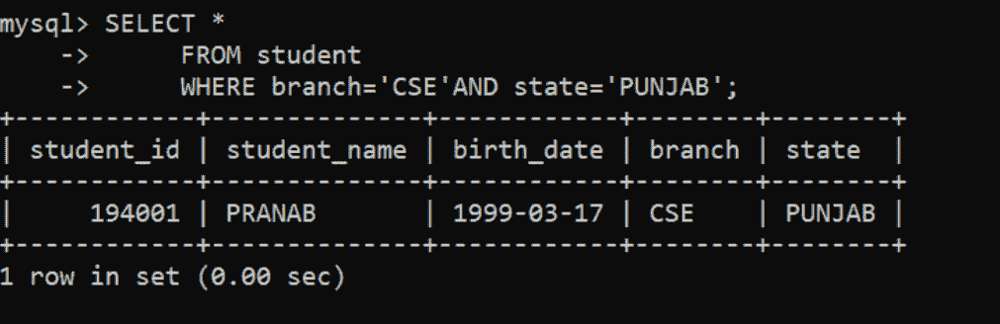

# 在 MySQL 中使用与、或、非运算符的查询

> 原文:[https://www . geeksforgeeks . org/query-使用-and-or-not-operator-in-MySQL/](https://www.geeksforgeeks.org/queries-using-and-or-not-operators-in-mysql/)

**AND，OR，NOT** 运算符基本上与[](https://www.geeksforgeeks.org/sql-where-clause/#:~:text=It%20is%20used%20to%20fetch%20filtered%20data%20in,range%20inclusive%20of%20two%20values.&text=result%20set.,-Queries&text=It%20is%20used%20to%20fetch%20filtered%20data%20by%20searching,particular%20pattern%20in%20where%20clause.)****子句一起使用，以便通过使用 [**MySQL**](https://www.geeksforgeeks.org/mysql-common-mysql-queries/) 中的 **AND，OR，NOT** 过滤某些条件来从表中检索数据。
在本文中，让我们逐步看到使用 **AND、OR、NOT** 运算符对学生表的不同查询。****

******第一步:创建数据库大学:******

```
****CREATE DATABASE** university;**
```

********

******第二步:使用数据库大学:******

```
****USE** university;**
```

********

******第三步:创建表格学生:******

```
****CREATE TABLE** student(
student_id **INT**
student_name **VARCHAR**(20)
birth_date **DATE**
branch **VARCHAR**(20)
state **VARCHAR**(20));**
```

********

******第 4 步:查看表格学生描述:******

```
****DESCRIBE** student;**
```

********

******第五步:在学生表中添加行:******

```
****INSERT INTO** student **VALUES**(194001,'PRANAB','1999-03-17','CSE','PUNJAB');
**INSERT INTO** student **VALUES**(194002,'PRAKASH','2000-08-07','ECE','TAMIL NADU');
**INSERT INTO** student **VALUES**(194003,'ROCKY','2000-03-10','ECE','PUNJAB');
**INSERT INTO** student **VALUES**(194004,'TRIBHUVAN','1999-03-15','CSE','ANDHRA PRADESH');
**INSERT INTO** student **VALUES**(194005,'VAMSI','2000-04-19','CSE','TELANGANA');**
```

********

******第 6 步:查看表格中的行:******

```
****SELECT * FROM** student;**
```

********

> ******和**运算符的语法:
> **从**表中选择*名称
> **其中**条件 1 **和**条件 2 **和** …。CONDITIONn****

******示例-1:**
使用 MySQL 中的 and 运算符查询查找带有 CSE 分支和 PUNJAB 州的学生记录:****

```
****SELECT ***
   ** FROM** student
 **   WHERE** branch='CSE'**AND**state='PUNJAB'**
```

********

****所有有中央教育学院分校和旁遮普的学生。****

> ******或**运算符的语法:
> **从**表中选择*名称
> **其中**条件 1 **或**条件 2 **或** …。CONDITIONn****

******示例-2:**
在 MySQL 中使用 or 运算符查询查找带有 CSE 或 ECE 分支的学生记录:****

********

****所有有分支的学生要么是 CSE，要么是 ECE。****

> ******NOT** 运算符的语法:
> **从**表中选择*名称
> **非**条件 1 **非**条件 2 **非。**..CONDITIONn****

******示例-3:**
使用 MySQL 中的 NOT 运算符查询查找不在旁遮普的学生记录:****

```
****SELECT ***
    **  FROM** student
     ** WHERE NOT** state='PUNJAB';**
```

********

****所有来自旁遮普以外的学生。****