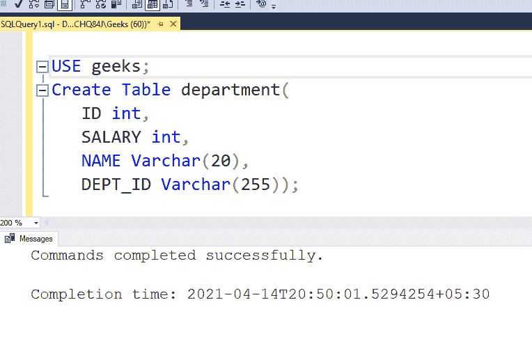
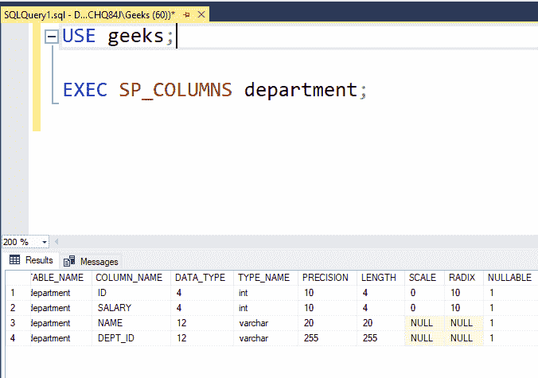
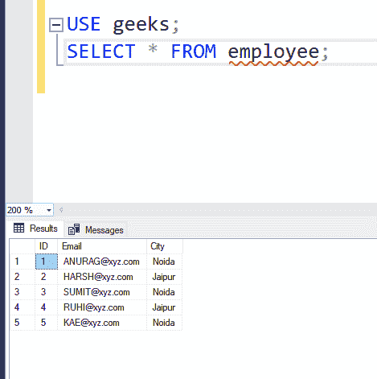
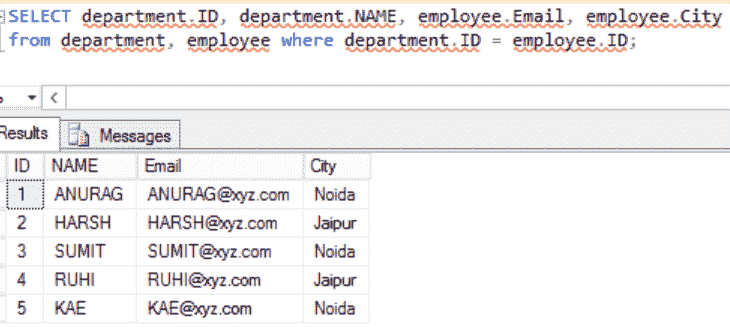
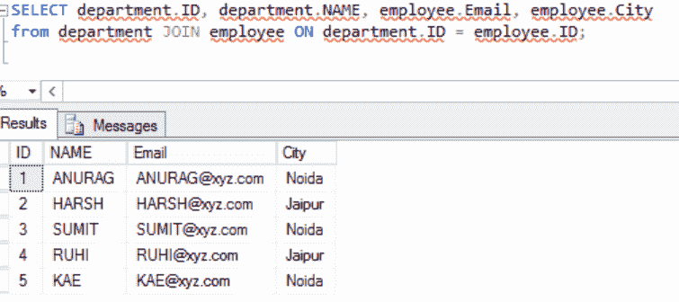

# 在 SQL 中查询多个表

> 原文:[https://www . geesforgeks . org/query-多表 in-sql/](https://www.geeksforgeeks.org/querying-multiple-tables-in-sql/)

在这里，我们将看到如何在 SQL 中查询多个表。例如，在这里，我们将首先创建一个名为“ ***【极客】*** ”的数据库，然后我们将在该数据库中创建 2 个表“ ***【部门】*** ”和“ ***【员工】*** ”。之后，我们将对表执行查询。

### 创建数据库:

使用下面的 SQL 语句创建一个名为 geeks 的数据库:

```sql
CREATE DATABASE geeks;
```

### 使用数据库:

```sql
USE geeks;
```

### 部门表定义:

我们的*极客*数据库中有以下*部门*表:

```sql
Create Table department(
   ID int,
   SALARY int,
   NAME Varchar(20),
   DEPT_ID Varchar(255));
```

**输出:**



您可以使用下面的语句来查询创建的表的描述:

```sql
EXEC SP_COLUMNS department;
```



### 将数据添加到部门表:

日期数据类型使用格式“ **YYYY-MM-DD** ”。使用以下语句向部门表添加数据:

```sql
INSERT INTO department VALUES (1,'Neha','F','1994-06-03');
INSERT INTO department VALUES (2,'Harsh','M','1996-03-12');
INSERT INTO department VALUES (3,'Harsh','M','1995-05-01');
INSERT INTO department VALUES (4,'Rupali','F',1996-11-11');
INSERT INTO department VALUES (5,'Rohan','M','1992-03-08');
```

要验证表格的内容，请使用以下语句:

```sql
SELECT * FROM department;
```


### 员工表定义:

现在创建另一个名为 employee 的表:

```sql
CREATE TABLE employee(
  ID int,
  Email Varchar(255),
  City Varchar(20) );
```

### 将数据添加到员工表:

在表格**员工**中添加数值:****

```sql
INSERT INTO employee VALUES (1, "ANURAG@xyz.com", "Noida");
INSERT INTO employee VALUES (2, "HARSH@xyz.com", "Jaipur");
INSERT INTO employee VALUES (3, "SUMIT@xyz.com", "Noida");
INSERT INTO employee VALUES (4, "RUHI@xyz.com", "Jaipur");
INSERT INTO employee VALUES (5, "KAE@xyz.com", "Noida");
```

**要验证表格的内容，请使用以下语句:**

```sql
SELECT * FROM employee;
```

****

### ****在 SQL 中查询多个表:****

****方法 1:****

**查询多个表的最常见方式是使用简单的 SELECT 表达式。要集成不同表的结果，请使用 from 子句来命名多个表。以下是它在实践中的工作原理:**

```sql
**Syntax:** 
SELECT table1name.column1name, table2name.column2name FROM table1name, table2name 
WHERE table1name.column1name = table2name.column1name;
```

****示例:****

```sql
SELECT department.ID, department.NAME, employee.Email, employee.City FROM department, employee 
WHERE department.ID = employee.ID;
```

****输出:****

****

****方法 2:使用连接****

**使用以下语法，也可以将 SQL 联接用于相同的目的:**

```sql
**Syntax:**
SELECT table1.column1,table1.column2,table2.column1,....
FROM table1  
JOIN table2
ON table1.matching_column = table2.matching_column;
```

****示例:****

```sql
SELECT department.ID, department.NAME, employee.Email, employee.City  
FROM department JOIN employee ON department.ID = employee.ID;
```

****输出:****

****