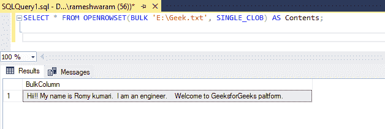

# 用 SQL Server 读取文本文件

> 原文:[https://www . geesforgeks . org/reading-a-text-file-with-SQL-server/](https://www.geeksforgeeks.org/reading-a-text-file-with-sql-server/)

这里我们将看到，如何用 SQL Server 读取一个文本文件。我们可以使用 OPENROWSET(BULL)函数读取文本文件。

### **OPENROWSET(BULK)**

它是一个表值函数，可以从任何文件中读取数据。该函数返回一个包含文件所有内容的单列表。这个单个大值被称为单字符大对象

**语法:**

```sql
SELECT * FROM OPENROWSET (BULK 'file_path', SINGLE_CLOB) as correlation_name;
```

该查询将读取文本文件的内容，并将其作为名为 Bulkcolumn 的表中的单个列返回。必须指定相关名称。我们有一个名为“极客. txt”的文本文件。文本文件的内容:

```sql
Hii!! My name is Romy kumari.
I am an engineer.

Welcome to GeeksforGeeks platform.
```

### **从 SQL 服务器读取文本文件**

**查询:**

```sql
SELECT * FROM OPENROWSET(BULK 'E:\Geek.txt', SINGLE_CLOB) AS Contents;
```

**输出:**



整个内容作为一列返回。

**从 SQL server 读取文本文件，使文本文件中的一行代表一行中的数据**

读取单行文本文件的每一行的步骤:

*   在数据库中创建一个表。
*   使用“Insert”关键字将文本文件中的数据插入表中。
*   使用 WITH 子句将 ROWTERMINATOR 设置为' \n '(代表换行符)。一旦在文件中遇到新行，就会将文件内容拆分为单独的行。

**步骤 1:** 创建数据库

使用下面的 SQL 语句创建一个名为 geeks 的数据库。

**查询:**

```sql
CREATE DATABASE geeks;
```

**步骤 2:** 使用数据库

使用下面的 SQL 语句将数据库上下文切换到极客。

**查询:**

```sql
USE geeks;
```

**步骤 3:** 表格定义

我们的极客数据库中有以下演示表。

```sql
CREATE TABLE demo(
Content VARCHAR(1000)
);
```

**步骤 4:** 将文本文件中的数据插入表格

使用以下命令从文本文件中插入数据。

**语法:**

```sql
BULK INSERT dbo.table_name
  FROM 'file_path'
  WITH  
     (
        ROWTERMINATOR ='\n'
     )
```

**查询:**

```sql
BULK INSERT dbo.demo
  FROM 'E:\Geek.txt'
  WITH  
     (
        ROWTERMINATOR ='\n'
     );
```

**第五步:**查看表格内容

**查询:**

```sql
SELECT * FROM demo;
```

**输出:**


这里，空代表一个空行。