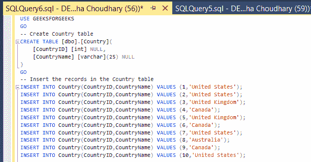
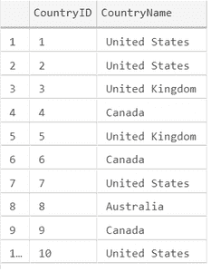
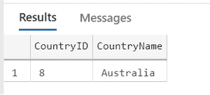
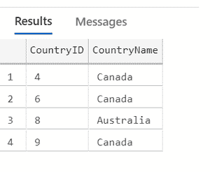
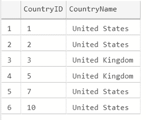
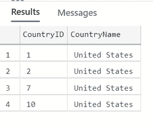
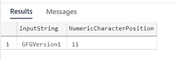
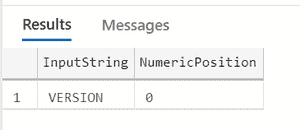
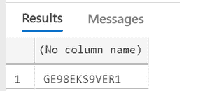
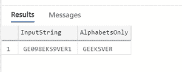

# 提取 SQL 查询的正则表达式

> 原文:[https://www . geesforgeks . org/正则表达式-提取-sql-query/](https://www.geeksforgeeks.org/regular-expression-to-extract-sql-query/)

正则表达式是搜索符合复杂条件的数据的更简单的机制。例如，从字母数字值中，仅提取字母值或数字值，或者检查字符匹配的特定模式并检索记录，等等。

让我们通过一些示例场景来逐一查看它们；

**步骤 1:** 创建数据库

**查询:**

```
SELECT * FROM sys.databases WHERE name = 'GEEKSFORGEEKS'
    BEGIN
    CREATE DATABASE [GEEKSFORGEEKS]
    END
```

**步骤 2:** 使用数据库

**查询:**

```
USE GEEKSFORGEEKS
```

**步骤 3:** 在 GEEKSFORGEEKS 下创建表格国家，并插入一些记录

**查询:**

```
INSERT INTO Country(CountryID,CountryName) VALUES (1,'United States');
INSERT INTO Country(CountryID,CountryName) VALUES (2,'United States');
INSERT INTO Country(CountryID,CountryName) VALUES (3,'United Kingdom');
INSERT INTO Country(CountryID,CountryName) VALUES (4,'Canada');
INSERT INTO Country(CountryID,CountryName) VALUES (5,'United Kingdom');
INSERT INTO Country(CountryID,CountryName) VALUES (6,'Canada');
INSERT INTO Country(CountryID,CountryName) VALUES (7,'United States');
INSERT INTO Country(CountryID,CountryName) VALUES (8,'Australia');
INSERT INTO Country(CountryID,CountryName) VALUES (9,'Canada');
INSERT INTO Country(CountryID,CountryName) VALUES (10,'United States');

SELECT * FROM Country
```



**输出:**



**例 1:**

要获得从 A–D 和 U 到 Z 之间的第二个字母开始的记录，其余的字母可以是任何东西。

**查询:**

```
--Find Country Names having:
--First character should be A and D alphabets. 
--The second character should be from U and Z alphabet
SELECT * FROM Country
WHERE CountryName like '[A-D][U-Z]%' 
--regular expression is used here
```

**输出:**



如果我们需要专门检查第一个字符，而其余的字符可以是任何东西，那么

**查询:**

```
--Find Country Names having:
--First character should be A and D alphabets. 
--Rest letters can be any character
SELECT * FROM Country
WHERE CountryName like '[A-D]%' 
--regular expression
```

**输出:**



通过看到以上两个输出，我们可以理解，仅仅通过给出不同的正则表达式，我们就获得了不同的输出。

假设我们想要查找仅以“U”开头的国家名称，那么查询将如下:

**查询:**

```
--Find country names starting with 'U' alone
SELECT * FROM Country
WHERE CountryName like 'U%'  
--regular expression
```

**输出:**



假设我们想查找以“U”开头的国家名称和其他信息，那么查询如下:

**查询:**

```
--Find country names starting with
-- U and additional condition is given
SELECT * FROM Country
WHERE CountryName like 'U% [S]%'
--regular expression
```

**输出:**



'

在使用 with Like 运算符时，我们需要了解以下因素还

<figure class="table">

| **Wildcard** | **Description** |
| % | A string of 0 or more characters will be retrieved within the specified range. |
| [ ] | Any single character will be retrieved separately. |
| 【^】 |

</figure>

我们也可以在其他函数中使用正则表达式。

**例 2:**

让我们先来看看 PATINDEX 函数。它是一个接受搜索模式和输入字符串并返回与模式不匹配的字符的起始位置的函数。

```
--pattern to check is A-Z or a-z(search pattern)
-- in the input string and 
--position of the non-matching pattern
-- It checks for numeric value position 
--and it is displaying position of the character
SELECT 'GFGVersion1' as InputString,
PATINDEX('%[^A-Za-z]%', 'GFGVersion1') as
NumericCharacterPosition;
```

**输出:**



要仅从输入字符串中获取数字，我们也可以用下面的方法

```
SELECT 'GFGVersion1' as InputString, 
PATINDEX('%[0-9]%', 'GFGVersion1') as
NumericCharacterPosition;
```

即不使用[^A-Za-z]，而是使用[0-9]并得到与上面相同的结果

```
-- 0 will indicate no numeric value present
SELECT 'VERSION' as InputString, 
PATINDEX('%[^A-Za-z]%', 'VERSION')
 as NumericPosition; 
```

**输出:**



如果没有数字，数字位置将显示 0

我们可以使用这个功能，使用一个正则表达式和一些像 PATINDEX 这样的函数，我们可以解决仅从输入字符串中获取字符/从输入字符串中获取数字等问题。,

为此，让我们看看 STUFF 函数

**STUFF 功能**

```
 --remove the integer from
 -- position 3 in the input string. 
 /* As only one character need to be removed, 
 we need to send params like this
 1st Param -- Input string
 2nd Param -- Start location 
 3rd Param -- Number of characters to be replaced
 4th Param - Replacing value
 */
SELECT STUFF('GE098EKS9VER1', 3, 1, '' );    
```

**输出:**



**例 3 :**

通过使用 PATINDEX 和 STUFF 函数，我们只能从输入字符串中获得字符值。

*   我们需要使用一个正则表达式来应用于 PATINDEX
*   找出数字的位置，用 STILD 函数去掉数字
*   必须重复步骤 2，直到没有数值

**查询:**

```
DECLARE @inputData NVARCHAR(MAX) = 'GE098EKS9VER1'       
--input string
DECLARE @intPosition INT    
 --get the position of the integer from the input string   
SET @intPosition = PATINDEX('%[^A-Za-z]%', @inputData)    
print @intPosition

--run loop until no integer is found in the input string
WHILE @intPosition > 0                                     
  BEGIN  
     --remove the integer from that position
    SET @inputData = STUFF(@inputData, @intPosition, 1, '' )   
    --PRINT @inputData 
    SET @intPosition = PATINDEX('%[^A-Za-z]%', @inputData )
    --Again get the position of the next integer in the input string
    --PRINT @intPosition 
END  
SELECT 'GE098EKS9VER1' as InputString, @inputData AS AlphabetsOnly
```

**输出:**



同样，我们可以使用正则表达式作为最佳搜索模式实践。

在整个 SQL 中，我们可以使用一个正则表达式来提取不同的输出来满足我们的需求。它也可以与其他函数一起使用，并且它将有助于仅从输入字符串中获取字母/从输入字符串中获取数字。