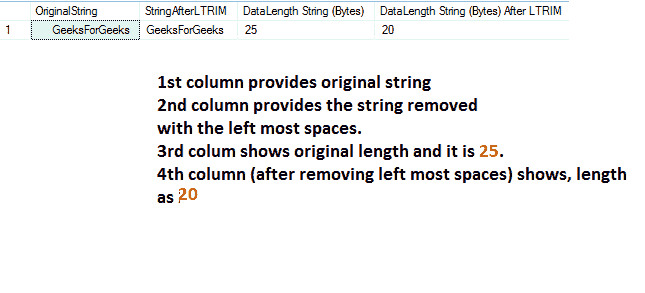
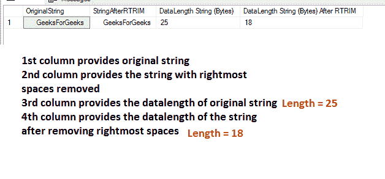
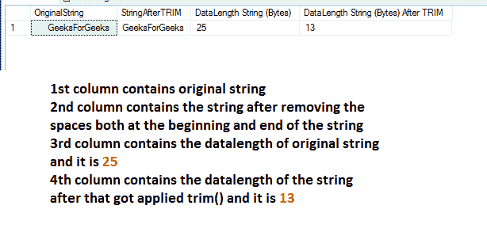
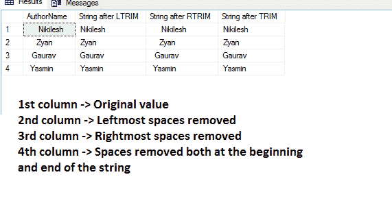

# 在 SQL Server 中删除字符串中的所有空格

> 原文:[https://www . geesforgeks . org/remove-all-spaces-from-in-string-SQL-server/](https://www.geeksforgeeks.org/remove-all-spaces-from-a-string-in-sql-server/)

在字符串前后都有出现空格的情况，我们可能需要删除/修剪空格以供使用。让我们看看它在 SQL Server 中是如何处理的。直到 SQL Server 2016，我们才有了名为 SQL [LTRIM](https://www.geeksforgeeks.org/ltrim-function-in-sql-server/) 和 SQL [RTRIM](https://www.geeksforgeeks.org/rtrim-function-in-sql-server/) 的函数。名字本身意味着 LTRIM 有助于删除最左边的空格，RTRIM 有助于删除最右边的空格。

从 SQL Server 2017 开始，我们有了 TRIM()函数，它也可以用一个函数来修剪前导和尾随字符。在本文中，让我们详细介绍它们。

### **SQL LTRIM 函数:**

它删除字符串开头的空格。字符串前后可能有空格。通过使用 LTRIM()函数，我们可以删除**最左边的**空格。让我们使用 DATALENGTH()函数来计算使用 SQL LTRIM 函数前后的数据长度(以字节为单位)。结合所有这些，让我们看看下面的例子

**查询:**

```
DECLARE @gfgString VARCHAR(26)= 
        '     GeeksForGeeks       ';

SELECT @gfgString as OriginalString, 
       LTRIM(@gfgString) AS StringAfterLTRIM, 
       DATALENGTH(@gfgString) AS 'DataLength String (Bytes)', 
       DATALENGTH(LTRIM(@gfgString)) AS
       'DataLength String (Bytes) After LTRIM';
```

**输出:**



### **SQL RTRIM 功能:**

它删除字符串末尾(从右侧开始)的空格。字符串前后可能有空格。通过使用 RTRIM()函数，我们可以删除最右边的**空格。让我们使用 DATALENGTH()函数来计算使用 SQL RTRIM 函数前后的数据长度(以字节为单位)。结合所有这些，让我们看看下面的例子**

****查询:****

```
DECLARE @gfgString VARCHAR(26)=
        '     GeeksForGeeks       ';

SELECT @gfgString as OriginalString, 
       RTRIM(@gfgString) AS StringAfterRTRIM, 
       DATALENGTH(@gfgString) AS 'DataLength String (Bytes)', 
       DATALENGTH(RTRIM(@gfgString))
       AS 'DataLength String (Bytes) After RTRIM';
```

****输出:****

****

### ****SQL TRIM()函数:****

**从 2017 年开始，我们也有 TRIM()功能。它删除字符串的开头空格和结尾空格。**

****查询:****

```
DECLARE @gfgString VARCHAR(26)= 
        '     GeeksForGeeks       ';
SELECT @gfgString as OriginalString, 
       TRIM(@gfgString) AS StringAfterTRIM, 
       DATALENGTH(@gfgString) AS 'DataLength String (Bytes)', 
       DATALENGTH(TRIM(@gfgString))
       AS 'DataLength String (Bytes) After TRIM';
```

****输出:****

****

**我们可以根据需要使用以上 3 个功能来删除空格。一般来说，要去掉所有的空格意味着，我们需要去 [TRIM()](https://www.geeksforgeeks.org/trim-function-in-sql-server/) 。我们也可以使用相同的方法来修剪列值。**

****查询:****

```
use GEEKSFORGEEKS
SELECT AuthorName, LTRIM(AuthorName) as 'String after LTRIM', RTRIM(AuthorName) as 'String after RTRIM', 
TRIM(AuthorName) as 'String after TRIM' FROM Authors;
```

****输出:****

****

**SQL Server 提供了许多字符串操作函数，在这里我们看到了 LTRIM()、RTRIM()和 TRIM()函数来移除空格。**