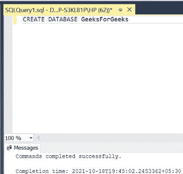
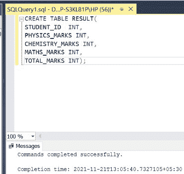
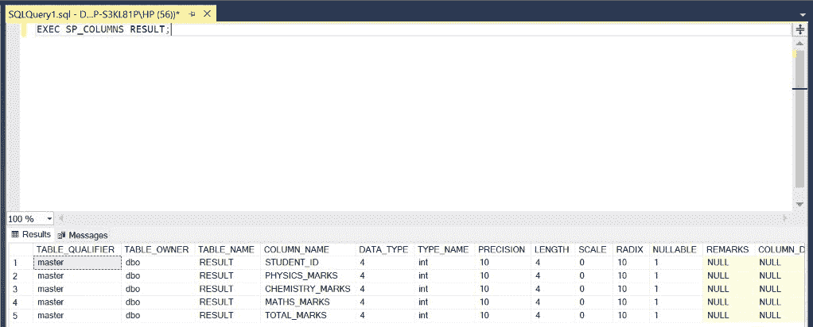
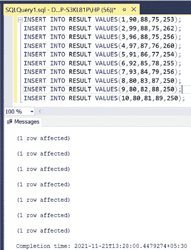
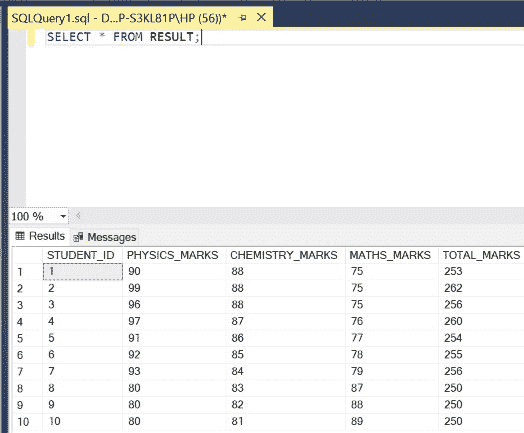
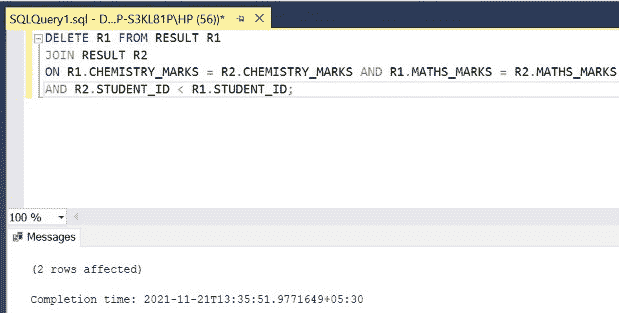
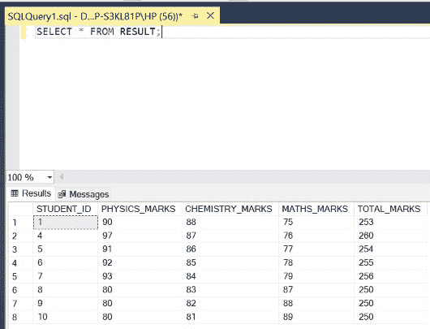
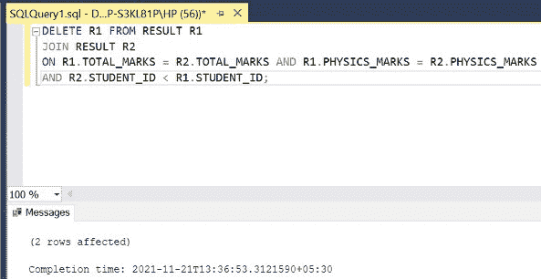
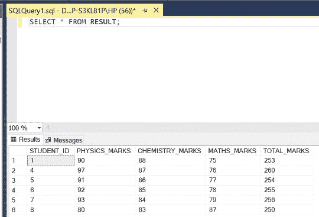

# 从 SQL 表中删除重复行(基于多列的值)

> 原文:[https://www . geesforgeks . org/remove-replicate-row-based-on-values-from-multi-columns-from-SQL-table/](https://www.geeksforgeeks.org/removing-duplicate-rows-based-on-values-from-multiple-columns-from-sql-table/)

在 SQL 中，有些行在多列(> 1)中包含重复条目。要删除这样的行，我们需要使用 **DELETE** 关键字以及表与自身的自连接。下图也是如此。在本文中，我们将使用微软的 SQL Server 作为我们的数据库。

**步骤 1:** 创建数据库。为此，使用下面的命令创建一个名为 GeeksForGeeks 的数据库。

**查询:**

```sql
CREATE DATABASE GeeksForGeeks
```

**输出:**



**步骤 2:** 使用 GeeksForGeeks 数据库。为此，请使用以下命令。

**查询:**

```sql
USE GeeksForGeeks
```

**输出:**


**步骤 3:** 在数据库 GeeksForGeeks 中创建一个表 RESULT。该表有 5 列，即学生标识、物理标记、化学标记、数学标记和总标记，包含学生的标识、他/她的物理、化学和数学标记，最后是他/她的总标记。

**查询:**

```sql
CREATE TABLE RESULT(
STUDENT_ID  INT,
PHYSICS_MARKS INT,
CHEMISTRY_MARKS INT,
MATHS_MARKS INT,
TOTAL_MARKS INT);
```

**输出:**



**第 4 步:**描述结果表的结构。

**查询:**

```sql
EXEC SP_COLUMNS RESULT;
```

**输出:**



**第 5 步:**在结果表中插入 10 行。

**查询:**

```sql
INSERT INTO RESULT VALUES(1,90,88,75,253);
INSERT INTO RESULT VALUES(2,99,88,75,262);
INSERT INTO RESULT VALUES(3,96,88,75,256);
INSERT INTO RESULT VALUES(4,97,87,76,260);
INSERT INTO RESULT VALUES(5,91,86,77,254);
INSERT INTO RESULT VALUES(6,92,85,78,255);
INSERT INTO RESULT VALUES(7,93,84,79,256);
INSERT INTO RESULT VALUES(8,80,83,87,250);
INSERT INTO RESULT VALUES(9,80,82,88,250);
INSERT INTO RESULT VALUES(10,80,81,89,250);
```

**输出:**



**第 6 步:**显示结果表的所有行。

**查询:**

```sql
SELECT * FROM RESULT;
```

**输出:**



**步骤 7:** 从表**结果**中删除在列**化学 _ 标记**和**数学 _ 标记**中有重复条目的行。为了实现这一点，我们使用 **DELETE** 功能通过自连接(对表的两个别名，即 **R1** 和 **R2** 使用 **JOIN** 功能)将表与其自身连接，并对列 **CHEMISTRY_MARKS** 和**mathematics _ MARKS**的条目进行比较，以获得列 **STUDENT_ID** 的不同条目，因为 ID 对于每个学生都是唯一的。

**语法:**

```sql
DELETE T1 FROM TABLE_NAME T1
JOIN TABLE_NAME T2
ON T1.COLUMN_NAME2 = T2.COLUMN_NAME2 AND
T1.COLUMN_NAME3 = T2.COLUMN_NAME3 AND .......
AND T2.COLUMN_NAME1 < T1.COLUMN_NAME1;
```

**查询:**

```sql
DELETE R1 FROM RESULT R1
JOIN RESULT R2
ON R1.CHEMISTRY_MARKS = R2.CHEMISTRY_MARKS
AND R1.MATHS_MARKS = R2.MATHS_MARKS
AND R2.STUDENT_ID < R1.STUDENT_ID;
```

**输出:**



**第 8 步:**显示更新后的**结果**表的所有行。

**查询:**

```sql
SELECT * FROM RESULT;
```

**注意:**在**化学 _ 标记**和**数学 _ 标记**列中没有重复的行条目。

**输出:**



**步骤 9:** 从表**结果**中删除在列**总计 _ 标记**和**物理 _ 标记**中有重复条目的行。

**查询:**

```sql
DELETE R1 FROM RESULT R1
JOIN RESULT R2
ON R1.TOTAL_MARKS = R2.TOTAL_MARKS AND R1.PHYSICS_MARKS = R2.PHYSICS_MARKS
AND R2.STUDENT_ID < R1.STUDENT_ID;
```

**输出:**



**步骤 10:** 显示更新后的**结果**表的所有行。

**查询:**

```sql
SELECT * FROM RESULT;
```

**注意**–在 **TOTAL_MARKS** 和 **PHYSICS_MARKS** 列中没有重复的行条目。

**输出:**

