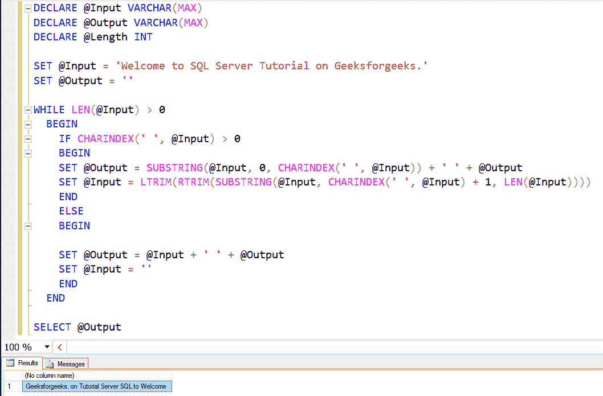

# 在 SQL 服务器中逐字倒排语句

> 原文:[https://www . geesforgeks . org/reverse-statement-word-by-in-SQL-server/](https://www.geeksforgeeks.org/reverse-statement-word-by-word-in-sql-server/)

要在 SQL server 中一个字一个字地反转任何语句，我们可以使用 SUBSTRING 函数，它允许我们提取和显示字符串的一部分。

先决条件: [SUBSTRING 函数](https://www.geeksforgeeks.org/substring-function-in-sql-server/)

**进场:**

*   使用 DECLARE 语句声明了三个变量(@Input，@Output，@Length)。
*   使用 WHILE 循环迭代@Input 中出现的每个字符。对于 SQL Server while 循环内部的情况，使用 SQL LEN 函数检查输入的长度是否大于 0。
*   在 while 循环中，使用 SUBSTRING 函数用三个参数设置@Output 值，它们是输入、起点和终点。在这里，我们将输入指定为@Input，将起始点指定为 0。
*   使用 CHARINDEX 函数查找“”，以便端点位于空格之前。
*   现在，将它添加到@Output，它在循环开始时是空的。
*   要更新@Input 变量，请使用 SUBSTRING 函数。这里我们将输入指定为@Input。
*   接下来，使用 SQL CHARINDEX 函数查找空白空间，然后我们添加了 1，这样起点将在空间之后。
*   然后，使用 SQL LEN 函数指定结束值。
*   在 SET @Output，它从 0 个索引开始提取单词，直到空格。这将是第一个词。
*   一旦它得到了第一个单词，它将使用 SET @Input 代码从@Input 中删除该单词。

**输入:**
欢迎来到极客论坛上的 SQL Server 教程。

**示例–**

```
DECLARE @Input VARCHAR(MAX)
DECLARE @Output VARCHAR(MAX)
DECLARE @Length INT 

SET @Input = 'Welcome to SQL Server 
             Tutorial on Geeksforgeeks.'

SET @Output = ''
WHILE LEN(@Input) > 0

BEGIN
IF CHARINDEX(' ', @Input) > 0

BEGIN
SET @Output = SUBSTRING
              (@Input, 0, CHARINDEX(' ', @Input))
               + ' ' + @Output
SET @Input = LTRIM
             (RTRIM
             (SUBSTRING
             (@Input, CHARINDEX 
             (' ', @Input) + 1, LEN(@Input))))
END

ELSE

BEGIN
SET @Output = @Input + ' ' + @Output
SET @Input = ''
END
END
SELECT @Output

```

**输出:**

```
Geeksforgeeks. on Tutorial Server SQL to Welcome

```

**使用 SQL Server 管理工作室的输入和输出:**

