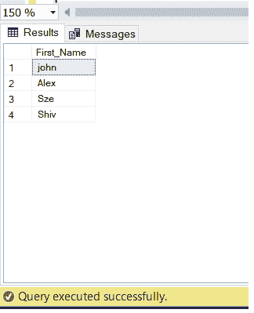
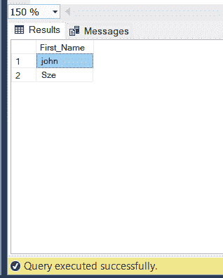
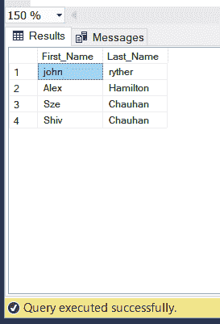
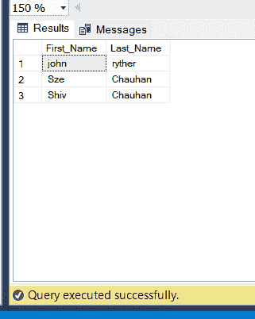

# 在 SQL 中根据条件选择多列

> 原文:[https://www . geesforgeks . org/select-多列-基于 sql 中的条件/](https://www.geeksforgeeks.org/selecting-multiple-columns-based-on-condition-in-sql/)

在现实场景中，我们必须从给定的表中选择唯一的列，现在根据需要，所选择的列可以是单个或多个。例如:编写一个查询，给出组织中 EMPLOYEE 的名称，因此这里我们只需要从特定的 EMPLOYEE 表中挑选出 name 列。同样，多列的另一个例子可以是:编写一个查询，给出在一个组织中工作的所有员工的姓名和工资。所以这里我们要选择 2 列姓名和工资。

上面的例子让我们明白了在学习 SQL 的时候，列的选择是非常重要的。首先，我们将学习如何从表中选择一列，然后我们将转向多列。

首先，我们创建数据库来执行选择查询

**步骤 1:** 创建数据库

使用下面的 SQL 查询创建一个名为 geeks 的数据库:

```sql
CREATE DATABASE geeks;
```

**步骤 2:** 使用数据库

```sql
USE geeks;
```

**步骤 3:** 表格创建

```sql
CREATE TABLE Employee  
(  
EmpID int,  
FirstName varchar(255),  
LastName varchar(255),  
Salary INT  
);
```

**步骤 4:** 向表中添加数据

```sql
INSERT INTO Employee VALUES(1, 'john' , 'ryther', 10000);
INSERT INTO Employee VALUES(2, 'Alex' , 'Hamilton', 20000);
INSERT INTO Employee VALUES(3, 'Sze' , 'Chauhan' , 10000);
INSERT INTO Employee VALUES(4,'Shiv', 'Chauhan', 50000);
```

**步骤 5:** 现在我们在 SQL 中看到不同的情况来获取期望的输出。

**情况 1:** 在 SQL 中选择单个列

在 SQL 中，选择任何列都是最简单的事情之一，因为您只需键入 [SELECT 命令](https://www.geeksforgeeks.org/sql-select-query/#:~:text=The%20select%20clause%20is%20the,in%20the%20final%20result%20set.)，然后列名和输出将是所需的列。

**语法:**

```sql
SELECT (Column Name)
FROM (Table Name);
```

为了更清楚，让我们以上面创建的 EMPLOYEE 表为例。现在，我们必须从给定的表中选择列名字。

**查询:**

```sql
SELECT FirstName
FROM EMPLOYEE;
```

**输出:**



**情况 2:** 根据条件选择单个柱

现在，我们来看看如何获取工资为 10，000 英镑的员工的名字。从表中可以很清楚地看出，我们期望的输出应该是:约翰和斯泽。为了解决这样的查询，我们只需在代码中加入一个 WHERE 子句和条件，如下查询所示:

**查询:**

```sql
SELECT FirstName
FROM EMPLOYEE
WHERE Salary=10000;
```

**输出:**



**案例 3:** 在 SQL 中选择多列

在带有或不带有任何条件的 SQL 中选择多列就像选择一列一样简单，不仅简单，而且相同。再来看我们前面的例子，这一次我们必须写一个查询来从 employee 表中获取名字和姓氏，这意味着我们必须提取 2 列，解决方案非常简单，我们必须用我们想要提取的 [SELECT 子句](https://www.geeksforgeeks.org/sql-select-query/#:~:text=The%20select%20clause%20is%20the,in%20the%20final%20result%20set.)然后是表名来写所有那些列名。其语法如下所示

**语法:**

```sql
SELECT column1,column2,column3...
FROM table name;
```

在我们的示例中，代码如下

**查询:**

```sql
SELECT FirstName,LastName
FROM Employee;
```

**输出:**



**情况 4:** 选择多个有条件的列

当我们必须选择多个列和一些条件时，我们放一个 [WHERE 子句](https://www.geeksforgeeks.org/sql-where-clause/)并将我们的条件写在该子句中。选择 WHERE 子句并不是强制性的，根据所询问的查询，可以有多个选项来放置条件，但是大多数条件都满足于 WHERE 子句。根据上面的例子，这次我们要放多个条件。

例如:用 SQL 编写一个查询，选择一个工资为 10000 或姓 Chauhan 的员工的名和姓。

对于这个查询，有三件事

*   选择列名和姓，即选择名、姓。
*   来自员工表，即来自员工
*   现在，条件是棘手的部分，因为有两个条件，让我们逐一处理
    *   工资必须是 10000，即工资=10000
    *   姓氏应该是 Chauhan，即 Last_name='chauhan '

因此，我们的查询已经解决了，现在我们只需要将上面的内容以适当的格式显示出来

**查询:**

```sql
SELECT FirstName, LastName
FROM Employee
WHERE Salary=10000 OR LastName='Chauhan';
```

**输出:**



从表中我们可以看出，工资 10000 的员工是约翰和 sze，姓 Chauhan 的员工是 sze 和 shiv，这就是我们想要的结果。