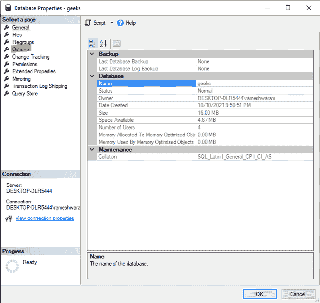

# 在 SQL 中将数据库从单用户模式设置为多用户

> 原文:[https://www . geesforgeks . org/set-database-从单用户模式到多用户 sql/](https://www.geeksforgeeks.org/set-database-from-single-user-mode-to-multi-user-in-sql/)

单用户模式指定一次只有一个用户可以访问数据库。如果将数据库设置为单用户模式，则所有其他连接都将被关闭，不会发出警告。如果在将数据库设置为单用户模式后断开连接，则不同的用户可以连接到数据库，但只能是一个用户。

在多用户模式下，多个用户可以同时连接到同一个数据库。这种模式通常用于组织中，以便多个用户可以同时访问它。使用多用户数据库的领域有银行、超市、保险代理部门。

这里我们将看到，如何将数据库从单用户模式设置为多用户模式。

有两种方法可以执行给定的活动:

*   使用 ALTER 命令
*   在 SQL Server 管理工作室中使用对象资源管理器。

为了进行演示，请遵循下面给出的步骤:

**步骤 1:** 创建数据库

使用以下命令创建数据库。

**查询:**

```sql
CREATE TABLE geeks;
```

**步骤 2:** 将数据库设置为单用户模式

ALTER 命令后跟 SET 关键字用于设置数据库的用户模式。在更改访问模式之前，必须关闭所有打开的连接。在 ALTER 命令后使用 ROLLBACK IMMEDIATE 终止子句和' with '关键字来关闭打开的连接。

**语法:**

```sql
ALTER DATABASE database_name SET 
SINGLE_USER WITH ROLLBACK IMMEDIATE
```

**查询:**

```sql
ALTER DATABASE geeks SET SINGLE_USER
WITH ROLLBACK IMMEDIATE;
```

**输出:**


在这里，我们可以看到“单一用户”显示在极客数据库名称旁边。

### **方法 1:使用 ALTER 命令**

我们可以像设置单用户访问模式一样使用 ALTER 命令。该命令不需要连接关闭。

**语法:**

```sql
ALTER DATABASE database_name 
SET MULTI_USER;
```

**查询:**

```sql
ALTER DATABASE geeks
SET MULTI_USER;
```

**输出:**


在这里，之前显示在极客数据库旁边的“单用户”关键字现在被删除了。

### **方法二:在 SQL Server 管理工作室中使用对象浏览器**

更改访问模式的步骤:

*   从菜单栏中选择视图。
*   选择对象资源管理器选项。对象浏览器将出现在屏幕的左侧。
*   选择数据库文件夹，并选择您的数据库(极客，我们已经在这里使用)。
*   右键单击数据库并选择属性选项。
*   将打开一个对话框，从对话框屏幕的左侧选择“选项”选项。
*   向下滚动到“状态”字段。
*   从状态字段中选择限制访问选项。
*   从下拉菜单中选择多用户。
*   单击“确定”。

**步骤 1:** 打开对象浏览器


**步骤 2:** 选择属性


**步骤 3:** 从对话框中选择选项关键字



**步骤 4:** 从限制访问字段的下拉列表中选择多用户


**第五步:**点击确定，出现对话框。现在点击是按钮。


**第 6 步:**再次打开对象浏览器


我们可以看到数据库名称中不再出现“单一用户”关键字。