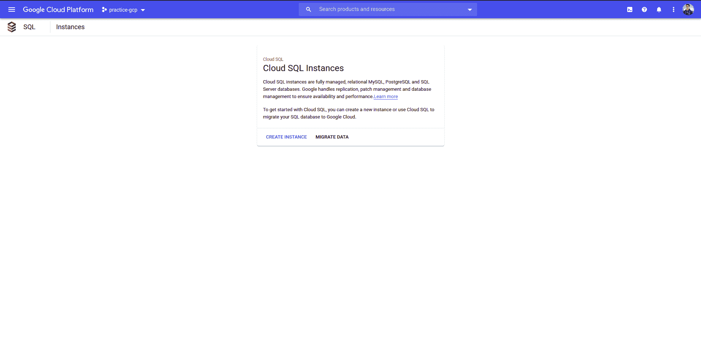
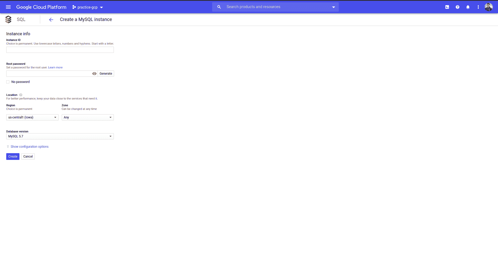
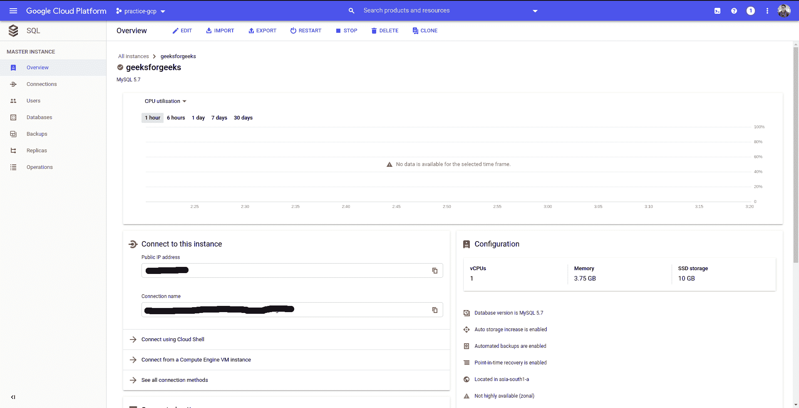
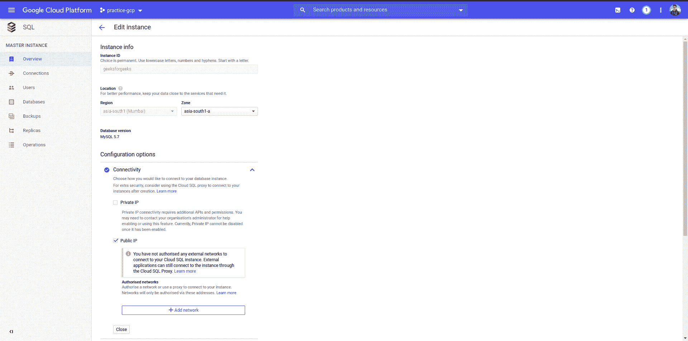

# 用 Flask

设置谷歌云 SQL

> 原文:[https://www . geesforgeks . org/setting-Google-cloud-SQL-with-flask/](https://www.geeksforgeeks.org/setting-up-google-cloud-sql-with-flask/)

建立一个数据库可能非常棘手，但是有一些非常简单和可扩展的解决方案，其中之一就是谷歌云 SQL。云 SQL 是一种完全受管理的数据库服务，它使得在云中设置、维护和管理关系型 PostgreSQL 和 MySQL 数据库变得非常容易。设置它可能既棘手又简单，困惑？我是来澄清混乱的。

首先，你需要一个谷歌云平台(GCP)账户。如果你不想要，那就去这里的[链接](https://cloud.google.com/)创建一个账户。当您注册时，您还将获得一年 300 美元的免费积分。您还需要设置您的计费帐户，以便能够使用包括云 SQL 在内的一些 GCP 服务。不要担心，如果你有免费学分，你就不会被收取这个教程的费用。

现在，您需要从市场上启用**云 SQL 管理应用编程接口**。你可以点击这个链接[这里](https://console.cloud.google.com/marketplace/details/google/sqladmin.googleapis.com?q=Cloud%20SQL%20Admin%20API)来完成。
现在，让我们跳转到我们的 GCP 仪表盘，然后搜索**云 SQL** 。您的 CLoud SQL 页面应该如下所示。



现在，点击**创建实例**，然后在本教程中，我们将选择 **MySQL** 选项。现在，您应该会看到下面的页面。



现在，填写细节。总是建议生成密码，因为它会创建一个随机字符串，并记录密码，因为如果您忘记密码，您将无法检索密码，并且还会将区域更改为地理上最近的区域，然后单击**创建**。仅此而已。下一页应该是这样的。



现在，您首先需要创建一个数据库。简单来说，点击左侧导航栏上的**数据库**选项，然后点击**创建数据库**，然后提供数据库的名称。对于本教程，我们的数据库名称将是*测试*。完成后，您应该会看到您的数据库列在那里。设置部分到此为止。现在让我们看看如何从你的 flask 应用程序连接到这个数据库。

显然，您将需要 Python。在本教程中，我们目前使用的是最新的 python 版本，即 3.8
您还需要安装 flask、flask-sqlalchemy 和 mysqlclient。要安装这些，只需在您的终端上运行以下命令。

```
pip3 install Flask Flask-SQLAlchemy mysqlclient
```

**注意:**如果你在 Linux 机器上，那么你需要在安装 mysqlclient 之前安装 *libmysqlclient-dev* 。要安装它，只需在你的终端上运行 **sudo apt-get 安装 libmysqlclient-dev** 。

完成所有先决条件后，让我们直接进入代码。为了简单起见，我将在一个文件中编写所有的代码，但是如您所知，如果您打算构建一个中型应用程序，那么您需要为路线、模型等创建单独的文件。
在这里，整个代码将被写在一个名为 **app.py** 的文件中。我以内联注释的形式为代码中的每一行添加了解释。

## 蟒蛇 3

```
# imports
from flask import Flask, request, make_response
from flask_sqlalchemy import SQLAlchemy

# initializing Flask app
app = Flask(__name__)

# Google Cloud SQL (change this accordingly)
PASSWORD ="your database password"
PUBLIC_IP_ADDRESS ="public ip of database"
DBNAME ="database name"
PROJECT_ID ="gcp project id"
INSTANCE_NAME ="instance name"

# configuration
app.config["SECRET_KEY"] = "yoursecretkey"
app.config["SQLALCHEMY_DATABASE_URI"]= f"mysql + mysqldb://root:{PASSWORD}@{PUBLIC_IP_ADDRESS}/{DBNAME}?unix_socket =/cloudsql/{PROJECT_ID}:{INSTANCE_NAME}"
app.config["SQLALCHEMY_TRACK_MODIFICATIONS"]= True

db = SQLAlchemy(app)

# User ORM for SQLAlchemy
class Users(db.Model):
    id = db.Column(db.Integer, primary_key = True, nullable = False)
    name = db.Column(db.String(50), nullable = False)
    email = db.Column(db.String(50), nullable = False, unique = True)

@app.route('/add', methods =['POST'])
def add():
    # getting name and email
    name = request.form.get('name')
    email = request.form.get('email')

    # checking if user already exists
    user = Users.query.filter_by(email = email).first()

    if not user:
        try:
            # creating Users object
            user = Users(
                name = name,
                email = email
            )
            # adding the fields to users table
            db.session.add(user)
            db.session.commit()
            # response
            responseObject = {
                'status' : 'success',
                'message': 'Successfully registered.'
            }

            return make_response(responseObject, 200)
        except:
            responseObject = {
                'status' : 'fail',
                'message': 'Some error occured !!'
            }

            return make_response(responseObject, 400)

    else:
        # if user already exists then send status as fail
        responseObject = {
            'status' : 'fail',
            'message': 'User already exists !!'
        }

        return make_response(responseObject, 403)

@app.route('/view')
def view():
    # fetches all the users
    users = Users.query.all()
    # response list consisting user details
    response = list()

    for user in users:
        response.append({
            "name" : user.name,
            "email": user.email
        })

    return make_response({
        'status' : 'success',
        'message': response
    }, 200)

if __name__ == "__main__":
    # serving the app directly
    app.run()
```

您需要更改代码中的以下占位符

*   密码:创建实例时为数据库设置的密码
*   公共知识产权地址:您的 GCP 实例公共知识产权(可在概览页面中找到)
*   数据库名:您稍后创建的数据库的名称(对于本教程，它是“测试”)
*   项目标识:您的 GCP 项目标识
*   实例名:您可以云 SQL 实例名

您的代码已准备好，但它仍然无法访问您的数据库。这是大多数人误解的地方。他们继续检查文件和他们的代码库，但他们没有发现错误，他们完全沮丧和放弃，但我希望你不是那个放弃的人，对吗？所以，让我们看看还有什么要做。

代码无法访问数据库的原因是，默认情况下，GCP 会阻止来自未知来源的所有传入连接(出于安全目的)。因此，您现在需要做的是将您的系统*公共 IP 地址*添加到**授权网络**中。为此，首先，进入您的云 SQL 实例页面，点击*编辑*按钮。你应该看到这样的一页



在这里，点击公共 IP 下的*添加网络*按钮。在那里，你需要输入你的公共 IP 地址。如果你不知道你的公共知识产权，那就去这个[链接](https://www.whatismyip.com/what-is-my-public-ip-address/)。输入你的公共知识产权后，你就可以走了。
现在，你的应用应该可以从你的系统连接到你的数据库。现在，在你的项目目录中打开你的终端，在里面输入 **python** 。这应该会打开 python 解释器。现在，只需在其中键入以下几行，就可以从 ORM 创建您的表。

## 蟒蛇 3

```
from app import db
db.create_all()
```

仅此而已。现在，您可以测试您的应用程序了。继续使用任何应用编程接口请求工具来检查它是否工作。你可以用著名的邮递员来测试一下。
将数据库托管在外部服务上的能力对于学生开发者来说非常关键，否则就不可能展示你的项目。