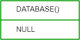
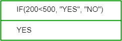

# SQL |高级功能

> 原文:[https://www.geeksforgeeks.org/sql-advanced-functions/](https://www.geeksforgeeks.org/sql-advanced-functions/)

以下是在 SQL 中定义的一些高级函数:

1.  **BIN():** It converts a decimal number to a binary number.
    **Syntax:**

    ```sql
    SELECT BIN(18);

    ```

    **输出:**
    

2.  **BINARY():** It converts a value to a binary string
    **Syntax:**

    ```sql
    SELECT BINARY "GeeksforGeeks";
    ```

    **输出:**
    

3.  **聚结():**它返回列表中的第一个非空表达式。
    **语法:**

```sql
SELECT COALESCE(NULL,NULL,'GeeksforGeeks',NULL,'Geeks');

```

**输出:**


8.  **CONNECTION_ID():** It returns the unique connection ID for the current connection.
    **Syntax:**

    ```sql
    SELECT CONNECTION_ID();

    ```

    **输出:**
    

9.  **CURRENT_USER():** It returns the user name and host name for the MySQL account used by the server to authenticate the current client.
    **Syntax:**

    ```sql
    SELECT CURRENT_USER();

    ```

    **输出:**
    

10.  **DATABASE():** It returns the name of the default database.
    **Syntax:**

    ```sql
    SELECT DATABASE();

    ```

    **输出:**
    

11.  **IF():** It returns one value if a condition is TRUE, or another value if a condition is FALSE.
    **Syntax:**

    ```sql
    SELECT IF(200<500, "YES", "NO");

    ```

    **输出:**
    

12.  **LAST_INSERT_ID():** It returns the first AUTO_INCREMENT value that was set by the most recent INSERT or UPDATE statement.
    **Syntax:**

    ```sql
    SELECT LAST_INSERT_ID();

    ```

    **输出:**
    

14.  **Syntax:**

    ```sql
    SELECT NULLIF(25.11, 25);

    ```

    **输出:**
    

15.  **Syntax:**

    ```sql
    SELECT NULLIF(115, 115);

    ```

    **输出:**
    

16.  **SESSION_USER():** It returns the user name and host name for the current MySQL user.
    **Syntax:**

    ```sql
    SELECT SESSION_USER();
    ```

    **输出:**
    

17.  **SYSTEM_USER():** It returns the user name and host name for the current MySQL user.
    **Syntax:**

    ```sql
    SELECT SYSTEM_USER();

    ```

    **输出:**
    

18.  **USER():** It returns the user name and host name for the current MySQL user.
    **Syntax:**

    ```sql
    SELECT USER();

    ```

    **输出:**
    

19.  **VERSION():** It returns the version of the MySQL database.
    **Syntax:**

    ```sql
    SELECT VERSION();

    ```

    **输出:**
    