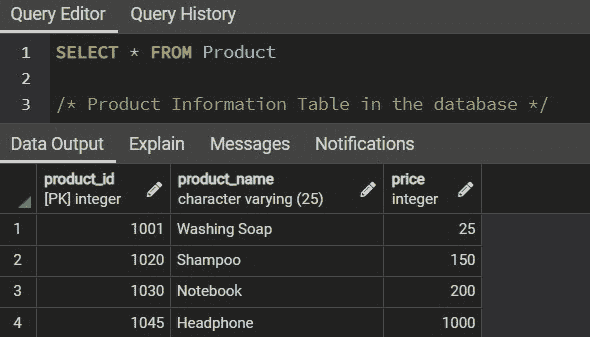
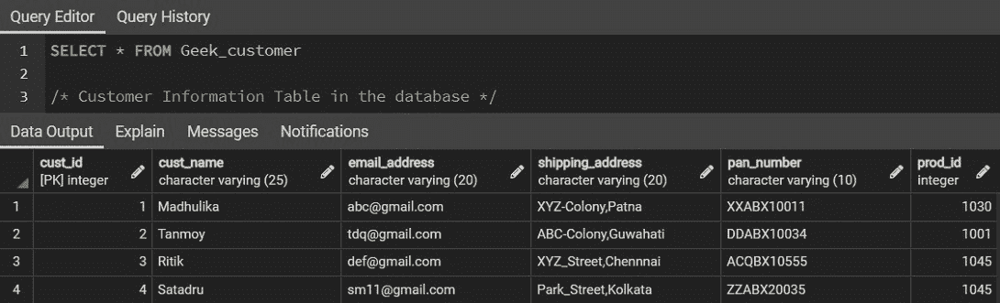
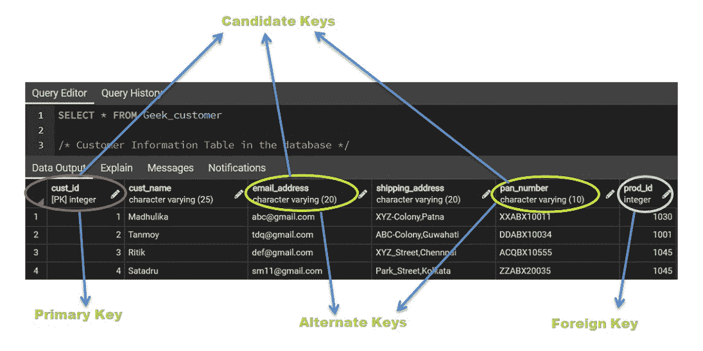

# SQL–备用键

> 原文:[https://www.geeksforgeeks.org/sql-alternate-key/](https://www.geeksforgeeks.org/sql-alternate-key/)

[](https://www.geeksforgeeks.org/types-of-keys-in-relational-model-candidate-super-primary-alternate-and-foreign/#:~:text=Alternate%20Key%3A%20The%20candidate%20key,out%20of%20many%20candidate%20keys).)**键是任何关系数据库的重要组成部分。有各种类型的键，其中之一是备用键。包含成为候选键所需的所有属性的键称为备用键。这些基本上是第二候选键，可以唯一地标识表中的一行。因此，备用密钥有时也被称为“辅助密钥”。**

**换句话说，我们可以将备用键定义为除主键之外的候选键集。一个给定的表可以有许多候选键，数据库管理员只选择其中的一个作为主键。因此，不用作主键的其他候选键是“备用键”。**

**关于备用密钥的一些要点如下:**

1.  **主键不能是备用键。对于只有一个候选关键字的表，该关键字必须是主键，不包含任何备用关键字。**
2.  **外键不能是备用键，因为它仅用于引用另一个表。**
3.  **备用密钥应该是唯一的。**
4.  **备用键可以是一组单个属性或多个属性。**
5.  **它也可以为空。**

**在本文中，我们将看到如何使用示例表在 SQL 中创建一个备用键，如图所示。**

****样本输入:**考虑客户信息表，该表包含从电子商务网站购买产品的客户的数据。此表参考了产品信息表，以了解客户购买的产品的详细信息。用于引用的常用属性是“产品标识”，也称为 [**外键**](https://www.geeksforgeeks.org/foreign-key-constraint-in-sql/) 。**

<figure class="table">**1020T36】洗发水 T86】1T90】abc@gmail.comT118】def@gmail.comT127

| **Product information** |
| --- |
| Product ID | product name | price |
| --- | --- | --- |
| One thousand and one | Soap washing | Twenty-five |
| information |
| Customer ID | Customer name | E-mail address | Shipping address | Disk number | Product ID |
| 突出 | Guhati | ddabx 10034 | One thousand and one |
| three | Ritik | XYZ _ Street, Chennai | acqbx 10555 | One thousand and forty-five |** </figure>

**在客户信息表中，**客户标识、摇号、电子邮件地址**是唯一的，因为它可以唯一地标识给定表中的一行。PAN 号码对每个人来说都是唯一的，客户 ID 也是电子商务网站提供的唯一号码，用于区分在其购物网站上注册的成吨的客户。**

**用户只能使用一个电子邮件地址在购物网站上注册。如果他/她想使用相同的电子邮件创建另一个帐户，将显示一条消息，*“具有此电子邮件地址的帐户已经存在，请登录”。*所以，每个消费者都会有一个唯一的电子邮件地址。因此，所有这些属性都可以唯一地标识表中的一行。**

> **上表的候选密钥集是:{客户 ID、电话号码、电子邮件地址}**

**比方说，这个电子商务网站的数据库管理员选择客户标识作为主键。因此，PAN 号码和电子邮件地址将是备用密钥或辅助密钥。备用键具有成为主键的所有属性，因此是备用选项。**

**使用 SQL 约束 [**【唯一的】**](https://www.geeksforgeeks.org/sql-unique-constraint/#:~:text=Unique%20constraint%20in%20SQL%20is,tuples%2C%20else%20it%20return%20false.) 来定义 SQL 中的备用键。**

```sql
UNIQUE(col_name(s))

col_name(s): The name of the column(s) in the table which need to be unique.
```

****基本 SQL 查询:****

****1。创建数据库****

```sql
CREATE DATABASE database_name
```

****2。创建表格****

```sql
CREATE TABLE Table_name(
col_1 TYPE col_1_constraint,
col_2 TYPE col_2 constraint,
col_3 TYPE UNIQUE,
col_4 TYPE REFERENCES Table_Name(col_name),
.....
)

col: The name of the columns.
TYPE: Data type whether an integer, variable character, etc
col_constraint: Constraints in SQL like PRIMARY KEY, NOT NULL, UNIQUE, REFERENCES, etc.
col_3: Definining an ALTERNATE KEY using constraint UNIQUE
col_4: Definining an FOREIGN KEY using constraint REFERENCES
```

****3。插入表格****

```sql
INSERT INTO Table_name
VALUES(val_1, val_2, val_3, ..........)

val: Values in particular column
```

****4。查看表格****

```sql
SELECT * FROM Table_name
```

****输出:****

**

**产品表**** **

**客户表**** 

**下表显示了表中所有按键的图示:**

**

**键****