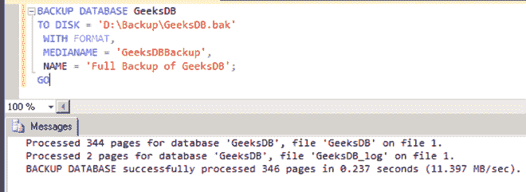

# SQL 备份

> 原文:[https://www.geeksforgeeks.org/sql-backup/](https://www.geeksforgeeks.org/sql-backup/)

在 SQL Server 中，备份或数据备份是创建并存储在不同位置的计算机数据的副本，以便在数据丢失时可以用来恢复原始数据。要创建完整的数据库备份，可以使用以下方法:

**1。** [**使用微软 SQL Server 中的 SQL Server 管理工作室**](https://www.geeksforgeeks.org/backup-database-in-ms-sql-server/) **。**

**2。使用 Transact-SQL:**

*   连接到数据库引擎。
*   打开新查询

**语法**

```
BACKUP DATABASE databasename TO backup_device [ ] [ WITH with_options [] ] ;
```

哪里，

*   **数据库名称**是需要备份的数据库。
*   **backup_device [ DISK | TAPE ]** 声明一个从 1 到 64 的备份设备列表，用于备份操作。
*   **WITH with_options [ ]** 定义了以下一个或多个选项:
*   **COMPRESSION | NO _ COMPRESSION**定义是否对此备份执行备份压缩。
*   **描述**最多可以有 255 个字符，描述备份集。
*   **名称**最多可包含 128 个字符，用于描述备份集的名称。
*   **第一次使用介质时，可以使用[MEDIANAME][MEDIADESCRIPTION]**格式，或者覆盖所有现有数据。

以下是创建备份的各种选项:

**1。创建完整的 SQL Server 磁盘备份:**

我们可以使用以下语句创建完整的 SQL Server 磁盘备份:

```
BACKUP DATABASE DatabaseName
TO DISK = 'C:\DatabaseName.BAK'
GO
```

在这里，备份数据库数据库名称是指令。“到磁盘”选项指定备份应该写入驱动器，以及备份位置和文件名。

**2。创建差异 SQL Server 备份:**

我们可以使用以下语句创建差异 SQL Server 备份:

```
BACKUP DATABASE DatabaseName
TO DISK = 'C:\DatabaseName.BAK'  
WITH DIFFERENTIAL  
GO
```

**3。创建文件级 SQL Server 备份:**

我们可以使用以下语句创建文件级的 SQL Server 备份:

```
BACKUP DATABASE DatabaseName FILE = 'DatabaseName'  
TO DISK = 'C:\DatabaseName_DatabaseName.FIL'
GO
```

这里，“带文件”选项用于在此命令中定义文件备份。必须定义数据库的逻辑文件名。

**4。创建文件组 SQL Server 备份:**

我们可以使用以下语句创建文件组 SQL Server 备份:

```
BACKUP DATABASE DatabaseName FILEGROUP = 'ReadOnly'  
TO DISK = 'C:\DatabaseName.FLG'
GO
```

**5。创建多个磁盘文件的完整 SQL Server 备份:**

我们可以使用以下语句创建多个磁盘文件的完整 SQL Server 备份:

```
BACKUP DATABASE DatabaseName 
TO DISK = 'C:\DatabaseName_1.BAK',
DISK = 'D:\DatabaseName_2.BAK',
DISK = 'E:\DatabaseName_3.BAK'
GO
```

这里，这个命令不是一个大文件，而是多次使用“DISK”选项将备份写入三个大小相似的小文件。

**6。使用密码创建完整的 SQL Server 备份:**

我们可以使用以下语句用密码创建一个完整的 SQL Server 备份:

```
BACKUP DATABASE DatabaseName 
TO DISK = 'C:\DatabaseName_1.BAK'
WITH PASSWORD = 'Q!W@E#R{content}apos;
GO
```

在这里，“WITH PASSWORD”命令会生成一个备份，在还原数据库时必须输入该备份的密码。

**7。使用进度统计信息创建完整的 SQL Server 备份:**

我们可以使用以下语句创建带有进度统计信息的完整 SQL Server 备份:

```
BACKUP DATABASE DatabaseName 
TO DISK = 'C:\DatabaseName_1.BAK'
WITH STATS
GO
```

在这里，“WITH STATS”命令生成一个完整的备份，并显示备份的进度。默认设置是每百分之十显示改进。

这是另一个示例，显示每 2%之后的统计数据。

```
BACKUP DATABASE DatabaseName 
TO DISK = 'C:\DatabaseName_1.BAK'
WITH STATS = 2
GO
```

**8。创建一个 SQL Server 备份并给它一个描述:**

我们可以创建一个 SQL Server 备份，并使用以下语句对其进行描述:

```
BACKUP DATABASE DatabaseName 
TO DISK = 'C:\DatabaseName_1.BAK'
WITH DESCRIPTION = 'Full backup for DatabaseName'
GO
```

要给备份命名，“带描述”命令使用描述选项。这可用于将来的任何恢复命令，以查看备份中的内容。最大字符数为 255。

**9。创建镜像的 SQL Server 备份:**

我们可以使用以下语句创建镜像的 SQL Server 备份:

```
BACKUP DATABASE DatabaseName 
TO DISK = 'C:\DatabaseName_1.BAK'
MIRROR TO DISK =  'D:\DatabaseName_mirror.BAK'
WITH FORMAT
GO
```

这种选择允许您制作多个备份副本，最好是在不同的位置。

**10。为 SQL Server 备份指定多个选项:**

我们可以使用以下语句为 SQL Server 备份指定多个选项:

```
BACKUP DATABASE DatabaseName 
TO DISK = 'C:\DatabaseName_1.BAK'
MIRROR TO DISK =  'D:\DatabaseName_mirror.BAK'
WITH FORMAT, STATS, PASSWORD = 'Q!W@E#R{content}apos;
GO
```

**示例:**

**创建数据库:**

```
CREATE DATABASE GeeksDB;
GO
```

**使用该数据库:**

```
USE GeeksDB;
GO
```

**备份该数据库:**

```
BACKUP DATABASE GeeksDB
TO DISK = 'D:\Backup\GeeksDB.bak'
 WITH FORMAT,
 MEDIANAME = 'GeeksDBBackup',
 NAME = 'Full Backup of GeeksDB';
GO
```

**输出:**

