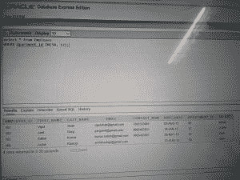

# SQL |条件表达式

> 原文:[https://www.geeksforgeeks.org/sql-conditional-expressions/](https://www.geeksforgeeks.org/sql-conditional-expressions/)

**以下是 SQL 中的条件表达式**

1.  **The CASE Expression**: Let you use IF-THEN-ELSE statements without having to invoke procedures.
    In a simple CASE expression, the SQL searches for the first WHEN……THEN pair for which expr is equal to comparison_expr and returns return_expr. If above condition is not satisfied, an ELSE clause exists, the SQL returns else_expr. Otherwise, returns NULL.
    We cannot specify literal null for the return_expr and the else_expr. All of the expressions(expr, comparison_expr, return_expr) must be of the same data type.
    **Syntax:**

    ```
    CASE expr WHEN comparison_expr1 THEN return_expr1
             [WHEN comparison_expr2 THEN return_expr2
              .
              .
              .
              WHEN comparison_exprn THEN return_exprn
              ELSE else_expr]
    END

    ```

    **示例:**

    ```
    Input :
    SELECT first_name, dpartment_id, salary,
           CASE dpartment_id WHEN 50 THEN 1.5*salary
                             WHEN 12 THEN 2.0*salary
           ELSE salary
           END "REVISED SALARY"
    FROM Employee;
    ```

    **输出:**
    

    **说明**:在上面的 SQL 语句中，department_id 的值被解码。如果是 50，那么工资是 1.5 倍，如果是 12，那么工资是 2 倍，否则工资没有变化。

2.  **The DECODE Function :** Facilitates conditional inquiries by doing the work of a CASE or IF-THEN-ELSE statement.
    The DECODE function decodes an expression in a way similar to the IF-THEN-ELSE logic used in various languages. The DECODE function decodes expression after comparing it to each search value. If the expression is the same as search, result is returned.
    If the default value is omitted, a null value is returned where a search value does not match any of the result values.
    **Syntax:**

    ```
    DECODE(col/expression, search1, result1
                            [, search2, result2,........,]
                            [, default])

    ```

    ```
    Input :
    SELECT first_name, dpartment_id, salary,
           DECODE(dpartment_id, 50, 1.5*salary,
                                 12, 2.0*salary,
                  salary)
           "REVISED SALARY"
    FROM Employee;

    ```

    **输出:**
    
    **说明:**在上面的 SQL 语句中，测试了 department_id 的值。如果是 50，那么工资是 1.5 倍，如果是 12，那么工资是 2 倍，否则工资没有变化。

3.  **COALESCE :** Returns the first non-null argument. Null is returned only if all arguments are null. It is often used to substitute a default value for null values when data is retrieved for display.
    NOTE: Same as CASE expressions, COALESCE also will not evaluate the arguments to the right of the first non-null argument found.
    **Syntax:**

    ```
    COALESCE(value [, ......] )

    ```

    ```
    Input:
    SELECT COALESCE(last_name, '- NA -')
    from Employee;

    ```

    **输出:**
    
    **解释:**-NA-”将显示在姓氏为空的地方，否则将显示各自的姓氏。

4.  **最大:**从任意数量的表达式列表中返回最大值。比较区分大小写。如果列表中所有表达式的数据类型都不相同，剩下的所有表达式都转换为第一个表达式的数据类型进行比较，如果这种转换不可能，SQL 将抛出一个错误。
    **注意:**如果列表中的任何表达式为空，则返回空。
    **语法:**

    ```
    GREATEST(expr1, expr2 [, .....] )

    ```

    *   ```
        Input:
        SELECT GREATEST('XYZ', 'xyz')
        from dual;

        ```

        ```
        Output:
        GREATEST('XYZ', 'xyz')
        xyz

        ```

        **说明:**小字母的 ASCII 值较大。

    *   ```
        Input:
        SELECT GREATEST('XYZ', null, 'xyz')
        from dual;

        Output:
        GREATEST('XYZ', null, 'xyz')
        -
        ```

        **解释:**由于因此存在空值，空值将显示为输出(如上面描述中提到的注意事项)。

5.  **IFNULL:** 如果 expr1 不为空，则返回 expr 1；否则它返回 expr2。根据使用它的上下文，返回一个数值或字符串值。
    **语法:**

    ```
    IFNULL(expr1, expr2)

    ```

    *   ```
        Input:
        SELECT IFNULL(1,0) 
        FROM dual;

        ```

        ```
        Output:
        -
        1

        ```

        **说明:**自，无表达式为空。

    *   ```
        Input:
        SELECT IFNULL(NULL,10) 
        FROM dual;

        Output:
        --
        10

        ```

        **解释:**由于 expr1 为空，因此显示 expr2。

6.  **IN:** Checks whether a value is present within a set of values and can be used with WHERE, CHECK and creation of views.
    NOTE: Same as CASE and COALESCE expressions, IN also will not evaluate the arguments to the right of the first non-null argument found.
    **Syntax:**

    ```
    WHERE column IN (x1, x2, x3 [,......] )

    ```

    ```
    Input:
    SELECT * from Employee
    WHERE dpartment_id IN(50, 12);

    ```

    **输出:**
    

    **说明:**员工的所有数据都用部门 ID 50 或 12 显示。

7.  **LEAST:** Returns the smallest value from a list of any number of expressions. Comparison is case sensitive. If datatypes of all the expressions in the list are not same, rest all expressions are converted to the datatype of the first expression for comparison and if this conversion is not possible, SQL will throw an error.
    NOTE: Returns null if any expression in the list is null.

    **语法:**

    ```
    LEAST(expr1, expr2 [, ......])

    ```

    *   ```

        strong>Input:
        SELECT LEAST('XYZ', 'xyz')
        from dual;

        **Output:**
        **LEAST('XYZ', 'xyz')**
        XYZ

        ```

        **说明:**大写字母的 ASCII 值较小。

    *   ```

        **Input:**
        SELECT LEAST('XYZ', null, 'xyz')
        from dual;

        **Output:**
        **LEAST('XYZ', null, 'xyz')**
        -

        ```

        **解释:**由于因此存在空值，空值将显示为输出(如上面描述中提到的注意事项)。

8.  **NULLIF:** Returns a null value if value1=value2, otherwise it returns value1.
    **Syntax:**

    ```
    NULLIF(value1, value2)

    ```

    **示例:**

    ```

    **Input:**
    SELECT NULLIF(9995463931, contact_num) 
    from Employee;

    ```

    **输出:**
    

**说明:**对于与给定号码匹配的员工，显示空。对于其余员工，返回值 1。

本文由[](https://auth.geeksforgeeks.org/profile.php?user=akanshgupta&list=practice)**供稿。如果你喜欢 GeeksforGeeks 并想投稿，你也可以使用[contribute.geeksforgeeks.org](http://www.contribute.geeksforgeeks.org)写一篇文章或者把你的文章邮寄到 contribute@geeksforgeeks.org。看到你的文章出现在极客博客主页上，帮助其他极客。**

**如果你发现任何不正确的地方，或者你想分享更多关于上面讨论的话题的信息，请写评论。**