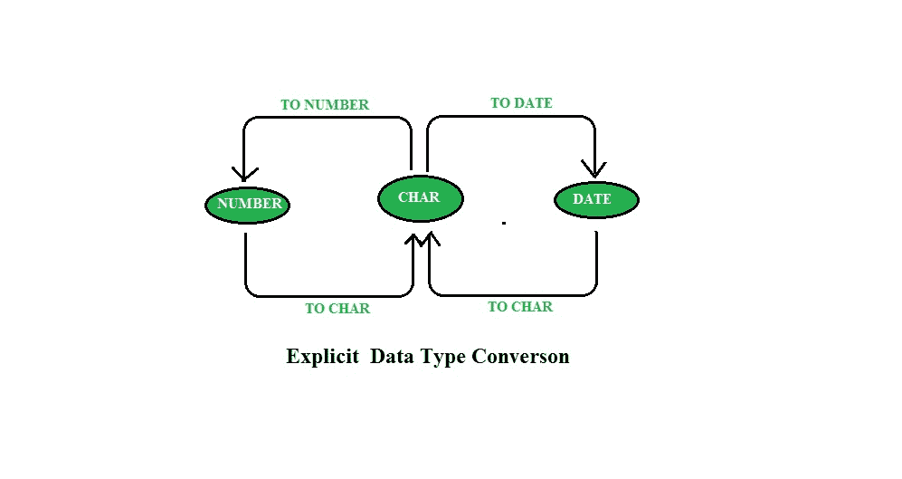

# SQL |转换函数

> 原文:[https://www.geeksforgeeks.org/sql-conversion-function/](https://www.geeksforgeeks.org/sql-conversion-function/)


在某些情况下，服务器使用一种类型的数据，而它期望另一种数据类型的数据。当服务器可以自动将数据转换为预期的数据类型时，就会发生这种情况。这种数据类型转换可以由服务器隐式完成，也可以由用户显式完成。

## 隐式数据类型转换:

在这种类型的转换中，数据被隐式地从一种类型转换成另一种类型(通过自身/自动)。

| 从 | 到 |
| --- | --- |
| VARCHAR2 或 CHAR | 数字 |
| VARCHAR2 或 CHAR | 日期 |
| 日期 | VARCHAR2 |
| 数字 | VARCHAR2 |

#### 示例:

2.  **QUERY:**

    ```sql
    SELECT employee_id,first_name,salary
    FROM employees
    WHERE salary > 15000;
    ```

    **输出:**

    | 员工标识 | 名字 | 薪水 |
    | --- | --- | --- |
    | One hundred | 史蒂文(男子名) | Twenty-four thousand |
    | One hundred and one | 尼娜 | Seventeen thousand |
    | One hundred and two | 法律 | Seventeen thousand |

3.  **QUERY:**

    ```sql
    SELECT employee_id,first_name,salary
    FROM employees
    WHERE salary > '15000';
    ```

    **输出:**

    | 员工标识 | 名字 | 薪水 |
    | --- | --- | --- |
    | One hundred | 史蒂文(男子名) | Twenty-four thousand |
    | One hundred and one | 尼娜 | Seventeen thousand |
    | One hundred and two | 法律 | Seventeen thousand |

    这里我们看到两个查询的输出结果是一样的，尽管第二个查询使用**‘15000’**作为文本，但它会自动转换为 **int** 数据类型。

## 显式数据类型转换:



#### 目标字符功能:

函数用于将数字或日期输入转换为具有格式模型的字符类型(可选)。
**语法:**

```sql
TO_CHAR(number1, [format], [nls_parameter])
```

#### 使用带有日期的 **TO_CHAR** 功能:

**语法:**

```sql
TO_CHAR(date, ’format_model’)
```

格式模型:

*   必须用单引号括起来，并且区分大小写

*   可以包括任何有效的日期格式元素
*   有一个 fm 元素来删除填充空白或
    抑制前导零
*   用逗号与日期值隔开

**示例:**

```sql
SELECT employee_id, TO_CHAR(hire_date, ’MM/YY’) Month_Hired
FROM employees
WHERE last_name = ’Higgins’;
```

**输出:**

| 员工标识 | MONTH _ APPLEED |
| --- | --- |
| Two hundred and five | 06/94 |

**日期格式模型的元素:**

| YYYY | 全年数字 |
| 年 | 详细说明年份 |
| abbr. 毫米（millimeter） | 月份的两位数值 |
| 月 | 月份的全名 |
| 孟族人 | 月份的三个字母缩写 |
| 镝 | 星期几的三个字母缩写 |
| 天 | 本周的全名 |
| 直接伤害 | 一个月中的数字日 |

#### 日期格式模型的元素:

**日期格式元素–时间格式:**
使用下表中列出的格式显示时间信息和文字，并将数字更改为拼写数字。

| 元素 | 描述 |
| --- | --- |
| 上午或下午 | 子午线指示器 |
| --- | --- |
| 上午或下午 | 带周期的子午线指示器 |
| --- | --- |
| HH 或 HH12 或 HH24 | 一天中的小时，或小时(1-12)，或小时(0-23) |
| --- | --- |
| 大调音阶的第三音 | 0-59 分钟 |
| --- | --- |
| 圣人 | 第二个 0-59 |
| --- | --- |
| ssssss | 午夜过后第二天 0-86399 |
| --- | --- |

**其他格式:**

| 元素 | 描述 |
| --- | --- |
| **/。，** | 标点符号在结果中重现 |
| --- | --- |
| “的” | 引用的字符串会在结果中重现 |
| --- | --- |

**指定影响数字显示的后缀:**

| 元素 | 描述 |
| --- | --- |
| 泰国(Thailand) | 序数(例如第 4 位的 DDTH |
| --- | --- |
| 特殊卡 | 拼出数字(例如 DDSP 代表四 |
| --- | --- |
| SPTH 还是 THSP | 拼出序数(例如第四位的 DDSPTH |
| --- | --- |

**示例:**

```sql
SELECT last_name,
TO_CHAR(hire_date, ’fmDD Month YYYY’)
AS HIREDATE
FROM employees;
```

**输出:**

| 姓 | hiredate |
| --- | --- |
| 奥斯汀 | 2005 年 1 月 25 日 |
| 舒巴姆 | 2004 年 6 月 20 日 |
| 尼尚特 | 1999 年 1 月 15 日 |
| 鸭子！鸭子 | 1995 年 7 月 15 日 |
| 万世卡 | 2004 年 8 月 5 日 |
| 库苏姆 | 1994 年 6 月 10 日 |
| 费贝特 | 2005 年 3 月 11 日 |
| 国王 | 1996 年 4 月 9 日 |

#### 使用带数字的 **TO_CHAR** 功能:

**语法:**

```sql
TO_CHAR(number, ’format_model’)
```

这些是一些格式元素，您可以使用
和 TO_CHAR 函数将数值
显示为字符:

| nine | 代表一个数字 |
| Zero | 强制显示零 |
| $ | 放置一个浮动美元符号 |
| L | 使用浮动当地货币符号 |
| **。** | 打印小数点 |
| **、** | 打印千位指示器 |

**示例:**

```sql
SELECT TO_CHAR(salary, ’$99,999.00’) SALARY
FROM employees
WHERE last_name = ’Ernst’;
```

**输出:**

| 薪水 |
| --- |
| $5000 |

#### 使用终止号码和终止日期功能:

使用 **TO_NUMBER** 功能将字符串转换为数字格式:

```sql
TO_NUMBER(char[, ’format_model’])
```

使用**至 _ 日期**功能将字符串转换为日期格式:

```sql
TO_DATE(char[, ’format_model’])
```

这些函数有一个 **fx** 修改器。该修饰符指定了**至 _ 日期**函数的字符参数和日期格式模型的精确匹配。
T5 例:

```sql
SELECT last_name, hire_date
FROM employees
WHERE hire_date = TO_DATE(’May 24, 1999’, ’fxMonth DD, YYYY’);
```

**输出:**

| 姓 | 你在说什么 |
| --- | --- |
| 库马尔 | 1999 年 5 月 24 日 |