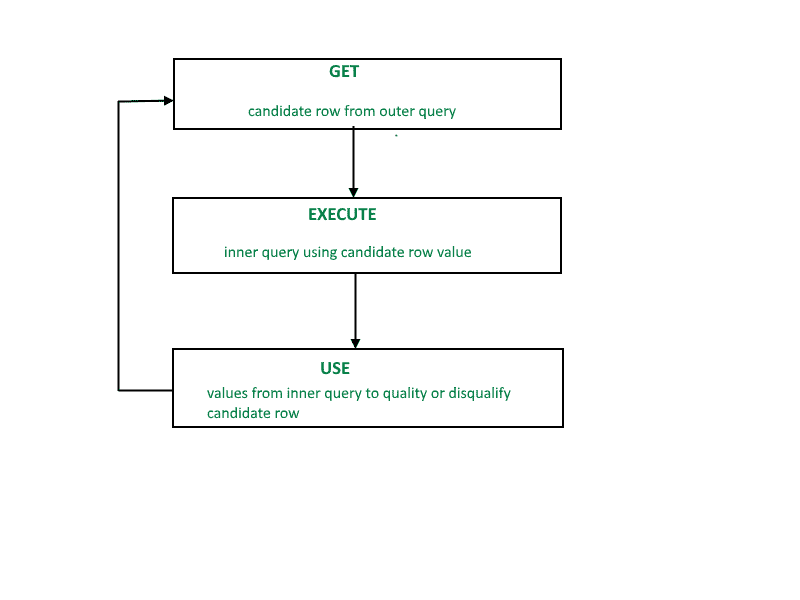
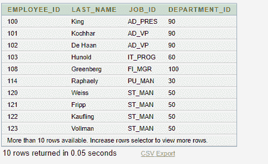
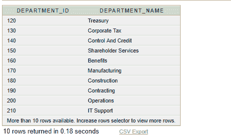

# SQL 相关子查询

> 原文:[https://www.geeksforgeeks.org/sql-correlated-subqueries/](https://www.geeksforgeeks.org/sql-correlated-subqueries/)

相关子查询用于逐行处理。对于外部查询的每一行，每个子查询执行一次。

对于父语句处理的每一行，相关子查询都计算一次。父语句可以是**选择**、**更新**或**删除**语句。

```
SELECT column1, column2, ....
FROM table1 outer
WHERE column1 operator
                    (SELECT column1, column2
                     FROM table2
                     WHERE expr1 = 
                               outer.expr2);
```

相关子查询是读取表中每一行并将每一行中的值与相关数据进行比较的一种方式。每当子查询必须为主查询考虑的每个候选行返回不同的结果或结果集时，都会使用它。换句话说，您可以使用相关子查询来回答一个多部分问题，该问题的答案取决于父语句处理的每一行中的值。

## 嵌套子查询与相关子查询:

对于普通的嵌套子查询，内部的 **SELECT** 查询首先运行并执行一次，返回主查询要使用的值。但是，相关子查询对外部查询考虑的每个候选行执行一次。换句话说，内部查询由外部查询驱动。
**注意:**您也可以在相关子查询中使用 **ANY** 和 **ALL** 运算符。
**相关子查询示例:**查找部门内所有收入高于平均工资的员工。

```
SELECT last_name, salary, department_id
 FROM employees outer
 WHERE salary >
                (SELECT AVG(salary)
                 FROM employees
                 WHERE department_id =
                        outer.department_id);
```

相关性的其他用法在**更新**和**删除**中

## 相关更新:

```
UPDATE table1 alias1
 SET column = (SELECT expression 
               FROM table2 alias2
               WHERE alias1.column =
                     alias2.column);
```

使用相关子查询根据另一个表中的行更新一个表中的行。

## 相关删除:

```
DELETE FROM table1 alias1
 WHERE column1 operator
               (SELECT expression
                FROM table2 alias2
                WHERE alias1.column = alias2.column);
```

使用相关子查询根据另一个表中的行删除一个表中的行。

## 使用 EXISTS 运算符:

EXISTS 运算符测试子查询结果集中是否存在行。如果找到了子查询行值，则条件被标记为**真**，并且搜索不会在内部查询中继续，如果没有找到，则条件被标记为**假**，并且搜索会在内部查询中继续。
**使用 EXIST 运算符的示例:**
查找至少有一个人向其报告的员工。

```
SELECT employee_id, last_name, job_id, department_id
FROM employees outer
WHERE EXISTS ( SELECT ’X’
FROM employees
WHERE manager_id =
outer.employee_id);
```

**输出:**


**使用 NOT EXIST 运算符的示例:**
查找没有任何员工的所有部门。

```
SELECT department_id, department_name
FROM departments d
WHERE NOT EXISTS (SELECT ’X’
FROM employees
WHERE department_id
= d.department_id);
```

**输出:**
