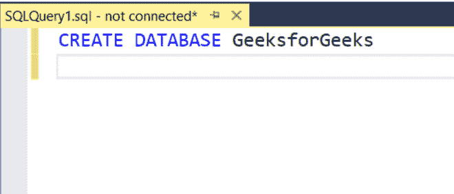
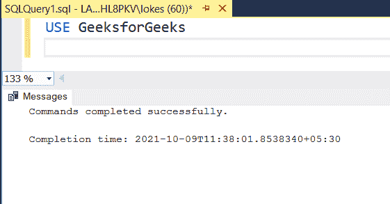
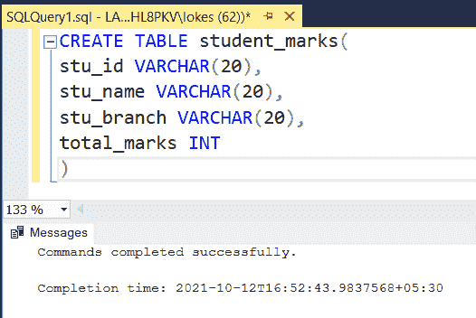
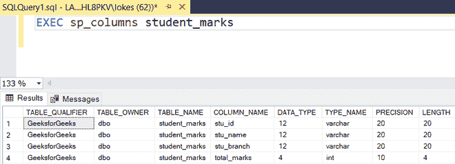
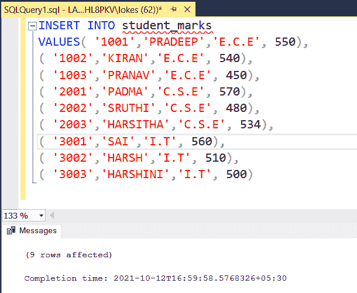
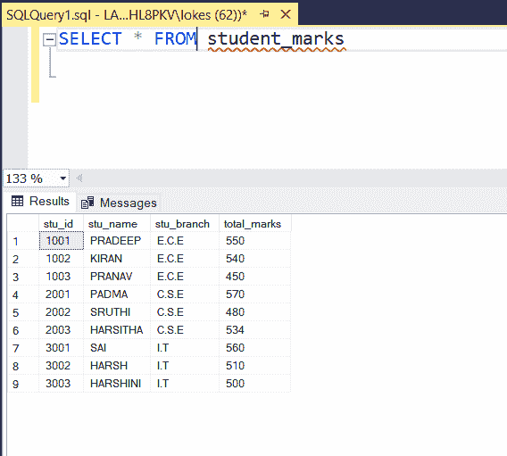
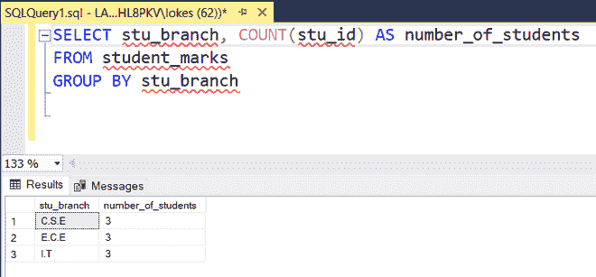
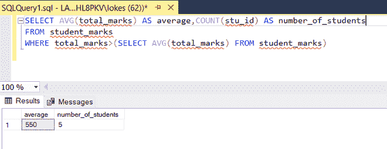

# 带分组依据子句的 SQL–count()

> 原文:[https://www . geesforgeks . org/SQL-按子句分组计数/](https://www.geeksforgeeks.org/sql-count-with-group-by-clause/)

count()函数是一个聚合函数，用于查找满足固定条件的行数。带有**分组依据**子句的 count()函数用于对根据表的特定属性分组的数据进行计数。

**语法:**

```sql
SELECT attribute1 , COUNT(attribute2)
FROM table_name
GROUP BY attribute1
```

在本文中，让我们看看使用 MSSQL 作为服务器的带有 Group by 子句的 SQL count()。

**步骤 1:** 我们正在创建一个数据库。为此，使用下面的命令创建一个名为 GeeksforGeeks 的数据库。

**查询:**

```sql
CREATE DATABASE GeeksforGeeks;
```



**步骤 2:** 要使用 GeeksforGeeks 数据库，请使用以下命令。

**查询:**

```sql
USE GeeksforGeeks
```



**步骤 3:** 现在我们正在创建一个表。使用以下 SQL 查询创建一个包含 4 列的 student_marks 表。

**查询:**

```sql
CREATE TABLE student_marks(
stu_id VARCHAR(20),
stu_name VARCHAR(20),
stu_branch VARCHAR(20),
total_marks INT
)
```



**步骤 4:** 查看表格的描述。

**查询:**

```sql
EXEC sp_columns student_marks
```



**步骤 5:** 向表中插入行的查询。使用以下 SQL 查询将行插入 student_marks 表。

**查询:**

```sql
INSERT INTO student_marks
VALUES( '1001','PRADEEP','E.C.E', 550),
( '1002','KIRAN','E.C.E', 540),
( '1003','PRANAV','E.C.E', 450),
( '2001','PADMA','C.S.E', 570),
( '2002','SRUTHI','C.S.E', 480),
( '2003','HARSITHA','C.S.E', 534),
( '3001','SAI','I.T', 560),
( '3002','HARSH','I.T', 510),
( '3003','HARSHINI','I.T', 500)
```



**步骤 6:** 查看插入的数据

**查询:**

```sql
SELECT * FROM student_marks
```



*   查询每个分支机构的学生人数

```sql
SELECT stu_branch, COUNT(stu_id) AS number_of_students
FROM student_marks
GROUP BY stu_branch
```



*   查询查找分数大于表格平均分数的学生人数。

```sql
SELECT AVG(total_marks) AS average,COUNT(stu_id) AS number_of_students
FROM student_marks
WHERE total_marks>(SELECT AVG(total_marks) FROM student_marks)
```

