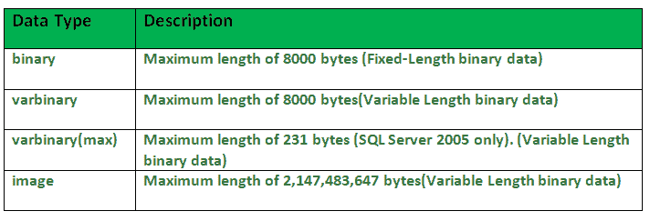
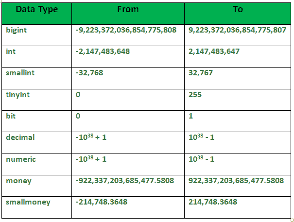
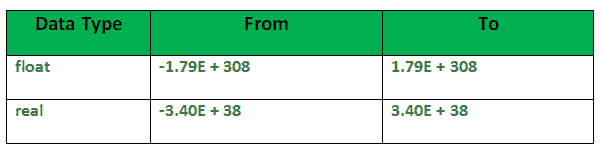
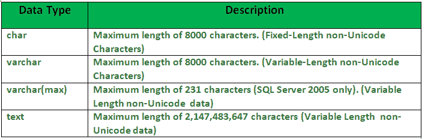
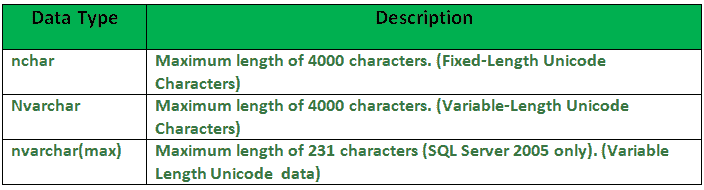
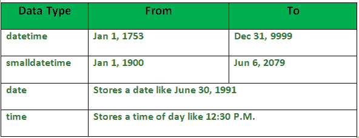

# SQL 数据类型

> 原文:[https://www.geeksforgeeks.org/sql-data-types/](https://www.geeksforgeeks.org/sql-data-types/)

与其他编程语言一样，SQL 也有某些可用的数据类型。所有数据类型的简要概念将在下面讨论。

1。**二进制数据类型:**
该数据类型有四个子类型，如下所示:

2.**精确数字数据类型:**
在下表中给出了 9 个子类型。该表包含特定类型的数据范围。

**3。近似数字数据类型:**
该数据类型的子类型在表中给出，范围如下。

**4。字符串数据类型:**
子类型如下表所示–

**5。Unicode 字符串数据类型:**
详情见下表–

**6。日期和时间数据类型:**
详情见下表。
