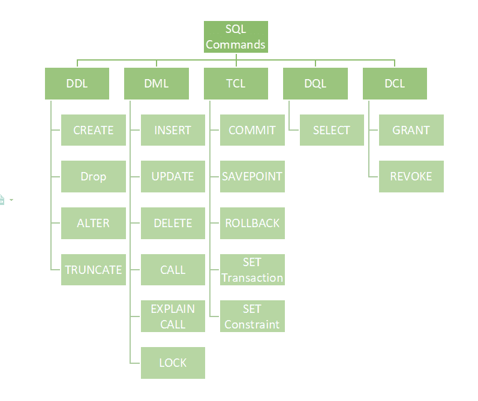

# SQL | DDL、DQL、DML、DCL 和 TCL 命令

> 原文:[https://www . geesforgeks . org/SQL-DDL-dql-DML-DCL-TCL-commands/](https://www.geeksforgeeks.org/sql-ddl-dql-dml-dcl-tcl-commands/)

众所周知，结构化查询语言是一种数据库语言，通过它我们可以对现有的数据库执行某些操作，也可以使用这种语言来创建数据库。 [SQL](https://www.geeksforgeeks.org/structured-query-language/) 使用某些命令，如创建、删除、插入等。去完成要求的任务。

这些 [SQL](https://www.geeksforgeeks.org/sql-concepts-and-queries/) 命令主要分为以下四类:

1.  数据定义语言
2.  数据查询语言
3.  数据操作语言
4.  数据控制语言

尽管许多资源声称还有另一类 SQL 子句**TCL——事务控制语言**。所以我们也将详细了解 TCL。

### **DDL(数据定义语言):**

[DDL](https://www.geeksforgeeks.org/features-of-structured-query-language-sql/) 或数据定义语言实际上由可用于定义数据库模式的 SQL 命令组成。它只处理数据库模式的描述，并用于创建和修改数据库中数据库对象的结构。DDL 是一组 SQL 命令，用于创建、修改和删除数据库结构，但不包括数据。一般用户通常不使用这些命令，他们应该通过应用程序访问数据库。

DDL 命令列表:

*   [**【创建】**](https://www.geeksforgeeks.org/sql-create/) :该命令用于创建数据库或其对象(如表、索引、函数、视图、存储过程和触发器)。
*   [**DROP**](https://www.geeksforgeeks.org/sql-drop-truncate/) :此命令用于从数据库中删除对象。
*   [**ALTER**](https://www.geeksforgeeks.org/sql-alter-add-drop-modify/) **:** 这是用来改变数据库的结构。
*   [**【TRUNCATE】**](https://www.geeksforgeeks.org/sql-drop-truncate/)**:**这用于从表中删除所有记录，包括为记录分配的所有空间都被删除。
*   [**COMMENT**](https://www.geeksforgeeks.org/sql-comments/) :用于给数据字典添加注释。
*   [**【重命名】**](https://www.geeksforgeeks.org/sql-alter-rename/) **:** 用于重命名数据库中存在的对象。

### **DQL(数据查询语言):**

**DQL** 语句用于对模式对象中的数据执行查询。DQL 命令的目的是基于传递给它的查询获得一些模式关系。我们可以这样定义 DQL:它是 SQL 语句的一个组成部分，允许从数据库中获取数据并对其进行排序。它包括 SELECT 语句。该命令允许从数据库中获取数据以对其执行操作。当针对一个或多个表触发 SELECT 时，结果被编译成另一个临时表，该临时表被显示或者可能被程序(即前端)接收。

DQL 名单:

*   [**SELECT**](https://www.geeksforgeeks.org/sql-select-clause/) **:** 用于从数据库中检索数据。

### **DML(数据操作语言):**

处理数据库中数据操作的 SQL 命令属于 DML 或数据操作语言，这包括大多数 SQL 语句。它是控制数据和数据库访问的 SQL 语句的组成部分。基本上，DCL 语句与 DML 语句分组。

DML 命令列表:

*   [**INSERT**](https://www.geeksforgeeks.org/sql-insert-statement/) :用于将数据插入表格。
*   [**【更新】**](https://www.geeksforgeeks.org/sql-update-statement/) **:** 用于更新表内已有数据。
*   [**DELETE**](https://www.geeksforgeeks.org/sql-delete-statement/) :用于删除数据库表中的记录。
*   [**LOCK:**](https://www.geeksforgeeks.org/sql-lock-table/) 表控制并发。
*   **CALL:** 调用 PL/SQL 或 JAVA 子程序。
*   **解释计划:**描述数据的访问路径。

### **DCL(数据控制语言):**

DCL 包括 GRANT 和 REVOKE 等命令，主要处理数据库系统的权限、许可和其他控制。

DCL 命令列表:

*   [**GRANT:**](https://www.geeksforgeeks.org/mysql-grant-revoke-privileges/) 该命令赋予用户访问数据库的权限。
*   [**【REVOKE:**](https://www.geeksforgeeks.org/difference-between-grant-and-revoke/)**该命令撤销用户使用 GRANT 命令授予的访问权限。**

**尽管许多资源声称还有另一类 SQL 子句 TCL——事务控制语言。所以我们也将详细了解 TCL。TCL 命令处理数据库内的[事务。](https://www.geeksforgeeks.org/sql-transactions/)**

**TCL 命令列表:** 

*   **[**提交**](https://www.geeksforgeeks.org/sql-transactions/) **:** 提交交易。**
*   **[**【回滚】**](https://www.geeksforgeeks.org/sql-transactions/) **:** 回滚事务，以防出现任何错误。**
*   ******:**在事务中设置保存点。****
*   ****[**SET TRANSACTION:**](https://www.geeksforgeeks.org/sql-transactions/)**为交易指定特征。******