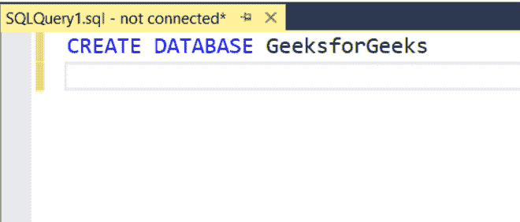

# SQL DELETE JOIN

> 原文:[https://www.geeksforgeeks.org/sql-delete-join/](https://www.geeksforgeeks.org/sql-delete-join/)

我们使用联接来组合来自多个表的数据。为了同时从表中删除相同的行或相关的行，我们使用 delete join。在本文中，让我们看看如何使用 MSSQL 作为服务器，使用 delete 和 JOIN 删除多个数据。

**语法:**

```sql
DELETE table1
FROM table1 JOIN table2 ON
table1.attribute_name = table2.attribute_name
WHERE condition
```

**步骤 1:** 我们正在创建一个数据库。为此，使用下面的命令创建一个名为 GeeksforGeeks 的数据库。

**查询:**

```sql
CREATE DATABASE GeeksforGeeks;
```



**步骤 2:** 要使用 GeeksforGeeks 数据库，请使用以下命令。

**查询:**

```sql
USE GeeksforGeeks
```

**输出:**


**步骤 3:** 现在我们创建两个表。使用以下 SQL 查询为学生创建一个包含 3 列的表和包含 2 列的 library_books 表。

**查询:**

```sql
CREATE TABLE student (
student_id VARCHAR(8),
student_name VARCHAR(20),
student_branch VARCHAR(20)
)
```

**输出:**


**查询:**

```sql
CREATE TABLE library_books(
lib_id VARCHAR(20),
book_taken INT
)
```

**输出:**


**步骤 4:** 查看表格的描述。

**查询:**

```sql
EXEC sp_columns students
```

**输出:**


**查询:**

```sql
EXEC sp_columns library_books
```

**输出:**


**步骤 5:** 向表中插入行的查询。使用以下 SQL 查询将行插入到学生和 library_books 表中。

**查询:**

```sql
INSERT INTO students
VALUES( '1001','PRADEEP','E.C.E'),
( '1002','KIRAN','E.C.E'),
( '1003','PRANAV','E.C.E'),
( '2001','PADMA','C.S.E'),
( '2002','SRUTHI','C.S.E'),
( '2003','HARSITHA','C.S.E'),
( '3001','SAI','I.T'),
( '3002','HARSH','I.T'),
( '3003','HARSHINI','I.T')
```

**输出:**


**查询:**

```sql
INSERT INTO library_books
VALUES( '1001',2),
( '1002',3),
( '1003',4),
( '2001',2),
( '3001',3)
```

**输出:**


**步骤 6:** 查看插入的数据

**查询:**

```sql
SELECT * FROM students
```

**输出:**


**查询:**

```sql
SELECT * FROM library_books
```

**输出:**


*   使用联接删除 id 1001 的库条目的查询

**查询:**

```sql
DELETE library_books
FROM  library_books JOIN students ON
students.student_id =library_books.lib_id
WHERE lib_id= 1001 
SELECT * FROM library_books
```

**输出:**

