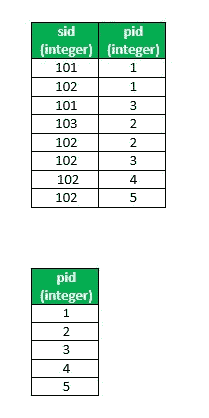
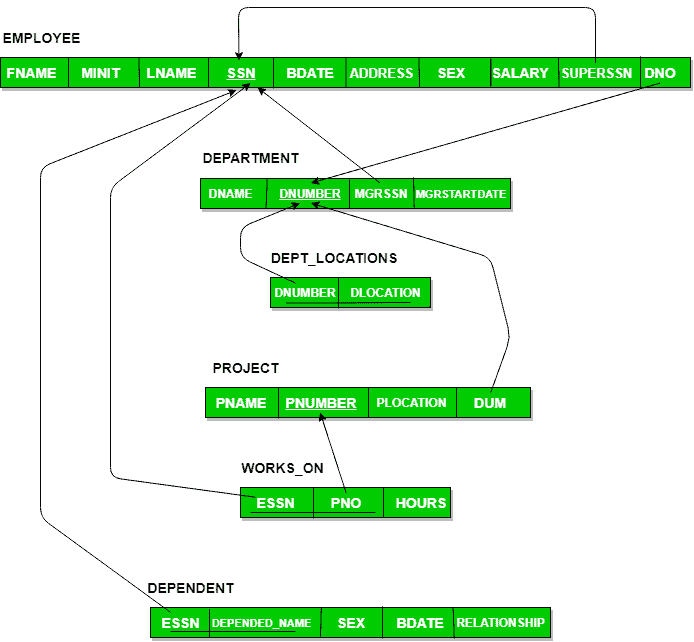

# SQL | DIVISION

> 原文:[https://www.geeksforgeeks.org/sql-division/](https://www.geeksforgeeks.org/sql-division/)

当您想要找出与一组不同类型实体的所有实体交互的实体时，通常需要进行划分。
当我们必须评估包含关键字‘all’的查询时，使用除法运算符。

**使用除法运算符的一些情况是:**

*   哪个人在某个城市的所有银行都有账户？
*   哪些学生修完了毕业所需的所有课程？

在所有这些查询中，关键字“all”后面的描述定义了一个包含一些元素的集合，最终结果包含满足这些要求的单元。

**重要提示:SQL 实现不支持除法。但是，它可以使用其他操作来表示。(如交叉连接，除了，在)**

**事业部的 SQL 实现**

**给定两个关系(表):R(x，y)，S(y)。**
**R 和 S** :表
**x 和 y**:R
**y**列:S 列

**R(x，y) div S(y)** 表示给出与 S 中 y 的所有值相关联的来自 R 的 x 的所有不同值。
**除法的计算:** R(x，y) div S(y)
**步骤:**

*   通过计算 R(x) x(交叉连接)S(y)，比如 r1，找出 S(y)与 R(x)的所有可能组合
*   从 r1 减去实际的 R(x，y)，比如 r2
*   r2 中的 x 不与 S(y)中的每个值相关联；因此 R(x)-r2(x)给出了与 S 中所有值相关的 x

**查询**

1.  **实施 1:**

    ```
    SELECT * FROM R 
    WHERE x not in ( SELECT x FROM (
    (SELECT x , y FROM (select y from S ) as p cross join 
    (select distinct x from R) as sp)
    EXCEPT
    (SELECT x , y FROM R) ) AS r ); 

    ```

2.  **实现 2 :** 使用相关子查询

    ```
    SELECT * FROM R as sx
    WHERE NOT EXISTS (
    (SELECT p.y FROM S as p )
    EXCEPT
    (SELECT sp.y FROM  R as sp WHERE sp.x = sx.x ) ); 

    ```

**关系代数**

```
Using steps which is mention above:
All possible combinations
r1 ← πx(R) x S
x values with “incomplete combinations”,
r2x ← πx(r1-R)
and 
result ← πx(R)-r2x

 R div S = πx(R)- πx((πx(R) x S) – R) 

```

### 例子

**供应模式**



此处 **sid** 表示**供应商 id****PID**表示**零件 sID** 。
**表:**供应商(sid、pid)、零件(pid)

**1。寻找供应所有零件的供应商。**

**Ans 1:使用实现 1**

```
SELECT * FROM suppliers
WHERE sid not in ( SELECT sid FROM ( (SELECT sid, pid FROM (select pid from parts) as p 
cross join 
(select distinct sid from supplies) as sp)
EXCEPT
(SELECT sid, pid FROM supplies)) AS r ); 
```

**Ans 2:使用实现 2**

```
SELECT * FROM suppliers as s
WHERE NOT EXISTS (( SELECT p.pid FROM parts as p )
EXCEPT
 (SELECT sp.pid FROM supplies sp WHERE sp.sid = s.sid ) );
```

**公司架构**



**2。列出在 dno=4 控制的所有项目中工作的员工。**

**Ans 1。使用实现 1**

```
SELECT * FROM employee AS e
WHERE ssn NOT IN (
SELECT essn FROM (
(SELECT essn, pno FROM (select pno from project where dno=4)
as p cross join (select distinct essn from works_on) as w)
EXCEPT (SELECT essn, pno FROM works_on)) AS r ); 
```

**Ans 2。使用实现 2**

```
SELECT * FROM employee AS e
WHERE NOT EXISTS (
 (SELECT pno FROM project WHERE dno = 4)
 EXCEPT
 (SELECT pno FROM works_on WHERE essn = e.ssn) );
```

 **重要提示:**对于除法，相关查询似乎更容易编写，但执行起来可能很昂贵。

**Some more Examples**

*   列出供应所有“红色”零件的供应商。(供应模式)*   Retrieve the names of employees, who work on all the projects that ‘John Smith’ works (company schema)

    本文由 **[卡丹·帕特尔](https://www.facebook.com/kadam.patel.750?hc_ref=NEWSFEED)** 供稿。如果你喜欢 GeeksforGeeks 并想投稿，你也可以使用[contribute.geeksforgeeks.org](http://www.contribute.geeksforgeeks.org)写一篇文章或者把你的文章邮寄到 contribute@geeksforgeeks.org。看到你的文章出现在极客博客主页上，帮助其他极客。

    如果你发现任何不正确的地方，或者你想分享更多关于上面讨论的话题的信息，请写评论。