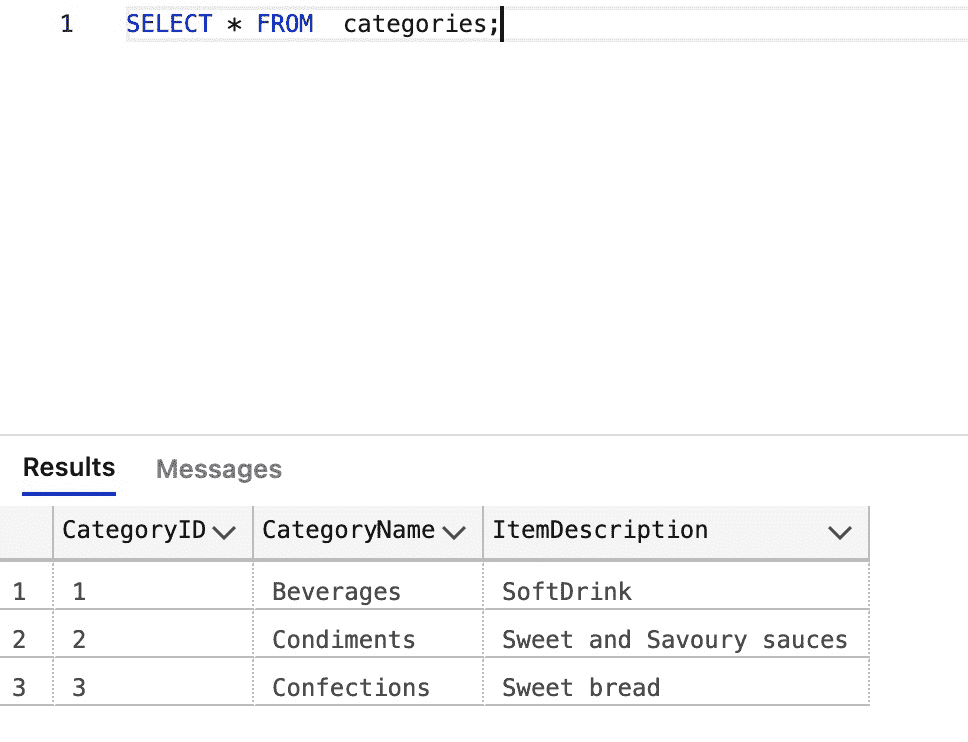
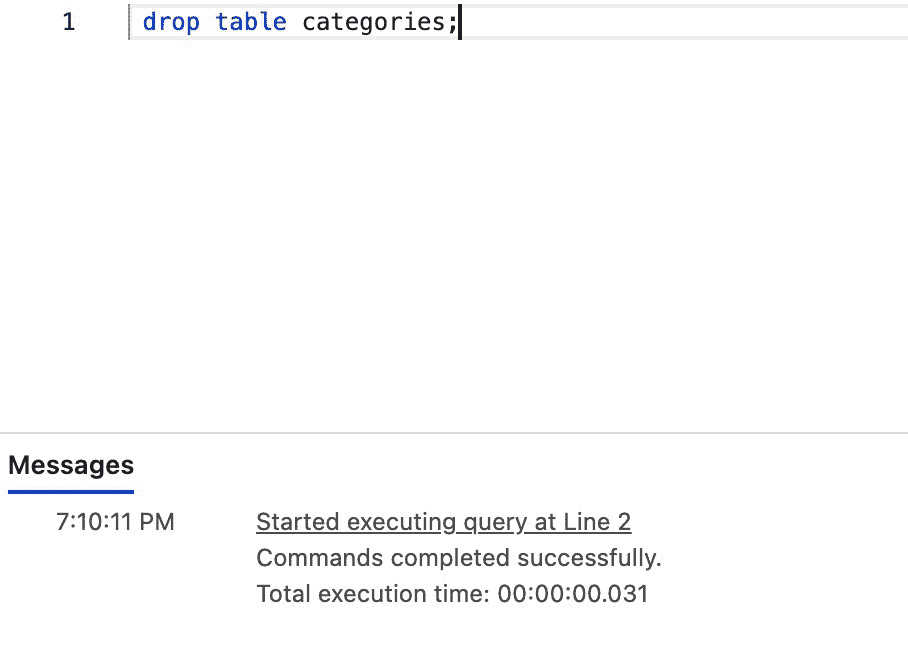
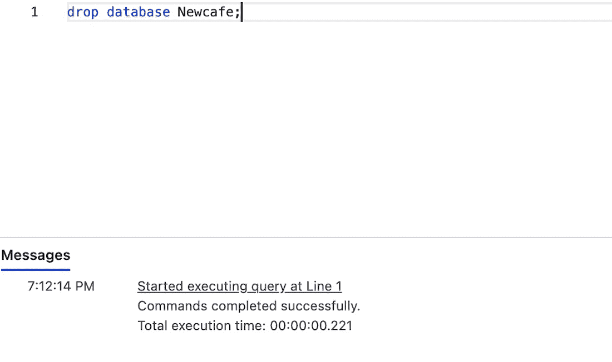

# SQL 删除表语句

> 原文:[https://www.geeksforgeeks.org/sql-drop-table-statement/](https://www.geeksforgeeks.org/sql-drop-table-statement/)

SQL 是一种编程语言，用于操作存储在数据库中的数据。它既灵活又方便用户。在 SQL 中，为了与数据库交互，用户必须键入具有特定语法的查询，例如 drop 命令。SQL 中的 drop 命令用于删除整个表，包括表中的数据、索引、触发器、约束和特定表的权限规范。它基本上是一种本质上不可逆的 DDL(数据定义语言)。这意味着一旦用户删除了一个表，就无法撤消该命令。因此，必须非常小心地使用 drop 命令。它也可以删除整个数据库或简单地删除一个表，这取决于用户的意愿。

**语法:**

**删除表格:**

```
DROP TABLE table_name;
```

**删除数据库:**

```
DROP DATABASE database_name;
```

**例 1:放下桌子**

在本例中，我们将讨论如何从名为“Newcafe”的数据库中删除名为“categories”的表。

**第一步:创建数据库**

```
CREATE DATABASE Newcafe;
```

**第二步:使用数据库**

```
USE Newcafe;
```

**第三步:创建表格**

```
CREATE TABLE [dbo].[categories]
(
    [CategoryID] INT NOT NULL PRIMARY KEY, 
    [CategoryName] NVARCHAR(50) NOT NULL,
    [ItemDescription] NVARCHAR(50) NOT NULL
);
GO
```

**在表内添加数据**

```
INSERT INTO [dbo].[categories]
( 
    [CategoryID], [CategoryName], [ItemDescription]
)
VALUES
( 
    1, 'Beverages', 'SoftDrink'
),
( 
    2, 'Condiments', 'Sweet and Savoury sauces'
), 
( 
    3, 'Confections', 'Sweet bread'
)
GO
```

**查看最终表格:**

```
SELECT * FROM  categories;
```



**第四步:放下类别表**

```
drop table categories;
```



**示例 2:删除数据库**

现在我们删除上面的内容，使用以下命令创建数据库:

```
drop database Newcafe;
```

