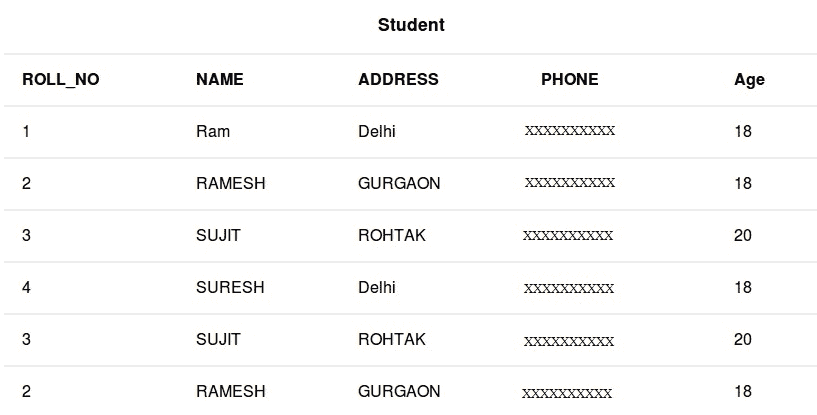
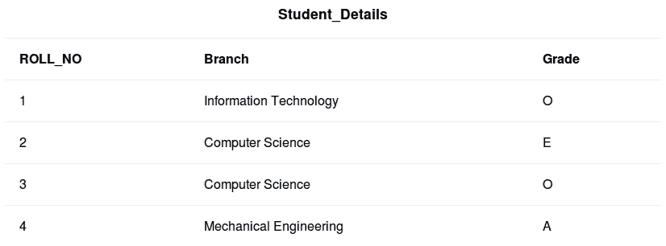

# SQL | DROP，TRUNCATE

> 原文:[https://www.geeksforgeeks.org/sql-drop-truncate/](https://www.geeksforgeeks.org/sql-drop-truncate/)

**下降**

DROP 用于删除整个数据库或一个表。DROP 语句销毁对象，如现有的数据库、表、索引或视图。
SQL 中的 DROP 语句从关系数据库管理系统(RDBMS)中删除一个组件。
**语法:**

```sql
DROP object object_name

Examples:
DROP TABLE table_name;
table_name: Name of the table to be deleted.

DROP DATABASE database_name;
database_name: Name of the database to be deleted.

```

**截断**

TRUNCATE 语句是一种数据定义语言(DDL)操作，用于标记表的范围以便解除分配(空的以便重用)。此操作的结果是快速删除表中的所有数据，通常会绕过许多完整性实施机制。在 [SQL:2008](https://en.wikipedia.org/wiki/SQL:2008) 标准中正式引入。
TRUNCATE TABLE my TABLE 语句在逻辑上(虽然不是物理上)等同于 DELETE FROM mytable 语句(没有 WHERE 子句)。
**语法:**

```sql
TRUNCATE TABLE  table_name;
table_name: Name of the table to be truncated.
DATABASE name - student_data

```

**DROP vs TRUNCATE**

*   Truncate 通常速度极快，非常适合从临时表中删除数据。
*   Truncate 保留表的结构以备将来使用，这与 drop table 不同，在 drop table 中，删除表及其完整结构。
*   使用 DROP 语句**删除表或数据库不能**回滚，因此必须明智地使用。

[](https://media.geeksforgeeks.org/wp-content/cdn-uploads/table11.jpg)

[](https://media.geeksforgeeks.org/wp-content/uploads/table12.jpg)

**查询**

*   To delete the whole database

    ```sql
    DROP DATABASE student_data; 

    ```

    运行上述查询后，整个数据库将被删除。

*   To truncate Student_details table from student_data database.

    ```sql
    TRUNCATE TABLE Student_details;

    ```

    运行上述查询后，Student_details 表将被截断，即数据将被删除，但结构将保留在内存中以供进一步操作。

**参考文献:**

*   https://en.wikipedia.org/wiki/Truncate_(SQL)
*   https://en.wikipedia.org/wiki/Data_definition_language#DROP_statement

本文由 **[Pratik Agarwal](https://www.facebook.com/Pratik.Agarwal01)** 供稿。如果你喜欢 GeeksforGeeks 并想投稿，你也可以使用[contribute.geeksforgeeks.org](http://www.contribute.geeksforgeeks.org)写一篇文章或者把你的文章邮寄到 contribute@geeksforgeeks.org。看到你的文章出现在极客博客主页上，帮助其他极客。

如果你发现任何不正确的地方，或者你想分享更多关于上面讨论的话题的信息，请写评论。