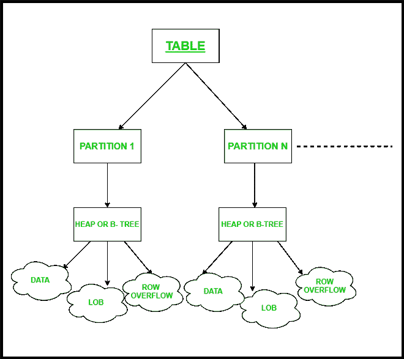
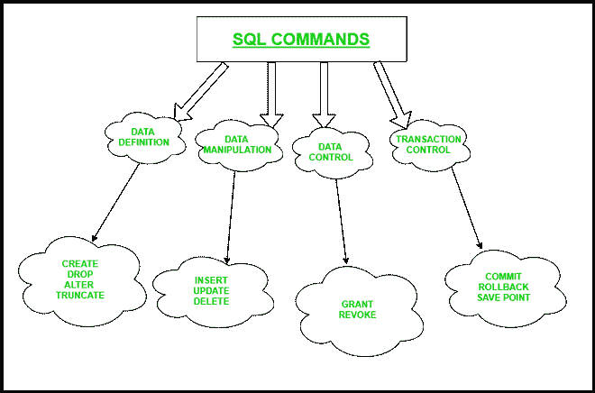

# 机器学习和数据科学家的 SQL

> 原文:[https://www . geesforgeks . org/SQL-for-machine-learning-and-data-scientists/](https://www.geeksforgeeks.org/sql-for-machine-learning-and-data-scientists/)

本文讨论了 SQL 及其在数据分析和机器学习中的应用。我们还将讨论 SQL 的各种应用及其在数据库管理中的未来前景。

**概述:**
[SQL(结构化查询语言)](https://www.geeksforgeeks.org/structured-query-language/)用于管理关系数据库，用于执行取行、创建数据库、修改数据库、删除数据库，以及读取、写入数据。它在管理结构化数据(即用于表示实体和变量之间关系的数据)时非常有用。SQL 基于关系代数和元组关系演算。MS Access，MySQL 是一种标准的数据库语言。

**用于数据分析的 SQL:**
[SQL 和 SQLite](https://www.geeksforgeeks.org/differences-between-sql-and-sqlite/) 在数据分析技术中具有重要意义。SQL 可以用于不同的目的，比如数据分析师可以用它来分析数据，数据洞察力可以帮助决策。SQL 可以帮助最终用户理解更复杂的数据存储系统，因为它能够直接与 SQL 中使用的内置语言进行交互。正因为如此，它在数据科学家和分析师的工作中帮助他们获得了大量访问 SQL 的机会，以了解如此丰富的数据。

**SQL 在** [**机器学习**](https://www.geeksforgeeks.org/machine-learning/) **中的使用:**
SQL 服务器发布了很棒的功能，有助于用关系数据运行 Python 和 R 语言脚本。随着时间的推移，SQL 服务器不断发布新功能，如数据分区，这有助于将所有工作集中在一个地方，并获得制作更小的文件和对象来管理它们的优势。数据分区有助于提高我们在分析数据流和通过 SQL 语句检索数据时使用规范化表的效率。

SQL 用于数据分区的技术，用于在更小的空间中存储更多的数据

**SQL 应用程序&操作:**
SQL 的应用程序包括设置和运行分析查询、事务处理、为分析应用程序检索数据库中的信息子集、编写数据集成脚本以及添加、更新和删除数据库中的数据行和列。这些 SQL 操作适用于各种各样的操作。

**运算符–**
SQL 运算符用在语句的 WHERE 子句中。语句的这一部分用于在适当的条件下过滤数据。SQL 运算符有以下六种类型。

1.  **算术–**
    包括基本的加减乘除运算符。

2.  **按位–**
    它包括按位“与”和“或”&异或运算符。

3.  **比较–**
    包括比较等式(等于、大于、小于)的运算符。

4.  **Compound–**
    包括符号为+=、-=、*=等的运算符。

5.  **逻辑–**
    它包括 AND、ANY、BETWEEN、NOT、OR 等运算符，为每个条件创建逻辑。

6.  **String–**
    用于使用==符号与字符串进行比较。

**具有不同功能的 SQL 命令:**
SQL 命令用作从数据库访问数据的指令。它用于执行各种功能，如创建一个表，并在其中执行各种功能，如删除，修改其大小，为用户设置权限。它还可以用于访问数据查询、特定任务和功能。

带有描述的 SQL 命令

**带其他语言脚本的 SQL:**
SQL 结合了其他语言，如 R、Python、和 Power-Shell 脚本，提供了各种功能。Python 的大量库，如 SciPy & Pandas，有助于表达一种更方便的方式来执行回归分析算法，而不是单独在 SQL 中执行相同的功能。因此，其他脚本语言使得在 SQL 中实现数据分析和回归算法变得更加容易。

**结论:**
SQL 是一项相当庞大的技术，它有着相当光明的未来，因为它在不断开发新的特性，以在每个领域扩展自己。SQL 的未来不仅限于计算机科学，还包括金融、医疗保健、公共服务，简言之，无处不在。归根结底，每个组织都需要一个数据库来管理其客户的数据。所以，我们为什么要选择 SQL 来进行快速高效的数据分析，有着永无止境的原因。