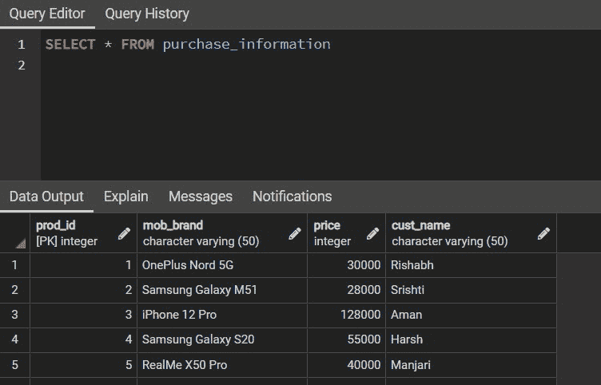

# 使用左右外连接和并集子句的 SQL 完全外连接

> 原文:[https://www . geesforgeks . org/SQL-full-outer-join-use-left-and-right-outer-join-and-union-子句/](https://www.geeksforgeeks.org/sql-full-outer-join-using-left-and-right-outer-join-and-union-clause/)

SQL join 语句用于根据一个公共属性或字段组合来自两个或两个以上表的行或信息。SQL 中基本上有四种类型的[<u>【JOINS】</u>](https://www.geeksforgeeks.org/sql-join-set-1-inner-left-right-and-full-joins/)。

在本文中，我们将使用左外连接、右外连接和 UNION 子句讨论完全外连接。

考虑下面的两个表格:

**样本输入表 1:**

<figure class="table">

| **购买信息** |
| --- |
| 产品标识 | 手机 _ 品牌 | 成本(印度卢比) | 客户名称 |
| one | 加北 5G | Thirty thousand | 里沙卜 |
| Two | 三星 Galaxy M51 | Twenty-eight thousand | Srishti |
| three | iPhone 12 Pro | 1,28,000 | 等于 Haman） |
| four | 三星 Galaxy S20 | Fifty-five thousand | 严厉的 |
| five | Realme X50 Pro | Forty thousand | 万里 |

</figure>

**样本输入表 2:**

<figure class="table">T22】1

| **Customer information** |
| --- |
| Customer _ID | Customer _ name | E-mail address |
| Srishti | abc@gmail.com |
| Two | Lajieshen |

</figure>

### **完全外部连接**:

完全连接通过连接[左连接](https://www.geeksforgeeks.org/sql-join-set-1-inner-left-right-and-full-joins/)和[右连接](https://www.geeksforgeeks.org/sql-join-set-1-inner-left-right-and-full-joins/)提供结果。结果将包含表 1 和表 2 中的所有行。结果表中不匹配的行将具有空值。

```
SELECT * FROM Table1
FULL OUTER JOIN Table2
ON Table1.column_match=Table2.column_match;

Table1: First Table in Database.
Table2: Second Table in Database.
column_match: The column common to both the tables.
```

上面的查询也可以使用**左外部连接、**右外部连接、**和联合的组合来编写。**UNION[UNION](https://www.geeksforgeeks.org/union-and-union-all-in-ms-sql-server/#:~:text=Union%20means%20joining%20two%20or,are%20described%20in%20the%20query.)的意思是将两个或多个数据集连接成一个集合。上面的查询和下面的查询将提供相同的输出。

```
SELECT * FROM Table1
LEFT OUTER JOIN Table2
ON Table1.column_match=Table2.column_match
UNION
SELECT * FROM Table1
RIGHT OUTER JOIN Table2
ON Table1.column_match=Table2.column_match;

Table1: First Table in Database.
Table2: Second Table in Database.
column_match: The column common to both the tables.
```

**样品输出**:

<figure class="table">3

|  | **Result** |
| --- | --- |
|  | [Customer name] | [Customer id] | [Customer name] | [e-mail address] |
| 【阿曼】 | 【XXX @ Gmail。【com】 |  |
| 三星银河【s20】 | 【55000】 |
| --- | --- |
| 【T1128】【T1130】【T1132】 |  | 【pooja】【T1137】 |
| --- | --- | --- |

</figure>

### **样本输入的 SQL 查询:**

我们考虑了大亿日期间某**电商网站的手机客户及购买信息。**数据库电子商务有两个表，一个包含产品信息，另一个包含客户信息。现在，我们将在这两个表之间执行一个 FULL OUTER JOIN，将它们连接成一个表，并获得关于客户和他们从网站上购买的产品的完整数据。

现在我们来考虑一下*购买 _ 信息*表。要查看该表，请使用以下查询:

```
SELECT * FROM purchase_information; 
```

**输出:**



**采购表**

要查看*客户信息*表，请使用以下查询:

```
SELECT * FROM customer_information;
```

**输出:**


**客户表**

现在我们可以简单地调用 FULL OUTER JOIN 子句，使用下面的查询从上面创建的两个表中获得一个组合结果:

```
SELECT * FROM purchase_information
FULL OUTER JOIN customer_information
ON purchase_information.cust_name=customer_information.customer_name
```

**输出:**


**使用全外连接的结果表**

但是我们可以在不使用 FULL OUTER JOIN 子句的情况下获得相同的结果。为此，我们使用左连接、右连接和联合子句，如下所示:

```
SELECT FROM purchase_information
LEFT OUTER JOIN customer information
ON purchase_information.cust_name=customer_information.customer_name
UNION
SELECT * FROM purchase_information

RIGHT OUTER JOIN customer_information
ON purchase_information.cust_name=customer_information.customer_name
```

**输出:**


**使用左、右和并集的全外连接结果表**