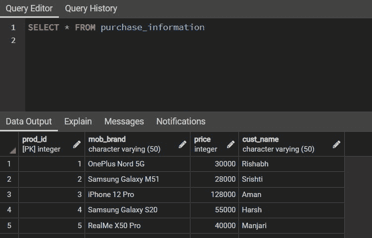
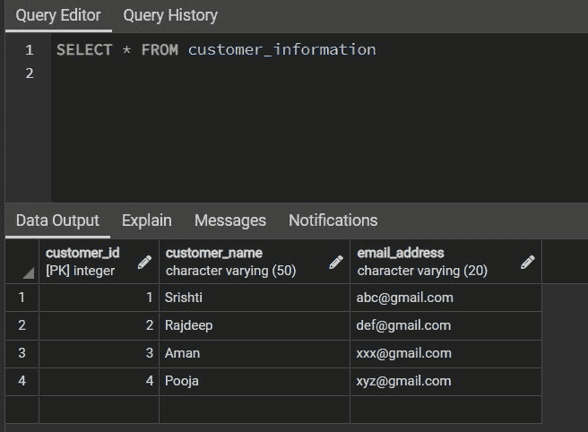
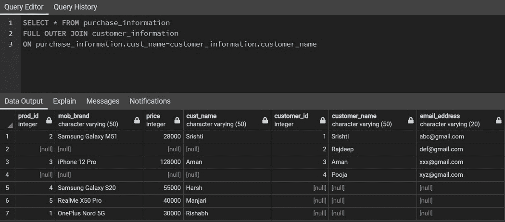
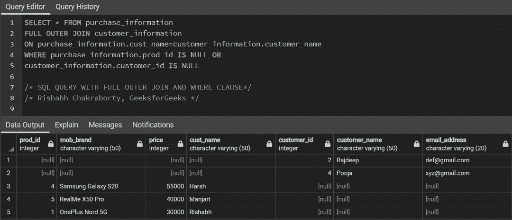

# 使用 Where 子句的 SQL 完全外部连接

> 原文:[https://www . geesforgeks . org/SQL-full-outer-join-use-where-子句/](https://www.geeksforgeeks.org/sql-full-outer-join-using-where-clause/)

SQL join 语句用于根据一个公共属性或字段组合来自两个或两个以上表的行或信息。SQL 中基本上有四种类型的[<u>【JOINS】</u>](https://www.geeksforgeeks.org/sql-join-set-1-inner-left-right-and-full-joins/)。

在本文中，我们将讨论使用 WHERE 子句的完全外部连接。

考虑下面的两个表格:

**样本输入表 1** :

<figure class="table">

| **采购信息** |
| 产品标识 | 手机 _ 品牌 | 成本(印度卢比) | 客户名称 |
| one | 加北 5G | Thirty thousand | 里沙卜 |
| Two | 三星 Galaxy M51 | Twenty-eight thousand | Srishti |
| three | iPhone 12 Pro | 1,28,000 | 等于 Haman） |
| four | 三星 Galaxy S20 | Fifty-five thousand | 严厉的 |
| five | Realme X50 Pro | Forty thousand | 万里 |

</figure>

**样本输入表 2** :

<figure class="table">T32

| **Customer information** |
| Customer _ID | Customer _ name | E-mail address |
| one | Sriti | abc@gmail.com |
| Two | Lajieshen |

</figure>

**完全外部连接:**完全连接通过连接[左连接](https://www.geeksforgeeks.org/sql-join-set-1-inner-left-right-and-full-joins/)和[右连接](https://www.geeksforgeeks.org/sql-join-set-1-inner-left-right-and-full-joins/)提供结果。结果将包含表 1 和表 2 中的所有行。结果表中不匹配的行将具有空值。

```
SELECT * FROM Table1
FULL OUTER JOIN Table2
ON Table1.column_match=Table2.column_match;

Table1: First Table in Database.
Table2: Second Table in Database.
column_match: The column common to both the tables.
```

**样品输出:**

<figure class="table">t18【客户名称】 3

|  | **Result** |
| 【产品 _ id】 |  | [Customer id] | [Customer name] | [e-mail address] |
| 【阿曼】 | 【XXX @ Gmail。【com】 |
|  |
| 【 Samsung Galaxy s20 】 | 【55，000】 |
|  |  |  |  |  | 【T143】【pooja】【T1135】)的 NULL |

</figure>

**使用 WHERE 子句的完全外部连接**:使用带有完全外部连接的 WHERE 子句有助于检索在连接两个具有空条目的表时没有条目匹配的所有行。

```
SELECT * FROM Table1
FULL OUTER JOIN Table2
ON Table1.column_match=Table2.column_match
WHERE Table1.column is NULL
OR Table2.column is NULL;

Table1: First Table in Database.
Table2: Second Table in Database.
column_match: The column common to both the tables.
column: The column having NULL value after Full Outer Join
```

上面的查询只返回那些买过手机，在客户信息表中没有保存任何记录的客户，以及没有购买任何产品的客户信息。

**样本输入的 SQL 查询**:我们已经考虑了一个来自**电子商务网站的手机客户和购买信息在大亿日**。数据库电子商务有两个表，一个包含产品信息，另一个包含客户信息。现在，我们将在这两个表之间执行 FULL OUTER JOIN，将它们连接成一个表，并获得关于客户和他们从网站上购买的产品的完整数据。

**基本 SQL 查询:**

**1。创建数据库**

```
CREATE DATABASE database_name;
```

**2。创建表格**

```
CREATE TABLE Table_name(
col_1 TYPE col_1_constraint,
col_2 TYPE col_2 constraint
.....
)

col: Column name
TYPE: Data type whether an integer, variable character, etc
col_constraint: Constraints in SQL like PRIMARY KEY, NOT NULL, UNIQUE, REFERENCES, etc
```

**3。插入表格**

```
INSERT INTO Table_name
VALUES(val_1, val_2, val_3, ..........)

val: Values in particular column
```

**4。查看表格**

```
SELECT * FROM Table_name
```

有关 SQL 语法的更多信息，请访问我们的网站 [<u>SQL 教程</u>](https://www.geeksforgeeks.org/sql-tutorial/) 。

**输出:**

**1。客户信息和采购信息表**



**采购信息表**



**客户信息表**

**2。全外连接**



**全外连接结果表**

**3。带 WHERE 子句的完全外部连接**



**带 WHERE 子句的完全外部连接结果表**