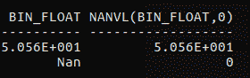

# SQL 通用函数| NVL、NVL2、DECODE、jocket、NULLIF、LNNVL 和 NANVL

> 原文:[https://www . geesforgeks . org/SQL-general-functions-nvl-nvl 2-decode-join-null if-lnnvl-nanvl/](https://www.geeksforgeeks.org/sql-general-functions-nvl-nvl2-decode-coalesce-nullif-lnnvl-nanvl/)

在本文中，我们将讨论一些强大的 SQL 通用函数，它们是——NVL 函数、NVL2 函数、DECODE 函数、聚结函数、NULLIF 函数、LNNVL 函数和 NANVL 函数。

这些函数适用于任何数据类型，并且适用于表达式列表中空值的使用。这些都是**单行函数**，即每行提供一个结果。

*   **NVL(expr1, expr2)** : In SQL, NVL() converts a null value to an actual value. Data types that can be used are date, character and number. Data type must match with each other i.e. expr1 and expr2 must of same data type.
    **Syntax –**

    ```
    NVL (expr1, expr2)

    ```

    **表达式 1** 是可能包含空值的源值或表达式。
    **表达式 2** 是转换空值的目标值。

    示例–

    ```
    SELECT  salary, NVL(commission_pct, 0),
        (salary*12) + (salary*12*NVL(commission_pct, 0))
          annual_salary FROM employees;

    ```

    输出:
    

*   **NVL2(expr1, expr2, expr3)** : The NVL2 function examines the first expression. If the first expression is not null, then the NVL2 function returns the second expression. If the first expression is null, then the third expression is returned i.e. If expr1 is not null, NVL2 returns expr2\. If expr1 is null, NVL2 returns expr3\. The argument expr1 can have any data type.

    **语法–**

    ```
    NVL2 (expr1, expr2, expr3)

    ```

    **expr1** 是可能包含 null 的源值或表达式
    **expr2** 是 expr1 不为 null 时返回的值
    **expr3** 是 expr1 为 null 时返回的值

    示例–

    ```
    SELECT last_name, salary, commission_pct,
     NVL2(commission_pct, ’SAL+COMM’, ’SAL’)
     income FROM employees;

    ```

    输出:
    

*   **DECODE()** : Facilitates conditional inquiries by doing the work of a CASE or IF-THEN-ELSE statement.
    The DECODE function decodes an expression in a way similar to the IF-THEN-ELSE logic used in various languages. The DECODE function decodes expression after comparing it to each search value. If the expression is the same as search, result is returned.
    If the default value is omitted, a null value is returned where a search value does not match any of the result values.

    **语法–**

    ```
    DECODE(col|expression, search1, result1 
     [, search2, result2,...,][, default])

    ```

    示例–

    ```
    SELECT last_name, job_id, salary,
       DECODE(job_id, ’IT_PROG’, 1.10*salary,
        ’ST_CLERK’, 1.15*salary,
        ’SA_REP’, 1.20*salary,salary) 
         REVISED_SALARY FROM employees;

    ```

    输出:
    

*   **聚结()**:聚结()函数检查第一个表达式，如果第一个表达式不为空，则返回该表达式；否则，它会对剩余的表达式进行聚结。
    与 NVL()函数相比，聚结()函数的优势在于聚结函数可以采用多个替代值。简单来说，COMPETE()函数返回列表中的第一个非空表达式。

**语法–**

```
COALESCE (expr_1, expr_2, ... expr_n)

```

示例–

```
SELECT last_name, 
    COALESCE(commission_pct, salary, 10) comm
    FROM employees ORDER BY commission_pct;

```

输出:


*   **NULLIF()** : The NULLIF function compares two expressions. If they are equal, the function returns null. If they are not equal, the function returns the first expression. You cannot specify the literal NULL for first expression.

    **语法–**

    ```
    NULLIF (expr_1, expr_2)

    ```

    示例–

    ```
    SELECT LENGTH(first_name) "expr1",
       LENGTH(last_name) "expr2",
       NULLIF(LENGTH(first_name),LENGTH(last_name))
        result FROM employees;

    ```

    输出:
    

    *   **LNNVL()** : LNNVL evaluate a condition when one or both operands of the condition may be null. The function can be used only in the WHERE clause of a query. It takes as an argument a condition and returns TRUE if the condition is FALSE or UNKNOWN and FALSE if the condition is TRUE.

    **语法–**

    ```
    LNNVL( condition(s) )

    ```

    示例–

    ```
    SELECT COUNT(*) FROM employees 
          WHERE commission_pct < .2; 

    ```

    输出:
    

    现在上面的例子根本没有考虑那些没有提成的员工。
    为了也包含它们，我们使用了 LNNVL()

    ```
    SELECT COUNT(*) FROM employees 
      WHERE LNNVL(commission_pct >= .2); 

    ```

    输出:
    

    *   **NANVL()** : The NANVL function is useful only for floating-point numbers of type BINARY_FLOAT or BINARY_DOUBLE. It instructs the Database to return an alternative value n2 if the input value n1 is NaN (not a number). If n1 is not NaN, then database returns n1\. This function is useful for mapping NaN values to NULL.

    **语法–**

    ```
    NANVL( n1 , n2 )
    ```

    考虑以下名为 nanvl_demo 的表格:
    

    示例–

    ```
    SELECT bin_float, NANVL(bin_float,0)
      FROM nanvl_demo;

    ```

    输出:
    

**参考**:Oracle 9i SQL 入门(第 1 册)