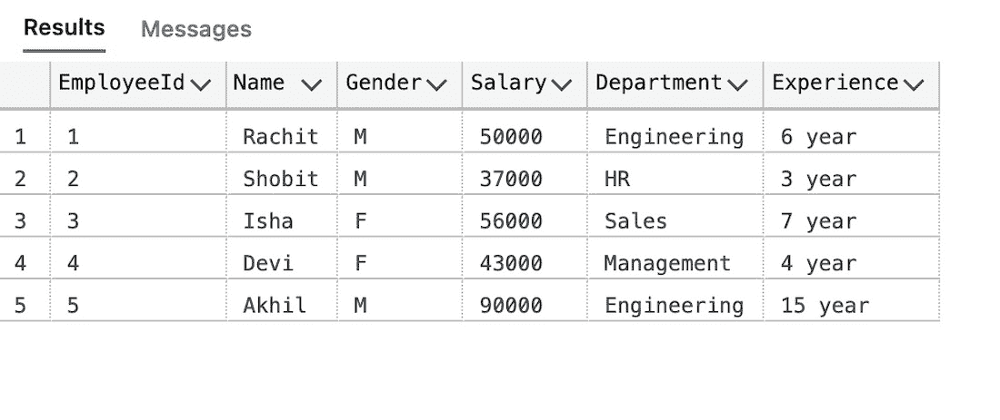
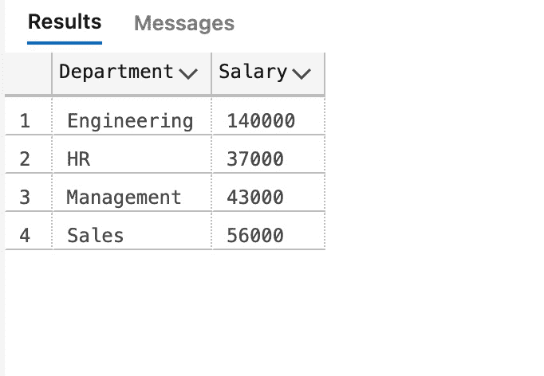
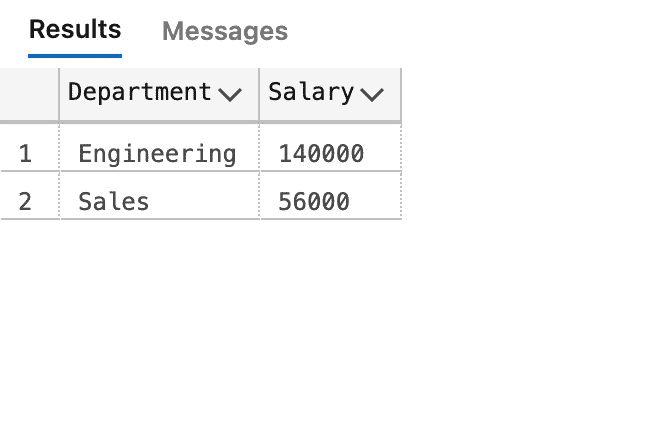
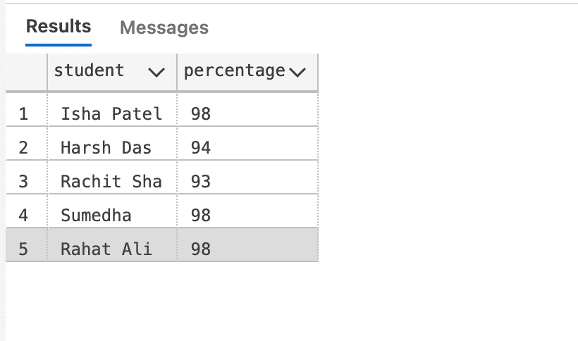
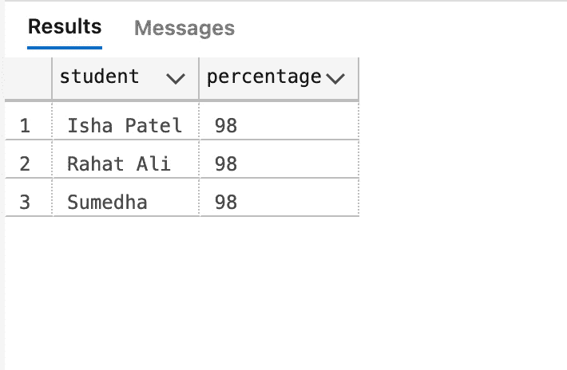
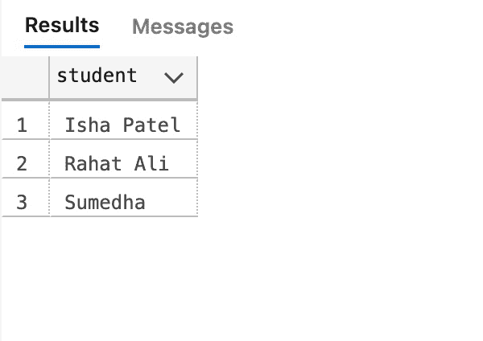

# 带示例的 SQL HAVING 子句

> 原文:[https://www . geesforgeks . org/SQL-having-子句-带示例/](https://www.geeksforgeeks.org/sql-having-clause-with-examples/)

在 MSSQL 中，HAVING 子句用于根据指定条件对 [GROUP BY](https://www.geeksforgeeks.org/sql-group-by/) 的结果进行筛选。条件是布尔类型，即使用逻辑运算符(与、或)的*。*这个子句包含在 SQL 中，因为当我们将它与聚合表达式一起使用时， [WHERE](https://www.geeksforgeeks.org/sql-where-clause/) 关键字失败了。Having 是 SQL 中一个非常常用的子句。类似于 WHERE，它有助于应用条件，但是 HAVING 适用于组。如果您希望过滤一个组，HAVING 子句将会起作用。

**一些要点:**

*   Having 子句用于根据提供的条件过滤数据。
*   Having 子句通常用于大数据报告。
*   Having 子句仅与 SELECT 子句一起使用。
*   语法中的表达式只能有常量。
*   在查询中，ORDER BY 将放在 HAVING 子句之后(如果有)。
*   HAVING 子句在列操作中实现。
*   Having 子句通常用在 GROUP BY 之后。
*   GROUP BY 子句用于将所需数据分组。

**语法:**

```
SELECT col_1, function_name(col_2)
FROM tablename
WHERE condition
GROUP BY column1, column2
HAVING Condition
ORDER BY column1, column2;
```

这里，function_name 是所用函数的名称，例如 SUM()，AVG()。

**例 1:**

这里我们首先创建一个名为“公司”的数据库，然后在数据库中创建一个名为“员工”的表。创建表后，我们将执行查询。

**步骤 1:创建数据库**

```
CREATE DATABASE Company;
```

**第二步:使用该数据库**

```
USE Company;
```

**第三步:创建表格**

```
CREATE TABLE Employee(
   EmployeeId int,
   Name Varchar(20),
   Gender Varchar(20),
   Salary int,
   Department Varchar(20),
   Experience Varchar(20)
);
```

**在表格中添加数值:**

```
INSERT INTO Employee VALUES (1, 'Rachit', 'M', 50000, 'Engineering', '6 year')
INSERT INTO Employee VALUES (2, 'Shobit', 'M', 37000, 'HR', '3 year')
INSERT INTO Employee VALUES (3, 'Isha', 'F', 56000, 'Sales', '7 year')
INSERT INTO Employee VALUES (4, 'Devi', 'F', 43000, 'Management', '4 year')
INSERT INTO Employee VALUES (5, 'Akhil', 'M', 90000, 'Engineering', '15 year')
```

**最终表为:**

```
SELECT * FROM Employee;
```



**第四步:执行查询**

这个员工表将帮助我们理解 HAVING 子句。它包含员工标识、姓名、性别、部门和工资。要知道工资总额，我们将编写查询:

```
SELECT Department, sum(Salary) as Salary
FROM employee
GROUP BY department;  
```

这是结果，



现在如果我们需要显示工资总和为 5 万或更多的部门。在这种情况下，我们将使用 HAVING 子句。

```
SELECT Department, sum(Salary) as Salary
FROM employee
GROUP BY department
HAVING SUM(Salary) >= 50000;  
```



**例 2:**

假设，一个老师想在课堂上宣布状元。为此，她决定奖励每一个得分超过 95%的学生。我们需要根据姓名和他们的百分比对数据库进行分组，并找出当年得分超过 95%的人。为此，我们首先创建一个名为“School”的数据库，然后在数据库中创建一个名为“Student”的表。创建表后，我们将执行查询。

**步骤 1:创建数据库**

```
CREATE DATABASE School;
```

**第二步:使用该数据库**

```
USE School;
```

**第三步:创建表格**

```
CREATE TABLE Student(
   student Varchar(20),
   percentage int
);
```

**在表格中添加数值:**

```
INSERT INTO Student VALUES ('Isha Patel', 98)
INSERT INTO Student VALUES ('Harsh Das', 94)
INSERT INTO Student VALUES ('Rachit Sha', 93)
INSERT INTO Student VALUES ('Sumedha', 98)
INSERT INTO Student VALUES ('Rahat Ali', 98)
```

**最终表为:**

```
SELECT * FROM Student;
```



**第四步:执行查询**

```
SELECT student, percentage
FROM Student
GROUP BY student, percentage
HAVING percentage > 95;
```

在这里，三个名叫伊莎、苏梅达、拉哈特·阿里的学生得分都超过了 95 %。



此外，我们还可以使用 HAVING 子句过滤多个值上的行。HAVING 子句还允许使用多个聚合条件过滤行。

```
SELECT student  
FROM Student
WHERE percentage > 90
GROUP BY student, percentage
HAVING SUM(percentage) < 1000 AND AVG(percentage) > 95;
```

此查询返回百分比大于 95 且百分比总和小于 1000 的学生。

