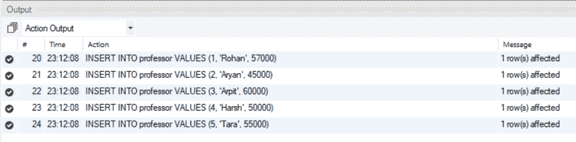
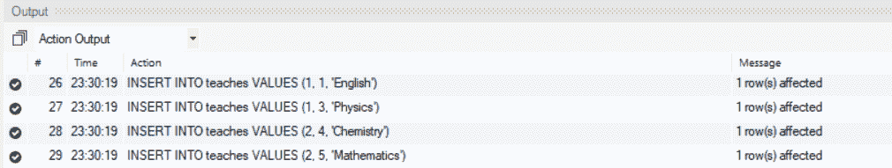

# SQL 内部连接

> 原文:[https://www.geeksforgeeks.org/sql-inner-join/](https://www.geeksforgeeks.org/sql-inner-join/)

**概述:**
结构化查询语言或 [SQL](https://www.geeksforgeeks.org/sql-tutorial/) 是一种标准的数据库语言，用于创建、维护和检索关系数据库(如 MySQL、Oracle 等)中的数据。连接是笛卡尔乘积和选择过程的组合。当且仅当满足给定的连接条件时，连接操作将来自不同关系的两个元组配对。内部联接是只包含满足某些条件的元组的联接。在本文中，我们将使用 MySQL 来演示 SQL 内部连接的工作原理。

**实现 SQL 内部连接的步骤:**
这里，我们将讨论 SQL 内部连接的实现如下。

**步骤-1:创建数据库:**
这里，我们将使用如下 SQL 查询创建数据库。

```
CREATE DATABASE geeks;
```

**第二步:使用数据库:**
在这里，我们将使用极客数据库。

```
USE geeks;
```

**步骤-3:添加表:**
我们将向数据库添加 2 个表，如下所示。

1.  第一个表将是教授，其中将包含身份证，教授的名字，和工资。
2.  将教授第二个表格，该表格将包含课程 ID、教授 ID 和课程名称。

**添加表教授–**

```
CREATE TABLE professor(
    ID int,
    Name varchar(20),
    Salary int
);
```

**添加表格示教–**

```
CREATE TABLE teaches(
    course_id int,
    prof_id int,
    course_name varchar(20)
);
```

**第 4 步:表的描述:**
我们可以使用下面的 SQL 命令获得这两个表的描述，如下所示。

```
DESCRIBE professor
```

**输出:**

<figure class="table">键

| 【领域】 | 【类型】 |
| --- | --- |

</figure>

```
DESCRIBE teaches
```

**输出:**

<figure class="table">键

| 【领域】 | 【类型】 |
| --- | --- |

</figure>

**步骤-5:插入行:**
这里，我们将在两个表中逐个插入行，如下所示。

**在教授表中插入行–**

```
INSERT INTO professor VALUES (1, 'Rohan', 57000);
INSERT INTO professor VALUES (2, 'Aryan', 45000);
INSERT INTO professor VALUES (3, 'Arpit', 60000);
INSERT INTO professor VALUES (4, 'Harsh', 50000);
INSERT INTO professor VALUES (5, 'Tara', 55000);
```

**输出:**



**在示教表中插入行–**

```
INSERT INTO teaches VALUES (1, 1, 'English');
INSERT INTO teaches VALUES (1, 3, 'Physics');
INSERT INTO teaches VALUES (2, 4, 'Chemistry');
INSERT INTO teaches VALUES (2, 5, 'Mathematics');
```

**输出:**



**步骤-6:表的当前状态:**
验证两个表中的数据如下。

**教授表–**

```
SELECT * FROM professor;
```

**输出:**

<figure class="table">

| 【id】 | 【 name 】 | [salary] |
| --- | --- | --- |

</figure>

**示教表格–**

```
SELECT * FROM teaches;
```

**输出:**

<figure class="table">T14T18】1T20】英语T24】1T26】3T30T32T34】2

| 课程 id | 教授 _ id | 课程名称 |
| --- | --- | --- |
| one |
| physics |

</figure>

**第 7 步:内部连接查询:**

**语法:**

```
SELECT comma_separated_column_names
FROM table1 INNER JOIN table2 ON condition
```

**示例–**

```
SELECT teaches.course_id, teaches.prof_id, professor.Name, professor.Salary
FROM professor INNER JOIN teaches ON professor.ID = teaches.prof_id;
```

**输出:**
使用内部连接，我们能够基于一个条件组合两个表中的信息，并且不满足所需条件的两个表的笛卡尔乘积中的元组不包括在结果表中。

<figure class="table">T7】course _ idT21】1T25】57000T28T31】3 阿比特 T35】

| 教授 _ id | (full) name | salary |
| --- | --- | --- |
| one | Luohan |
| one |

</figure>